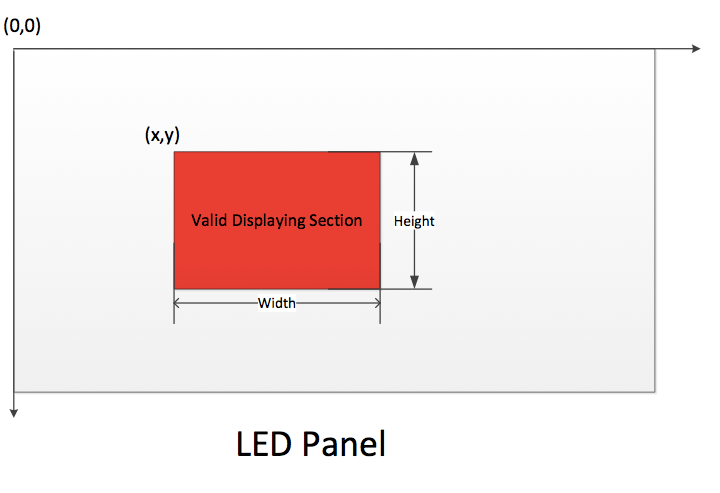
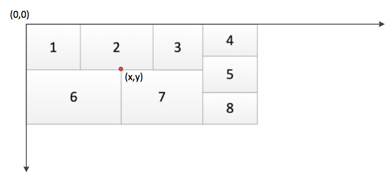

淳中科技

编号：

密级：

**CronosMax控制卡通信****协议**

# 修订记录

历史记录

| 时间 | 历史描述 | 作者 | 版本 |
| --- | --- | --- | --- |
| 2022-11-06 | 创建 | 李平 | V1.0 |
| 2023-03-10 | 修订 | 李平 | V1.1 |
| 2023-04-04 | 修订 | 李平 | V1.2 |
| 2023-04-06 | 修订 | 李平 | V1.3 |
| 2023-04-18 | 修订 | 李平 | V1.4 |
| 2023-04-19 | 修订 | 李平 | V1.5 |
| 2023-04-20 | 修订 | 李平 | V1.6 |
| 2023-05-19 | 修订 | 李平 | V1.7 |
| 2023-06-01 | 修订 | 李平 | V1.8 |
| 2023-06-29 | 修订 | 李平 | V1.9 |
| 2023-07-06 | 修订 | 李平 | V1.10 |
| 2023-08-01 | 修订 | 李平 | V1.11 |
| 2024-01-30 | 修订 | 李平 | V1.12 |
| 2024-04-26 | 修订 | 李平 | V1.13 |
| 2024-10-15 | 修订 | 李平 | V1.14 |
| 2024-10-24 | 修订 | 李平 | V1.15 |
| 2024-10-26 | 修订 | 李平 | V1.16 |
| 2024-11-06 | 修订 | 李平 | V1.17 |
| 2024-11-06 | 修订 | 李平 | V1.18 |
| 2024-11-15 | 修订 | 李平 | V1.19 |
| 2024-11-20 | 修订 | 李平 | V1.20 |
| 2024-12-02 | 修订 | 李平 | V1.21 |
| 2025-02-20 | 修订 | 李平 | V1.22 |
| 2025-02-24 | 修订 | 贾昊泽 | V1.23 |
| 2025-03-06 | 修订 | 贾昊泽 | V1.24 |
| 2025-03-07 | 修订 | 李平 | V1.25 |
| 2025-04-21 | 修订 | 李平 | V1.26 |
| 2025-04-21 | 修订 | 李平 | V1.27 |
| 2025-06-12 | 修订 | 李平 | V1.28 |
| 2025-06-24 | 修订 | 李平 | V1.29 |
| 2025-07-04 | 修订 | 李平 | V1.30 |
| 2025-08-11 | 修订 | 李平 | V1.31 |
| 2025-08-19 | 修订 | 李平 | V1.32 |
| 2025-08-20 | 修订 | 李平 | V1.33 |
| 2025-09-06 | 修订 | 李平 | V1.34 |
| 2025-09-10 | 修订 | 李平 | V1.35 |
| 2025-09-26 | 修订 | 李平 | V1.37 |
| 2026-03-27 | 修订 | 李平 | V1.38 |
| 2026-04-15 | 修订 | 李平 | V1.40 |

详细记录

| 修订日期 | 修订版本 | 修订说明 |
| --- | --- | --- |
| 2022-11-06 | V1.0 | 创建 |
| 2023-03-10 | V1.1 | 添加/修订协议
80324:设置音频绑定
80326:查询音频绑定
81212:查询映射关系
81214:设置映射关系 |
| 2023-04-04 | V1.2 | 添加/修订协议
80328:控制卡状态变化通知.
80330:设置Ip.
80332:查询Ip. |
| 2023-04-06 | V1.3 | 添加/修订协议
去掉80330设置Ip.
去掉80332查询Ip.
修改:80014查询Ip
修改80016设置Ip |
| 2023-04-18 | V1.4 | 添加/修订协议
修改80428,添加音柱相关参数
修改80430添加音柱相关参数 |
| 2023-04-19 | V1.5 | 添加/修订协议
修改80026,添加双控制卡信息
添加80708,添加音柱相关参数
添加80710添加音柱相关参数
80428/80430恢复原状 |
| 2023-04-20 | V1.6 | 添加/修订协议
修改80026,添加双控制卡信息 |
| 2023-05-19 | V1.7 | 添加/修订协议
修改80072,设置系统时间精确到毫秒精度. |
| 2023-06-01 | V1.8 | 添加/修订协议
修改80070,查询系统时间精确到毫秒精度. |
| 2023-06-29 | V1.9 | 添加/修订协议
修改80060和80062:
分包传输(同日志导出的逻辑),增加包总数和包索引号. |
| 2023-07-06 | V1.10 | 添加/修订协议
修改80026:
增加输入输出卡的在线状态信息,用于判断当前板卡是否被拔出. |
| 2023-08-01 | V1.11 | 添加/修订协议
修改80026:
网络切换卡增加初始化状态指示标识
(初始化标识
status:1-表示初始化成功;0-表示初始化失败) |
| 2024-01-30 | V1.12 | 添加/修订协议
对80034协议添加备注信息. |
| 2024-04-26 | V1.13 | 添加/修订协议
对80488协议修订. |
| 2024-10-15 | V1.14 | 添加/修订协议
修改80026,80328:
增加DeviceStatus字段信息,用于表示热备中的对方机箱是否在线. |
| 2024-10-24 | V1.15 | 添加/修订协议
修改80400,80702,81212,81214,80826,80836.
增加子通道相关功能. |
| 2024-10-26 | V1.16 | 添加/修订协议
修改81212,81214.
增加子通道相关功能. |
| 2024-11-6 | V1.17 | 添加/修订协议
增加80952,80954
增加led相关的配置和查询 |
| 2024-11-6 | V1.18 | 添加/修订协议
修改80424, 80426.
添加了解码卡子通道字符叠加配置功能 |
| 2024-11-15 | V1.19 | 添加/修订协议
查询屏组信息（80800）,设置屏组信息（80802）其中的smod字段增加了mode段信息.
mode为0是普通屏组,mode为1是led屏组. |
| 2024-11-20 | V1.20 | 扩展协议字段含义：屏组底图查询（80848）、屏组底图设置（80850）中的x，y，w，h的单位：在普通模式的屏组下是输出端口（即一个显示屏）；在LED模式的屏组下是像素数。 |
| 2024-12-02 | V1.21 | 扩展协议字段含义：
屏组信息变动通知（81100）增加屏组类型字段. |
| 2025-02-20 | V1.22 | 添加/修订协议
修改80026
增加DeviceType/type字段信息,用于表示设备类型(0-普通版本，1-双机热备版本) |
| 2025-02-24 | V1.23 | 增加字段属性80922Preset字段增加name属性
新增协议81254 查询矩阵无窗颜色及无源颜色
新增协议81256 设置矩阵无窗颜色及无源颜色 |
| 2025-03-06 | V1.24 | 增加字段属性80112Preset字段增加name属性
新增协议80956大屏音频信息查询
新增协议80958大屏音频信息配置
新增协议81122大屏音频变动通知 |
| 2025-03-07 | V1.25 | 添加/修订协议
80048,80050添加备注.(协议未修改)
浅压缩卡源端IP复用virtual_ip字段 |
| 2025-04-21 | V1.26 | 添加/修订协议
双主机间端口备份查询（81512）
双主机间端口备份设置（81514） |
| 2025-04-21 | V1.27 | 添加/修订协议
双主机间端口备份查询（81258）
双主机间端口备份设置（81260） |
| 2025-06-12 | V1.28 | 添加/修订协议
拼接窗口（8/16）模式设置（80960）
拼接窗口（8/16）模式查询（80962） |
| 2025-06-24 | V1.29 | 添加/修订协议
大屏输出使能状态查询（80964）
大屏输出使能状态配置（80966） |
| 2025-07-4 | V1.30 | 添加/修订协议
修订预监通道画布位置查询（80488） |
| 2025-08-11 | V1.31 | 添加备注
80488协议中,其中48U机箱仅支持连接左侧控制卡tcp方式取流. |
| 2025-08-19 | V1.32 | 添加备注
80000协议中,增加ModelNumber字段用以区分各类不同集中式设备类型.cronosMax设备类型值为2400. |
| 2025-08-20 | V1.33 | 添加备注
80488协议中,12U预监增加为4路标清的布局(同28U). |
| 2025-09-06 | V1.34 | 添加/修订协议
主机大屏输出使能状态查询(80964).
主机大屏输出使能状态配置(80966).
主机大屏工作状态查询(80968)
主机大屏工作状态变动通知(81124) |
| 2025-09-10 | V1.35 | 大屏输出使能状态通知（81124） |
| 2025-09-26 | V1.36 | 添加/修订协议
主机大屏工作状态查询(80968)增加备机状态字段SlaveErrStatus.
主机大屏工作状态变动通知(81124)增加备机状态字段SlaveErrStatus. |
| 2025-11-24 | V1.37 | 添加/修订协议
预监卡画布查询（80712）.
预监卡画布变动通知（80707） |
| 2025-11-26 | V1.37 | 新增
设置开机默认配置（80160）
查询开机默认配置（80162） |
| 2025-12-25 | V1.37 | 新增
大底图分包上传（80840） |
| 2025-12-29 | V1.37 | 增加手动轮询功能，以下协议增加method/next字段
屏组80920/80922/80924/80926/80930/81116
矩阵81240/81242/81244/81246/81506 |
| 2026-01-04 | V1.37 | 手动轮询增加快捷键字段hotkey
屏组80920/80922/80924/80926/80930/81116
矩阵81240/81242/81244/81246/81506
拼接/矩阵增加轮询排序index字段，涉及协议如下 
80932/80934/81248/81250 |
| 2026-01-05 | V1.37 | 新增
输入端口元素叠加查询（80714）
输入端口元素叠加配置（80716） |
| 2026-01-07 | V1.37 | 新增
输出静帧和恢复状态查询（81262） |
| 2026-01-17 | V1.37 | 新增
屏组模块使能状态查询（80970）
屏组模块使能状态配置（80972） |
| 2026-01-29 | V1.37 | 新增
屏组辅助线模式配置（80974）
屏组辅助线模式查询（80976） |
| 2026-02-06 | V1.37 | 修改
添加字段OldPwd（80012） |
| 2026-02-25 | V1.37 | 新增
坐席场景变动通知（81908） |
| 2026-02-26 | V1.37 | 新增
用户角色变化通知（80330） |
| 2026-03-12 | V1.37 | 新增
屏组聚焦呈现查询（80978）
屏组聚焦呈现配置（80980）
外接设备连接状态监测结果通知（80332）
外接设备连接状态检测（80164） |
| 2026-03-23 | V1.37 | 新增状态码
610	其他客户端正在下载数据
611	正在打包 |
| 2026-03-27 | V1.38 | 新增
大屏底图配置进度通知（81126） |
| 2026-04-13 | V1.39 | 新增
矩阵预操作设置（81264）
查询矩阵预操作配置（81266）
矩阵预操作变动通知（81512） |
| 2026-04-15 | V1.40 | 修订
修订80488和80703协议内容 |

# 目录

# 协议约定

## 协议格式

协议头部

头部24字节，采用网络字节序

| 协议标记 | 版本号 | 协议号 | 序列号 | 状态码 | 长度 | 协议体类型 |
| --- | --- | --- | --- | --- | --- | --- |
| 2字节 | 2个字节 | 4个字节 | 4个字节 | 4个字节 | 4个字节 | 4字节 |
| 0xFFFF | 0x0001 |  | 递增 |  |  | 0: xml
1: 二进制 |

本协议采用TCP传输模式；

连接模式：可长连接，也可以短连接，具体参考1.3授权机制；

消息格式：协议头+协议体，协议体可以为XML，也可以是二进制数据块。

偶数协议号表示是发起的请求，奇数协议号表示的是响应，响应协议号=请求协议号+1。

XML请求协议体格式

| <?xml version="1.0" encoding="utf-8"?>
<Message>
</Message> |
| --- |

XML响应协议体格式

| <?xml version="1.0" encoding="utf-8"?>
<Response>
</Response> |
| --- |

## 协议流程

采用请求->应答模式，且是TCP连接模式:

请求和响应都带有协议号，应答带有响应码（标记请求是否成功）。

## 授权机制

客户端与设备之间可采用长连接，也可以采用短连接。

客户端登陆到设备后，设备会返回给客户端UserID和AToken两个值，之后客户端携带着两个值发送请求指令给设备，如果UserID和AToken是合法的，设备响应请求。这种机制可以实现单点登陆，短连接操作等功能。

客户端登陆设备采用http的摘要认证方式。

AToken有效期

| 场景 | AToken有效期 |
| --- | --- |
| 客户端授权后，一直保持连接，并发心跳 | AToken的有效期就是连接的生命期+2小时的延迟失效期 |
| 客户端登陆验证后断开 | AToken还有2小时有效 |
| 客户端重新登陆验证 | 生成新的AToken |
| 客户端退出登陆 | AToken立即失效 |

授权流程

退出流程

## 状态码

见附件。

## 用户角色

| 用户 | Role ID | 说明 |
| --- | --- | --- |
| admin | 0 | 管理员。
出厂自带用户，最高管理权限，不可删除，可以修改密码，
可以增删改其他用户。 |
| superuser | 1 | 超级用户。
具有管理权限，可以增删改user类型的用户。 |
| user | 2 | 操作员。
只具有操作管理权限。 |

## ID范围

| 名称 | ID范围 | 备注 |
| --- | --- | --- |
| 输入物理通道 | 从0开始 |  |
| 输入逻辑通道 | [1,10240] | 逻辑通道最大个数计算公式
Slotx4x16, max_slot=160(320) |
| 虚拟输入逻辑通道 | [20001,40000] |  |
| 矩阵输出物理通道 | 从0开始 |  |
| 坐席拼接逻辑通道 | 从1开始 | 与上位机协调，导致从1开始。 |
| 拼接屏组ID范围 | 从0开始 |  |

## 其他约定

1、该协议中所有字节序均使用网络字节序；

2、客户端与服务器之间使用长连接或短连接（短连接要定时更新AToken）；

3、处理器的监听端口是：2000；

拼接器

| 类别 | 约定 |
| --- | --- |
| 输入源ID | 通道号：从0开始；
子通道号：从1开始，0表示没有子通道； |
| 屏组ID | 屏组ID：0,1,2,3 |
| 窗口ID | 每个屏组分配1000个ID
屏组0:0-999，屏组1:1000-1999
屏组2:2000-2999，屏组3:3000-3999 |
| 场景ID | 每个屏组分配10000个ID
屏组0：0-9999，屏组1：19999-20000，
屏组2：29999-30000，屏组3：39999-40000 |
| OSD滚动字幕ID | 每个屏组分配1000个ID
屏组0：0-999，屏组2:1000-1999
屏组3:2000-2999，屏组4:3000-3999 |
|  |  |
|  |  |

矩阵

| 类别 | 约定 |
| --- | --- |
| 输入源ID | 逻辑通道从0开始，子通道会自动变成逻辑通道，进行统一编码 |
| 拼接场景ID | 屏组0：0-9999，屏组1：19999-20000，
屏组2：29999-30000，屏组3：39999-40000 |
| 矩阵和KVM场景ID | 从0开始 |
|  |  |
|  |  |
|  |  |

# 设备描述

## 背板

背板类型，每个背板含有一个由4bit组成的ID号

表2-1背板类型

| 背板名称 | 卡类型 | 兼容型槽位 | 网络槽位 | 备注 |
| --- | --- | --- | --- | --- |
| 2U | 0000 | 4 | 0 |  |
| 4U | 0001 | 8 | 0 |  |
| 8U | 0010 | 17 | 0 |  |
| 14U | 0011 | 36 | 2 |  |
| 28U | 0100 | 80(40in,40out) | - |  |
| 28U_320F | 1011 |  |  |  |
| RESERVED | 0101~1110 |  |  |  |
| NO_BOARD | 1111 |  |  |  |

注意1： ID无高4bit

## 槽位

槽位类型信息

| 类型 | 说明 |  |
| --- | --- | --- |
| 0 | 输入卡 |  |
| 1 | 输出卡 |  |
| 3 | 回显卡 |  |
| 255 | 无卡 |  |
| 其他 | 保留 |  |

## 视频切换卡

每种视频切换卡含有一个由4bit组成的ID号，ID号由切换卡上IIC通过IIC转GPIO的芯片实现。

切换卡ID

| 切换卡名称 | 卡类型 | 备注 |
| --- | --- | --- |
| VN16 | 0000 |  |
| VC16 | 0001 |  |
| VC40 | 0010 |  |
| VC72 | 0011 |  |
| VC144 | 0100 |  |
| RESERVED | 0101~1110 |  |
| NO_CARD | 1111 |  |

设备规模与切换卡对应关系

| 设备
规模 | 兼容
槽位 | 网络
槽位 | 网络交换卡 | 视频切换卡规模 | 视频切换卡规模 | 非混插时视频卡个数 | 非混插时视频卡个数 |
| --- | --- | --- | --- | --- | --- | --- | --- |
| 设备
规模 | 兼容
槽位 | 网络
槽位 | 网络交换卡 | 非混插 | 混插 | 输入卡 | 输出卡 |
| 2U | 4 | 0 | （注1） | - | VN16 | 1+i(i=0/1/2) | 3-i |
| 4U | 8 | 0 | NS12 | VC16 | VC40 | 4 | 4 |
| 8U | 17 | 0 | NS24 | VC40 | VC72 | 9 | 8 |
| 14U | 34 | 2 | NS48 | VC72 | VC144 | 17 | 17 |
| 28U | 80 | 0 | NS96 | VC144 | - | 40 | 40 |

注1：网络交换功能位于VN16上。

## 网络交换卡

每种网络交换卡含有一个由4bit组成的ID号，ID号由交换卡上电阻上下拉方式获得。

交换卡ID号

| 交换卡名称 | 卡类型 | 备注 |
| --- | --- | --- |
| NS16 | 0000 | x(删除) |
| NS24 | 0001 | 8u(VSC7434) |
| NS48 | 0010 | 14,28(VSC7434*2P) |
| NS96 | 0011 |  |
| NS9 | 0100 | 4U,2U(VSC7428) |
| NS85 | 1000 | 新28U,新320 |
| RESERVED | 0100~1110 |  |
| NO_CARD | 1111 |  |
|  |  |  |
|  |  |  |

注意1： ID无高4bit

## 母版卡

母版卡类型

| 母版卡名称 | 卡类型 | 备注 |
| --- | --- | --- |
| 输入卡 | 0 |  |
| 输出卡 | 1 |  |
| 控制卡 | 2 |  |
| 回显卡 | 3 |  |
| 中控卡 | 4 |  |
| 预监卡 | 5 |  |
| Hi3531A控制卡 | 6 |  |
| Hi3531D回显卡 | 7 |  |
| 无卡 | 255 |  |
| 保留 | Others |  |

通过输出卡FPGA版本来区分矩阵、拼接和320。

| 输出卡FPGA版本 | 类型 | 备注 |
| --- | --- | --- |
| 0XXX/FXXX | 矩阵 |  |
| 1XXX | 拼接 |  |
| 4XXX | 320 |  |

## 子卡

子卡ID是通过子卡上的IIC转GPIO芯片来实现的。

增加一种新板卡，IP_S（回显卡，也可用作编码卡）

子卡ID

| 子卡名称 | 卡类型 | 音频 | 接口数 | 板卡尺寸 | 输入卡 | 输出卡 |
| --- | --- | --- | --- | --- | --- | --- |
| DVI | 00x00001（0X01） | 独立 | 2 | 1x | YES | YES（-I） |
| HDMI | 00x00010（0X01） | 内嵌 | 2 | 1x | NO | NO |
| SDI | 00x00011（0X03） | 内嵌 | 2 | 1x | YES | YES |
| SFP | 00x00100（0X04） | 内嵌 | 2 | 2x | YES | YES |
| DVI_IN_GSV(KVM_MATRIX) | 00x00100（0X04） |  |  |  |  |  |
| IP | 00x00101（0X05） | 内嵌 | 2 | 2x | YES | YES |
| CVBS_1x2 | 00x00110（0X06） | 独立 | 2 | 1x | YES | YES |
| CVBS_4x2 | 00x00111（0X07） | 独立 | 1 | 1x | YES | NO |
| DUAL_LINK | 00x01000（0X08） | 独立 | 1 | 1x | YES | YES |
| HDMI_H（4K30子卡） | 00x01001（0X09） | 内嵌 | 1 | 1x | YES | YES |
| DP 4K30（STDP2650+7619子卡输入STDP2600+ 9136整卡输出） | 00x11010（0X1A） | 内嵌 | 2 | 1x | YES | YES |
| DP 4K30（输入卡方案EP+ADV） | 00x01010（0X0A） | 内嵌 | 1 | 1x | YES | NO |
| IP_S（3531方案） | 00x01011（0X0B） | 内嵌 | 2 | 1x | NO | YES |
| VGA | 00x01100（0X0C） | 独立 | 2 | 1x | YES | NO |
| HDBASE-T | 00x01101（0X0D） | 内嵌 | 2 | 2x | YES | YES |
| SFP_2.5G | 00x01110（0X0E） | 内嵌 | 2 | 2x | YES | YES |
| DVI-IN_ITE(KVM_MATRIX) | 00x01110（0X0E） |  |  |  |  |  |
| YPbPr | 00x01111（0X0F） | 独立 | 2 | 1x | NO | YES |
| VGA(双绞线远传) | 00x10110（0X16） | 独立 | 2 | 1x | YES | YES |
| SDI_IN_8CH | 00x10001（0X11） | 内嵌 | 8 |  | YES | NO |
| 4口KVM-B 2K带预监/回显/矩阵卡 | 00x10010（0X12） | 内嵌 | 4 | 整卡 | YES | YES |
| 4口KVM-B 2K不带预监/回显 | 00x11000（0X18） | 内嵌 | 4 | 整卡 | YES | YES |
| SDI_G | 00x10011（0X13） | 内嵌 | 2 | 2x | NO | YES |
| IP_xingtu(输入卡) | 00x10101（0X15） |  |  |  |  |  |
| IP_xingtu(输出卡) | 00x10000（0X10） |  |  |  |  |  |
| H265(DEC_3798M) | 00x11001（0X19） | 内嵌 | 1 | 1x | YES | NO |
| HDBASE-T_4k | 00x11101（0X1D） |  |  |  |  |  |
| SFP_4k | 00x10100（0X14） | 内嵌 | 2 | 2x | YES | YES |
| KVM_B(8口-A35方案) | 00x10111（0X17） | 内嵌 | 8 | 整卡 | YES | YES |
| SFP_KVM(4口偏口) | 00x11110（0X1E） | 内嵌 |  |  |  |  |
| NET_KVM | 00x11011（0X1B） |  |  |  |  |  |
| HDMI2.0（瑞发科）4K@60 | 00x11100（0X1C） | 内嵌 | 1 | 整卡 | YES | YES |
| HDMI1.4（瑞发科）4K@30 | 01x00000（0X40） | 内嵌 | 2 | 整卡 | YES | YES |
| KVM-B 4K30带预监/回显/矩阵卡 | 01x00001（0X41） | 内嵌 | 2 | 整卡 | YES | YES |
| KVM-B 4K60带预监/回显/矩阵卡 | 01x00010（0X42） | 内嵌 | 1 | 整卡 | YES | YES |
| 浅压缩双绞线2K卡 | 01x00011（0X43） | 内嵌 | 4 | 整卡 | YES | YES |
| 浅压缩双绞线4K30卡 | 01x00100（0X44） | 内嵌 | 4 | 整卡 | YES | YES |
| 浅压缩光纤卡 | 01x00101（0X45） | 内嵌 | 1 | 整卡 | YES | YES |
| 浅压缩双绞线4K60卡 | 01x00110（0X46） | 内嵌 | 4 | 整卡 | YES | YES |
| H265_2K | 01x00111（0X47） | 内嵌 | 2 | 2x | 3536 | YES |
| H265_4K30 | 01x01000（0X48） | 内嵌 | 2 | 2x | 3536 | YES |
| DP 2K输出整卡（DP2600+ 9136） | 01x01001（0X49） | 内嵌 | 4 | 整卡 | NO | YES |
| HDMI2.0（ITE方案）4K@60 | 01x01010（0X4A） | 内嵌 | 1 | 整卡 | YES | YES |
| HDMI1.4（ITE方案）4K@30 | 01x01011（0X4B） | 内嵌 | 2 | 整卡 | YES | YES |
| DP4K60输出卡（FPGA方案） | 01x01100（0X4C） | 内嵌 | 1 | 整卡 | YES | YES |
|  | 01x01101（0X4D） |  |  |  |  |  |
| KVM-B 4K30内拼输出卡 | 01x01110（0X4E） | 内嵌 | 1 | 整卡 | YES | YES |
| KVM-B 4K60内拼输出卡 | 01x01111（0X4F） | 内嵌 | 2 | 整卡 | YES | YES |
| KVM-B 2K光网备份卡 | 01x10000（0X50） | 内嵌 | 4 | 整卡 | YES | YES |
| KVM-B 4K30光网备份卡 | 01x10001（0X51） | 内嵌 | 2 | 整卡 | YES | YES |
| KVM-B 4K60光网备份卡 | 01x10010（0X52） | 内嵌 | 2 | 整卡 | YES | YES |
| SFP_4k60 | 01x10011（0X53） | 内嵌 | 2 | 整卡 | YES | YES |
| DP 4K60（输入卡方案STDP2900+IT68051） | 01x10100（0X54） | 内嵌 | 1 | 整卡 | YES | NO |
| Multicon 2K卡 | 01x10101（0X55） | 内嵌 | 8 | 整卡 | YES | NO |
| Multicon 4K30卡 | 01x10110（0X56） | 内嵌 | 8 | 整卡 | YES | NO |
| Multicon 4K60卡 | 01x10111（0X57） | 内嵌 | 8 | 整卡 | YES | NO |
|  |  |  |  |  |  |  |
| NO_CARD | 11111 |  |  |  |  |  |

注意1：子卡ID对于输入卡来说高3bit规定为000，对于输出卡来说高3bit规定为001，画原理图时请注意

注1：独立音频接口的封装，莲花头还是凤凰头？

注2：单链DVI输入的接头上有一些信号并未使用，考虑使用未使用的信号线来做音频输入，并考虑兼容平衡和非平衡音频输入

注3： IP_E卡为2x尺寸，含2个Hi3531芯片，建议板上使用marvell的含有两个RGMII的交换芯片。节省了SGMII转RGMII的PHY芯片。

注4：DP输入卡现有的ST的芯片并不不支持音频，需要考虑外部增加一个音频接口。

注5：对于输入卡来说高3bit为000，对于输出卡来说高3bit为001

中控子卡

| 子卡名称 | 卡类型 | 接口数 | 板卡尺寸 | 输入卡 | 输出卡 |
| --- | --- | --- | --- | --- | --- |
| 红外卡 | 1 | 8 |  | NO | YES |
| 串口卡 | 2 | 8个232
8个485 |  | NO | YES |
| 继电器卡 | 3 | 8 |  | NO | YES |
| USB发送卡 | 4 | 8 |  | NO | YES |
| USB接收卡 | 5 | 8 |  | YES | NO |

## 输入卡开窗模型

# 预监

## 画面布局

| 名称 | 宽（像素） | 高（像素） |
| --- | --- | --- |
| 整体画布 | 1920 | 2160 |
| 通道 | 192 | 128 |

大图位置：左上角，尺寸：768x540

画布分成两部分：上半部分和下半部分，每个部分都是1920x1080。

14U和28U预监布局

画布上半部分（每个小格192x108）：

| 大图768x540 | 大图768x540 | 大图768x540 | 大图768x540 | 1 | 2 | 3 | 4 | 5 | 6 |
| --- | --- | --- | --- | --- | --- | --- | --- | --- | --- |
| 大图768x540 | 大图768x540 | 大图768x540 | 大图768x540 | 7 | 8 | 9 | 10 | 11 | 12 |
| 大图768x540 | 大图768x540 | 大图768x540 | 大图768x540 | 13 | 14 | 15 | 16 | 17 | 18 |
| 大图768x540 | 大图768x540 | 大图768x540 | 大图768x540 | 19 | 20 | 21 | 22 | 23 | 24 |
| 25 | 26 | 27 | 28 | 29 | 30 | 31 | 32 | 33 | 34 |
| 35 | 36 | 37 | 38 | 39 | 40 | 41 | 42 | 43 | 44 |
| 45 | 46 | 47 | 48 | 49 | 50 | 51 | 52 | 53 | 54 |
| 55 | 56 | 57 | 58 | 59 | 60 | 61 | 62 | 63 | 64 |

画布下半部分（每个小格192x108）：

| 65 | 66 | 67 | 68 | 69 | 70 | 71 | 72 | 73 | 74 |
| --- | --- | --- | --- | --- | --- | --- | --- | --- | --- |
| 75 | 76 | 77 | 78 | 79 | 80 | 81 | 82 | 83 | 84 |
| 85 | 86 | 87 | 88 | 89 | 90 | 91 | 92 | 93 | 94 |
| 95 | 96 | 97 | 98 | 99 | 100 | 101 | 102 | 103 | 104 |
| 105 | 106 | 107 | 108 | 19 | 110 | 111 | 112 | 113 | 114 |
| 115 | 116 | 117 | 118 | 119 | 120 | 121 | 122 | 123 | 124 |
| 125 | 126 | 127 | 128 | 129 | 130 | 131 | 132 | 133 | 134 |
| 135 | 136 | 137 | 138 | 139 | 140 | 141 | 142 | 143 | 144 |

2U或4U布局

小格：320x216

上半部分

| 大图768x540 | 大图768x540 | 大图768x540 |  |  |  |
| --- | --- | --- | --- | --- | --- |
| 大图768x540 | 大图768x540 | 大图768x540 |  |  |  |
| 大图768x540 | 大图768x540 | 大图768x540 |  |  |  |
| 大图768x540 | 大图768x540 | 大图768x540 |  |  |  |
| 1 | 2 | 3 | 4 | 5 | 6 |

下半部分，每个格：320x216

| 7 | 8 | 9 | 10 | 11 | 12 |
| --- | --- | --- | --- | --- | --- |
| 13 | 14 | 15 | 16 | 17 | 18 |
| 19 | 20 | 21 | 22 | 23 | 24 |
| 25 | 26 | 27 | 28 | 29 | 30 |
| 31 | 32 |  |  |  |  |

8U布局

小格:240x180

| 大图768x540 | 大图768x540 | 大图768x540 | 大图768x540 |  |  |  |  |
| --- | --- | --- | --- | --- | --- | --- | --- |
| 大图768x540 | 大图768x540 | 大图768x540 | 大图768x540 |  |  |  |  |
| 大图768x540 | 大图768x540 | 大图768x540 | 大图768x540 |  |  |  |  |
| 1 | 2 | 3 | 4 | 5 | 6 | 7 | 8 |
| 9 | 10 | 11 | 12 | 13 | 14 | 15 | 16 |
| 17 | 18 | 19 | 20 | 21 | 22 | 23 | 24 |

下半部分

| 25 | 26 | 27 | 28 | 29 | 30 | 31 | 32 |
| --- | --- | --- | --- | --- | --- | --- | --- |
| 33 | 34 | 35 | 36 | 37 | 38 | 39 | 40 |
| 41 | 42 | 43 | 44 | 45 | 46 | 47 | 48 |
| 49 | 50 | 51 | 52 | 53 | 54 | 55 | 56 |
| 57 | 58 | 59 | 60 | 61 | 62 | 63 | 64 |
| 65 | 66 | 67 | 68 |  |  |  |  |

## 编码方式

H264，客户端切分

# 交互流程

处理器的监听端口是 2000

客户端与处理器之间的交互

## 服务端口

| 卡类型 | 服务类型 | 端口 | 端口类型 |
| --- | --- | --- | --- |
| 控制卡 | 调试服务 | 1024 | TCP |
|  | 客户端服务 | 2000 | TCP |
|  | 板卡状态维护服务（接收板卡状态） | 2001 | UDP |
|  | 上位机大数据传输端口 | 2002 | TCP |
|  | 备份服务端口 | 2010 | TCP |
|  | CronosMax客户端服务 | 2100 | TCP |
|  | 预监服务 | 3000 | TCP |
|  | web服务（可默认成80） | 9600 | TCP |
|  | 升级服务 | 1030 | TCP |
|  | 备份端口服务 | 2140 | TCP |
|  | 设备发现服务 | 60000 | UDP，组播 |
| 解码卡 | 配置服务1 | 1000 | TCP |
|  | 配置服务2 | 1010 | TCP |
|  | 日志服务 | 8000 | TCP |
|  | web服务 | 80 | TCP |
|  | 升级服务 | 1030 | TCP |
|  | 设备发现服务（预留） | 60000 | UDP，组播 |
| 编码卡 | 配置服务1 | 1000 | TCP |
|  | 配置服务2 | 1010 | TCP |
|  | 日志服务 | 8000 | TCP |
|  | web服务（预留） | 80 | TCP |
|  | 升级服务 | 1030 | TCP |
|  | 设备发现服务（预留） | 60000 | UDP，组播 |
| 中控卡 | 配置服务（可走机箱内部局域网） | 1024 |  |

**注意：**如果设备有网络切换卡，解码卡、编码卡、中控卡的配置服务端口均可走机箱内部网络，不占用外部端口。

## 单点登陆和短连接

为了实现单点登陆和短连接功能，在客户端成功登录到设备后，设备返回一个令牌授权标签：<AToken expires="有效期">授权令牌</AToken>，用户只要将每条指令中<UserID>用户ID</UserID>

修改成<UserID atoken="授权令牌">用户ID</UserID>，可以获得与获得Atoken用户相等的权限，设备认定这条指令就是获得Atoken用户发送的指令。expires表示Atoken的有效期，单位是分钟，当Atoken过期后，用户需要重新去获取一个新的AToken。一般AToken失效时间是2个小时，即120分钟。

# 客户端和CronosMax之间协议

## 基本操作

### 登录（80000）

登陆过程是交互式的登陆。（摘要认证计算中使用的方法：Login）。如果连续三次使用错误密码，服务器会断开连接。

请求：客户端->处理器（未授权登陆）

协议编号：80000

协议体格式

| <?xml version="1.0" encoding="utf-8"?>
<Message>
<UserName>用户名</UserName>
<UserAgent>客户端类型</UserAgent>
<Type>0淳中(默认)/1中性/2 Pontus </Type>
<Language>1中文/2英文</Language>
<ModelNumber>2400</ModelNumber>
</Message> |
| --- |

客户端类型：0 - 普通PC，1-Android面板，2-Android平板，3-IOS平板，4-Surface平板,

5-KVM控制服务器

备注:

1.当登录字段中无ModelNumber,则判定为旧版客户端软件,允许继续登录.

2.当登录字段中有ModelNumber,仅当此字段的值为2400,才判定为CronosMax客户端,允许继续登录;其它情况返回405,禁止登录.

回应：

协议编号：80001

状态码：401

协议体格式

| <?xml version="1.0" encoding="utf-8"?>
<Response>
<UserName>用户名</UserName>
<WWW-Authenticate method="Digest">
<realm>域("Athena2")</realm>
<nonce>临时字符串</nonce>
<uri>ip:port</uri>
</ WWW-Authenticate >
<Type>0淳中(默认)/1中性/2 Pontus </Type>
<Language>1中文/2英文</Language>
</Response> |
| --- |

协议编号：80001

状态码：403禁止登录(品牌、语言不匹配)

协议体格式

| <?xml version="1.0" encoding="utf-8"?>
<Response>
<UserName>用户名</UserName>
<Type>0淳中(默认)/1中性/2 Pontus</Type>
<Language>1中文/2英文</Language>
</Response> |
| --- |

协议编号：80001

状态码：412用户已锁定，稍后再试

协议体格式

| <?xml version="1.0" encoding="utf-8"?>
<Response>
<UserName>用户名</UserName>
<WaitTime>剩余锁定时间</WaitTime>
</Response> |
| --- |

协议编号：80001

状态码：1007用户已被手动锁定

协议体格式

| <?xml version="1.0" encoding="utf-8"?>
<Response>
<UserName>用户名</UserName>
<Lock>1</Lock>
</Response> |
| --- |

请求：客户端->处理器（授权认证登陆）

协议编号：80000

协议体格式

| <?xml version="1.0" encoding="utf-8"?>
< Message>
<UserName>用户名</UserName>
<UserAgent>客户端类型</UserAgent>
<Type>0淳中(默认)/1中性/2 Pontus </Type>
<Language>1中文/2英文</Language>
<Authorization method="Digest">
<realm>域("Athena2")</realm>
<nonce>临时字符串（从服务器获取的nonce）</nonce>
<uri> ip:port </uri>
<response>计算出来的值（采用http的摘要认证计算公式）</response>
<FaceRand>人脸随机验证码</FaceRand>
</Authorization>
</Message> |
| --- |

注意：response的计算公式：md5(md5(user:realm:pwd):nonce:md5(method:uri))，其中淳中Realm固定为“Athena2”，method淳中中文固定为“Login”，淳中英文固定为“LoginEN”；中性Realm固定为“Athena-ii”，method中性中文固定为“Register”，中性英文固定为“RegisterEn”。

说明：<FaceRand>字段不为空人脸登录，人脸标识ID可以替换pwd实现登录。

回应：

协议编号：80001

状态码：200

协议体格式

| <?xml version="1.0" encoding="utf-8"?>
<Response>
<UserID>用户ID(后期可能会做成每次登陆都不一样)</UserID>
<AToken expires="有效期">授权令牌</AToken>
<Role>用户角色</Role>
</Response> |
| --- |

| 上位机
控制卡 | 淳中中文 | 淳中英文 | 中性中文 | 中性英文 |
| --- | --- | --- | --- | --- |
| 淳中中文 | 支持 | 不支持 | 不支持 | 不支持 |
| 淳中英文 | 不支持 | 支持 | 不支持 | 不支持 |
| 中性中文 | 不支持 | 不支持 | 支持 | 不支持 |
| 中性英文 | 不支持 | 不支持 | 不支持 | 支持 |

### 退出（80002）

请求：客户端->处理器

协议编号：80002

协议体格式

| <?xml version="1.0" encoding="GB2312"?>
<Message>
<UserID>用户ID</UserID>
</Message> |
| --- |

回应：

协议编号：80003

状态码：200

协议体格式

| 无XML |
| --- |

### 心跳（80004）

请求：客户端->处理器

协议编号：80004

协议体格式：

| <?xml version="1.0" encoding="utf-8"?>
<Message>
<UserID>用户ID</UserID>
</Message> |
| --- |

回应：

协议编号：80005

状态码：200

| <?xml version="1.0" encoding="utf-8"?>
<Message>
<!--  time是服务器时间，客户端可以用来校时  -->
<Time>2012-11-01T17:29:00</Time>
</Message> |
| --- |

### 修改密码（80006）

请求：客户端->处理器

协议编号：80006

协议体格式

| <?xml version="1.0" encoding="utf-8"?>
<Message>
<UserID>用户ID</UserID>
<OldPwd>旧密码的MD5值</OldPwd>
<NewPwd>新密码</NewPwd>
<FaceRand>人脸随机验证码</FaceRand>
</Message> |
| --- |

说明：人脸随机码为空时修改密码，不为空时修改人脸ID。密码和人脸ID分开修改。

回应：

协议编号：80007

状态码：成功200，失败4xx或5xx

协议体格式

| 无XML |
| --- |

### 更新授权令牌AToken（80008,针对短连接）

请求：客户端->处理器

协议编号：80008

协议体格式

| <?xml version="1.0" encoding="utf-8"?>
<Message>
<UserID>用户ID</UserID>
</Message> |
| --- |

回应：

协议编号：80010

响应码：成功200，失败4xx或5xx

协议体格式

| <?xml version="1.0" encoding="utf-8"?>
<Response>
<AToken expires="有效期">授权令牌</AToken>
</Response> |
| --- |

### 用户查询（80010）

请求：客户端->处理器

协议编号：80010

协议体格式

| <?xml version="1.0" encoding="utf-8"?>
<Message>
<UserID>用户ID</UserID>
</Message> |
| --- |

注意：查询比这个用户权限低一个级别的用户，超级管理员能够查询所有的用户。

回应：

协议编号：80011

状态码：成功200，失败4xx或5xx

协议体格式

| <?xml version="1.0" encoding="utf-8"?>
<Response>
<UserList>
<User id="用户名" name="用户名"  role="1/2/3" auth="自定义权限" />
  ...
</UserList>
</ Response> |
| --- |

注意：role=1，表示超级用户；role=2，表示操作员。role=0表示管理员admin，它不属于任何一个分组。

### 用户增删改（80012）

请求：客户端->处理器

协议编号：80012

协议体格式

| <?xml version="1.0" encoding="utf-8"?>
<Message>
<UserID>用户ID</UserID>
<UserModify>
<!--三个Cmd标签是可选的，这是三个动作-->
<Cmd type="add">
<UserName>用户名</UserName>
<PassWd>用户密码</PassWd>
<Auth>用户权限描述</Auth>
<Role>1/2/3</Role>
<FaceId>用户人脸标识</FaceId>
<FaceRand>人脸随机验证码</FaceRand>
</Cmd>
<Cmd type="mod" userid="用户ID">
<OldPwd>旧密码的MD5值<OldPwd>
<PassWd>用户密码</PassWd>
<Auth>用户权限描述</Auth>
<Role>1/2/3</Role>
<FaceId>用户人脸标识</FaceId>
<FaceRand>人脸随机验证码</FaceRand>
</Cmd>
<Cmd type="del" userid="用户ID" />
</UserModify>
</Message> |
| --- |

备注：人脸随机码<FaceRand>不为空时，用户人脸标识<FaceId>有效。

回应：

协议编号：80013

状态码：成功200，失败4xx或5xx

协议体格式

| <?xml version="1.0" encoding="utf-8"?>
<Response>
<User id="用户ID" />
</Response> |
| --- |

### 查询设备IP信息（80014）

请求：客户端->处理器

协议编号：80014

协议体格式

| <?xml version="1.0" encoding="utf-8"?>
<Message>
<UserID>用户名</UserID>
</Message> |
| --- |

回应：

协议编号：80015

状态码：成功200，失败4xx或5xx

协议体格式

| <?xml version="1.0" encoding="utf-8"?>
<Response>
<Net type="virip(虚拟Ip)">
<IP>控制卡IP </IP>
<Mask>子网掩码</Mask>
<Gate>网关</Gate>
<Mac>物理MAC地址</Mac>
</Net>
<Net type="leftip(左控制卡Ip)">
<IP>控制卡IP </IP>
<Mask>子网掩码</Mask>
<Gate>网关</Gate>
<Mac>物理MAC地址</Mac>
</Net>
<Net type="rightip(右控制卡Ip)">
<IP>控制卡IP </IP>
<Mask>子网掩码</Mask>
<Gate>网关</Gate>
<Mac>物理MAC地址</Mac>
</Net>
</Response> |
| --- |

### 设置设备IP信息（80016）

请求：客户端->处理器

协议编号：80016

协议体格式

| <?xml version="1.0" encoding="utf-8"?>
< Message>
<UserID>用户ID</UserID>
<Net type="virip(虚拟Ip)">
<IP>控制卡IP</IP>
<Mask>子网掩码</Mask>
<Gate>网关</Gate>
<Mac>物理MAC地址</Mac>
</Net>
<Net type="leftip(左控制卡Ip)">
<IP>控制卡IP</IP>
<Mask>子网掩码</Mask>
<Gate>网关</Gate>
<Mac>物理MAC地址</Mac>
</Net>

<Net type="rightip(右控制卡Ip)">
<IP>控制卡IP</IP>
<Mask>子网掩码</Mask>
<Gate>网关</Gate>
<Mac>物理MAC地址</Mac>
</Net>
</Message> |
| --- |

回应：

协议编号：80017

状态码：成功200，失败4xx或5xx

协议体格式

| 无XML |
| --- |

### 查询设备ID（80018）

请求：客户端->处理器

协议编号：80018

协议体格式

| <?xml version="1.0" encoding="utf-8"?>
<Message>
<UserID>用户ID</UserID>
</Message> |
| --- |

回应：

协议编号：80019

响应码：成功200，失败4xx或5xx

协议体格式

| <?xml version="1.0" encoding="utf-8"?>
<Response>
<DevId>设备ID</DevId>
</Response> |
| --- |

### 查询设备工作时间（80020）

请求：客户端->处理器

协议编号：20020

协议体格式

| <?xml version="1.0" encoding="utf-8"?>
<Message>
<UserID>用户ID</UserID>
</Message> |
| --- |

回应：

协议编号：80021

响应码：成功200，失败4xx或5xx

协议体格式

| <?xml version="1.0" encoding="utf-8"?>
<Response>
<LifeTime>设备工作时间（秒）</LifeTime>
</Response> |
| --- |

### 查询License设备超时时间（80022）

请求：客户端->处理器

协议编号：80022

协议体格式

| <?xml version="1.0" encoding="utf-8"?>
<Message>
<UserID>用户ID</UserID>
</Message> |
| --- |

回应：

协议编号：80023

响应码：成功200，失败4xx或5xx

协议体格式

| <?xml version="1.0" encoding="utf-8"?>
<Response>
<Timeout>
设备还剩下多长时间可以使用（单位秒），0：永久运行，1：超时，其他：剩下的超时时间</Timeout>
<Bootout>设备剩余开机次数（单位次），0:永久运行，-1:没有次数，其他：剩下的开机次数</Bootout>
</Response> |
| --- |

### License升级（80024）

请求：客户端->处理器

协议编号：80024

协议体格式

| <?xml version="1.0" encoding="utf-8"?>
<Message>
<UserID>用户ID</UserID>
<License>license字符串</License>
<BrandInfo>品牌语言字符串</BrandInfo>
<DeviceModel>产品型号字符串</DeviceModel>
</Message> |
| --- |

回应：

协议编号：80025

响应码：成功200，失败4xx或5xx

协议体格式

| 无XML |
| --- |

### 获取设备硬件信息（80026）

请求：客户端->处理器

协议编号：80026

协议体格式

| <?xml version="1.0" encoding="utf-8"?>
<Message>
<UserID>用户ID</UserID>
</Message> |
| --- |

回应：

协议编号：80027

状态码：成功200，失败4xx或5xx

协议体格式（卡的类型参考第2章设备描述）

| <?xml version="1.0" encoding="utf-8"?>
<Response>
<Modules>
<Module name="screen" />
<Module name="matrix" />
<Module name="kvm" />
</Modules>
<SysInfo>
<machineU>机器规模（2/4/8/14/26/56）</machineU>
<MaxVSlotNum>最大卡槽数</MaxVSlotNum>
<MaxVIn>最多输入通道数</MaxVIn>
<MaxVOut>最多输出通道数</MaxVOut>
<MaxNPort>最多网络端口数</MaxNPort>
<Lang>0/1(中文/英文)</Lang>
<ModelNumber>2300/2000(AthenaPro/CronosMax)</ModelNumber>
</SysInfo>
<CtrlBoard type="母卡类型">
<Control ver="版本号" date="编译日期">
<Preview ListenPort="预监监听端口" />
<LeftControl 插卡状态en="0/1(0:未插卡,1已插卡)" ver="版本号" date="编译日期" />
<RightControl 插卡状态en="0/1(0:未插卡,1已插卡)" ver="版本号" date="编译日期" />
</Control>
<DeviceType type="设备类型(0-普通版本，1-双机热备版本)"/>
<DeviceStatus id="编号(0-主，1-备)" status="连接状态(0-断线，1-在线)"/>
<BackBoard id="背板ID"/>
<SwitchBoard id="切换卡ID" />
<NetBoard id="网络切换卡ID"status="初始化状态:1-成功;0-失败">
<LeftNetBoardid="网络切换卡ID"status="初始化状态:1-成功;0-失败/>
<RightNetBoardid="网络切换卡ID"status="初始化状态:1-成功;0-失败/>
</NetBoard>
<Software>
<CenterCtrl ver="版本号" date="编译日期" />
</Software>
</CtrlBoard>
<IOBoard>
<board slot="槽位号" type="母卡类型"tmp="当前温度" extype="扩展类型:0-无扩展，3-320回显" mode="功能类型"status="在线状态:1-在线;0-离线(被拔出)">
<fpga ver="版本" date="编译日期"  tmp="当前温度（暂未使用）" />
<mcu ver="版本" date="编译日期"  tmp="当前温度（暂未使用）" />

</board>
    ......
</IOBoard>
</ Response> |
| --- |

### 查询板卡温度（80028）

请求：客户端->处理器

协议编号：80028

协议体格式

| <?xml version="1.0" encoding="utf-8"?>
<Message>
<UserID>用户ID</UserID>
<BoardList type="all/list">
<Board slot="槽位号" />
   ...
</BoardList>
</Message> |
| --- |

如果type="all"表示获取所有板卡的温度，如果type="list"，获取指定槽位的板卡温度

回应：

协议编号：80029

响应码：成功200，失败4xx或5xx

协议体格式

| <?xml version="1.0" encoding="utf-8"?>
<Response>
<BoardList>
<Board slot="槽位号" temp="温度" />
  ...
<BoardList>
</Response> |
| --- |

### 设备休眠，唤醒（80030，暂不支持）

请求：客户端->处理器

协议编号：80030

协议体格式

| <?xml version="1.0" encoding="utf-8"?>
<Message>
<UserID>用户ID</UserID>
<Device sleep="0/1" />
</Message> |
| --- |

注意：sleep=0表示休眠，sleep=1表示休眠

回应：

协议编号：80031

状态码：成功200，失败4xx或5xx

协议体格式

| 无XML |
| --- |

### 获取一帧预监图像（80032）

请求：客户端->处理器

协议编号：80032

协议体格式

| <?xml version="1.0" encoding="utf-8"?>
<Message>
<UserID>用户ID</UserID>
<Input id="物理通道ID"  picSize="small/big" />
</Message> |
| --- |

回应：

协议编号：80033

状态码：成功200，失败4xx或5xx

协议体格式

| Struct{ 
  UINT16 channel; //通道
  UINT16 img_type; // 图像类型: 0 - jpeg, 其他-保留
  UINT8 img_data[]; // 图像数据
}; |
| --- |

### 预监视频流设置（80034）

请求：客户端->处理器

协议编号：80034

协议体格式

| <?xml version="1.0" encoding="utf-8"?>
<Message>
<UserID>用户ID</UserID>
<Preview cmd="start/stop/set">
<Source id="物理通道ID"big="0/1" interval="时间间隔（毫秒）" />
</Preview>
</Message> |
| --- |

备注: 目前cmd只用到了set, Source 只用到了id,且为物理端口号.高清预监最多只能预监4路,使用此目录切换要预监的信号源id.

回应：

协议编号：80035

响应码：成功200，失败4xx或5xx

协议体格式

| 无XML |
| --- |

### 处理器向客户端发送预监视频流（80036）

请求：处理器->客户端

协议编号：80036

协议体格式

| Struct{ 
  UINT16 channel; //通道
  UINT16 img_type; // 图像类型: 0 - jpeg, 1-H264,256-Audio_PCMU,257-Audio
  UINT8 img_data[]; // 图像数据
}; |
| --- |

注意：当客户端连接到服务器后，只需要发送一次命令，会不停的返回预监数据

这是一个单向通知消息，不需要客户端作回应。

img_type类型

| img_type | 说明 |  |
| --- | --- | --- |
| 0 | 视频jpeg |  |
| 1 | 视频h264 |  |
|  |  |  |
| 256 | 音频PCMA |  |
| 257 | 音频PCMU |  |
| 258 | 音频AAC |  |

### 预监音频流设置（80038）

请求：客户端->处理器

协议编号：80038

协议体格式

| <?xml version="1.0" encoding="utf-8"?>
<Message>
<UserID>用户ID</UserID>
<Audio cmd="start/stop ">
<Port id="通道ID" />
</Preview>
</Message> |
| --- |

回应：

协议编号：80039

状态码：成功200，失败4xx或5xx

协议体格式

| 无XML |
| --- |

### 处理器向客户端发送预监音频数据流（80040）

请求：处理器->客户端

协议编号：80040

协议体格式

| Struct{ 
  UINT16 channel; //通道
  UINT16 data_type; //256-Audio_PCMA
  UINT8 data[]; // 音频数据
}; |
| --- |

注意：当客户端连接到服务器后，只需要发送一次命令，会不停的返回预监音频数据

这是个单向通知消息，无需客户端响应。

### 查询整幅预监图内通道的位置（80042）

请求：客户端->处理器

协议编号：80042

协议体格式

| <?xml version="1.0" encoding="utf-8"?>
<Message>
<UserID>用户ID</UserID>
</Message> |
| --- |

回应：

协议编号：80043

响应码：成功200，失败4xx或5xx

协议体格式

| <?xml version="1.0" encoding="utf-8"?>
<Response>
<Layout>
<Part1>
<Ch id="通道号" x="" y="" w="" h="" />
    ...
</Part1>
<Part2>
<Ch id="通道号" x="" y="" w="" h="" />
    ...
</Part2>
</Layout>
</Response> |
| --- |

### 整幅画面预监参数设置（80044）

请求：客户端->处理器

协议编号：80044

协议体格式

| <?xml version="1.0" encoding="utf-8"?>
<Message>
<UserID>用户ID</UserID>
<AllPreview cmd="start/stop " />
</Message> |
| --- |

回应：

协议编号：80045

响应码：成功200，失败4xx或5xx

协议体格式

| 无XML |
| --- |

### 设备向客户端发送整幅预监视频流（80046）

请求：处理器->客户端

协议编号：80046

协议体格式

| Struct{ 
  UINT16 channel; //通道，0-表示上半张，1表示下半张
  UINT16 img_type; // 10-表示整个预监图
  UINT8 img_data[]; // 图像数据
}; |
| --- |

注意：当客户端连接到服务器后，只需要发送一次命令，会不停的返回预监数据

### 设置网络板卡IP（80048）

请求：客户端->处理器

协议编号：80048

协议体格式

| <?xml version="1.0" encoding="utf-8"?>
<Message>
<UserID>用户ID</UserID>
<PortList>
<Port id="端口号">
<OutAddr ip="ip地址" mask="子网掩码" gate="网关" mac="MAC地址" virtual_ip="虚拟IP" mode=冗余模式(0-从控制卡，1-主控制卡)/>
</Port>
</PortList>
</Message> |
| --- |

备注:浅压缩卡源端IP复用virtual_ip字段.

回应：

协议编号：80049

响应码：成功200，失败4xx或5xx

协议体格式

| 无XML |
| --- |

### 查询网络板卡IP（80050）

请求：客户端->处理器

协议编号：80050

协议体格式

| <?xml version="1.0" encoding="utf-8"?>
<Message>
<UserID>用户ID</UserID>
<PortList>
<Portid="端口号" />
   ...
</PortList>
</Message> |
| --- |

回应：

协议编号：80051

响应码：成功200，失败4xx或5xx

协议体格式

| <?xml version="1.0" encoding="utf-8"?>
<Response>
<PortList>
<Port id="端口号"ip="ip地址" mask="子网掩码" gate="网关" mac="MAC地址" virtual_ip="虚拟IP" mode=冗余模式(0-从控制卡，1-主控制卡)/>
  ...
</PortList>
</Response> |
| --- |

备注:浅压缩卡源端IP复用virtual_ip字段.

### 物理端口输出测试（80052）

请求：客户端->处理器

协议编号：80052

协议体格式

| <?xml version="1.0" encoding="utf-8"?>
<Message>
<UserID>用户ID</UserID>
<Port id="物理端口">
<Test en="使能0/1" color="颜色RGB24位" grid="网格参数：0-12" />
</Port>
</Message> |
| --- |

回应：

协议编号：80053

错误码：成功200，失败4xx或5xx

协议体格式

| 无XML |
| --- |

### FGPA和MCU在线升级（80054）

请求：处理器->客户端

协议编号：80054

协议体格式

| <?xml version="1.0" encoding="utf-8"?>
<Message>
<UserID>用户ID</UserID>
<Upgrade  module="1/2/3/4">
<Data>升级数据的Base64编码</Data>
<!-- 可以同时升级多个槽位 -->
<Slot id="槽位号" />
</Upgrade>
</Message> |
| --- |

module：1-输入卡FPGA，2-输入卡MCU，3-输出卡FPGA，4-输出卡MCU

回应：

协议编号：80055

错误码：200

协议体格式

| 无XML |
| --- |

### 恢复出厂设置（80056）

请求：处理器->客户端

协议编号：80056

协议体格式

| <?xml version="1.0" encoding="utf-8"?>
<Message>
<UserID>用户ID</UserID>
</Message> |
| --- |

回应：

协议编号：80057

错误码：200

协议体格式

| 无XML |
| --- |

### 程序升级（80058）

请求：处理器->客户端

协议编号：80058

协议体格式：二进制

| struct{
uint16 type; // 类型，0-控制卡，1-解码卡，2-解码卡。网络字节序
uint32 data_len; // 升级数据长度，不包括data_len。网络字节序。
  char data[]; // 升级数据
}; |
| --- |

回应：

协议编号：80059

错误码：成功2xx，失败4xx或5xx

协议体格式

| 无 |
| --- |

### 数据导出（80060）

请求：处理器->客户端

协议编号：80060

协议体格式：

| <?xml version="1.0" encoding="utf-8"?>
<Message>
<UserID>用户ID</UserID>
</Message> |
| --- |

回应：

协议编号：80061

错误码：成功2xx，失败4xx或5xx

协议体格式：二进制。zip压缩包。

| struct{
UINT8type; // 类型，0-控制卡，1-解码卡，2-编码卡，3-中控卡。
UINT16 count; //子包总数，网络字节序。
UINT16 index; //子包索引，从0开始，网络字节序。
UINT32 data_len; // data数据长度（最大40KB），不包括data_len，网络字节序。
UINT8 data[0]; // 数据
}; |
| --- |

### 数据导入（80062）

请求：处理器->客户端

协议编号：80062

协议体格式：二进制

| struct{
UINT8type; // 类型，0-控制卡，1-解码卡，2-编码卡，3-中控卡。
UINT16 count; //子包总数，网络字节序。
UINT16 index; //子包索引，从0开始，网络字节序。
UINT32 data_len; // data数据长度（最大40KB），不包括data_len，网络字节序。
UINT8 data[0]; // 数据
}; |
| --- |

回应：

协议编号：80063

错误码：成功2xx，失败4xx或5xx

协议体格式

| 无 |
| --- |

### 数据重置（80064）

请求：处理器->客户端

协议编号：80064

协议体格式：xml

| <?xml version="1.0" encoding="utf-8"?>
<Message>
<UserID>用户ID</UserID>
<Reset/>
</Message> |
| --- |

回应：

协议编号：80065

错误码：成功2xx，失败4xx或5xx

协议体格式

| 无 |
| --- |

### 用户组查询（80066）

请求：客户端->处理器

协议编号：80066

协议体格式

| <?xml version="1.0" encoding="utf-8"?>
<Message>
<UserID>用户ID</UserID>
</Message> |
| --- |

注意：查询比这个用户权限低一个级别的用户，超级管理员能够查询所有的用户。

回应：

协议编号：80067

状态码：成功200，失败4xx或5xx

协议体格式

| <?xml version="1.0" encoding="utf-8"?>
<Response>
<Groups>
<Group id="组ID" name="组名" role="1/2/3" auth="自定义权限描述">
<User id="用户ID" />
      ...
</Group>
...
</Groups>
</ Response> |
| --- |

注意：role=1，表示高级管理员；role=2，表示管理员；role=3，表示操作员。role=0表示超级用户admin，它不属于任何一个分组。

### 用户组曾删改（80068）

请求：客户端->处理器

协议编号：80068

协议体格式

| <?xml version="1.0" encoding="utf-8"?>
<Message>
<UserID>用户ID</UserID>
<Group>
<!-- 四个cmd都是可选标签，add:添加，del:删除，mod:修改，set:设置用户分组，添加分组的时候会返回添加成功的分组ID-->
<Cmd type="add">
<Group name="组名" role="1/2/3" auth="自定义权限" />
</Cmd>
<Cmd type="del">
<Group id="分组ID" />
</Cmd>
<Cmd type="mod">
<Group id="分组ID" name="组名" role="1/2/3" auth="自定义权限" />
</Cmd>
<Cmd type="set">
<Group id="分组ID">
<User id="用户ID" />
          ...
</Group>
</Cmd>
...
</Group>
</Message> |
| --- |

注意：查询比这个用户权限低一个级别的用户，超级管理员能够查询所有的用户。

回应：

协议编号：80069

状态码：成功200，失败4xx或5xx

协议体格式

| <?xml version="1.0" encoding="utf-8"?>
<Response>
<Cmd type="add">
<Group id="分组ID" />
</Cmd>
</ Response> |
| --- |

注意：role=1，表示高级管理员；role=2，表示管理员；role=3，表示操作员。role=0表示超级用户admin，它不属于任何一个分组。

### 查询系统时间（80070）

请求：处理器->客户端

协议编号：80070

协议体格式：

| <?xml version="1.0" encoding="utf-8"?>
<Message>
<UserID>用户ID</UserID>
</Message> |
| --- |

回应：

协议编号：80071

错误码：成功2xx，失败4xx或5xx

协议体格式

| <?xml version="1.0" encoding="utf-8"?>
<Response>
<DateTime>YYYY-mm-dd HH:MM:SS</DateTime>
<TimeUSec>USec</TimeUSec>
</Response> |
| --- |

说明:红色部分为新增字段,USec类型为整型数据,单位为毫秒,范围为[0-999].表示当前时间毫秒部分的数据.

### 设置系统时间（80072）

请求：处理器->客户端

协议编号：80072

协议体格式：

| <?xml version="1.0" encoding="utf-8"?>
<Message>
<UserID>用户ID</UserID>
<DateTime>YYYY-mm-dd HH:MM:SS.MS</DateTime>
</Message> |
| --- |

说明:红色部分为新增字段,单位为毫秒,范围为[0-999].表示设置时间精确到毫秒精度.

回应：

协议编号：80071

错误码：成功2xx，失败4xx或5xx

协议体格式

| 无 |
| --- |

### 用户资源权限设置（80074）

请求：处理器->客户端

协议编号：80072

协议体格式：

| <?xml version="1.0" encoding="utf-8"?>
<Message>
<UserID>用户ID</UserID>
<Auth>
<User id="用户">或<UserGroup id="用户组ID">
<Inputs>
<Input id="输入逻辑ID" auth="权限值" />
…
<Group id="输入分组ID"auth="权限值"/>
…
</Inputs>
<Outputs>
<Output id="输出逻辑ID" auth="权限值" />
…
<Group id="输出分组ID" auth="权限值" />
…
</Outputs>
<Workspaces>
<Ws id="坐席ID" auth="权限值" />
…
<Group id="坐席ID" auth="权限值" />
…
</Workspaces>
<Screens>
<Screen id="屏组ID" auth="权限值" />
…
</Screens>
</User>或</UserGroup>
…
</Auth>
</Message> |
| --- |

**权限值定义**：1-可看，2-可控，3-完全控制

回应：

协议编号：80073

错误码：成功2xx，失败4xx或5xx

协议体格式

| 无 |
| --- |

### 用户资源权限查询（80076）

请求：处理器->客户端

协议编号：80074

协议体格式：

| <?xml version="1.0" encoding="utf-8"?>
<Message>
<UserID>用户ID</UserID>
<Users>
<User id="用户ID" />
<UserGroup id="用户组ID" />
</Users>
</Message> |
| --- |

回应：

协议编号：80075

错误码：成功2xx，失败4xx或5xx

协议体格式

| <?xml version="1.0" encoding="utf-8"?>
<Response>
<User id="用户">或<UserGroup id="用户组ID">
<Inputs>
<Input id="输入逻辑ID" auth="权限值" />
…
<Group id="输入分组ID" auth="权限值" />
…
</Inputs>
<Outputs>
<Output id="输出逻辑ID" auth="权限值" />
…
<Group id="输出分组ID" auth="权限值" />
…
</Outputs>
<Workspaces>
<Ws id="坐席ID" auth="权限值" />
…
<Group id="坐席ID" auth="权限值" />
…
</Workspaces>
<Screens>
<Screen id="屏组ID" auth="权限值" />
…
</Screens>
</User>或</UserGroup>
 ..
</Response> |
| --- |

**权限值定义**：1-可看，2-可控，3-完全控制

### 输出卡模式查询（80078）

请求：处理器->客户端

协议编号：80078

协议体格式：xml

| <?xml version="1.0" encoding="utf-8"?>
<Message>
<UserID>用户ID</UserID>
<Ports type="list/all">
<Port id="物理端口" />
…
</Ports>
</Message> |
| --- |

回应：

协议编号：80079

错误码：成功2xx，失败4xx或5xx

协议体格式

| <?xml version="1.0" encoding="utf-8"?>
<Response>
<Ports>
<!-- 如果data值是""表示删除相关配置 -->
<Port id="物理端口"cmdtype="参考模式设置说明（十进制）" data="参考模式设置说明（十进制）"/>
…
</Ports>
</ Response> |
| --- |

### 输出卡模式设置（80080）

请求：处理器->客户端

协议编号：80080

协议体格式：xml

| <?xml version="1.0" encoding="utf-8"?>
<Message>
<UserID>用户ID</UserID>
<Ports>
<!-- 如果data值是""表示删除相关配置 -->
<Port id="物理端口"cmdtype="参考下列说明（十进制）" data="参考模式设置说明（十进制）" />
…
</Ports>
</Message> |
| --- |

回应：

协议编号：80081

错误码：成功2xx，失败4xx或5xx

协议体格式

| 无 |
| --- |

**cmdtype说明**

| 类型（16进制8bit） | 数值（16进制16bit） | 数值含义 | 备注 |
| --- | --- | --- | --- |
| 0x10 | 0x0 | DVI模式 |  |
| 0x10 | 0x 1 | HDMI模式 |  |
| 0X12 | 0x 0 | 无源黑窗口模式禁能 |  |
| 0X12 | 0x 1 | 无源黑窗口模式使能 |  |

注意：

类型0X12

无源黑窗口模式是按照物理端口配置的，通过OCMD命令配置到MCU存储，掉电不丢失

无源黑窗口模式寄存器配置已经有了，也是按照物理端口配置的，但只配置到FPGA，掉电丢失；

在配置无源黑窗口模式寄存器时，同时配置OCMD命令，每一次改变模式配置一次OCMD命令即可，

### 系统重启（80082）

请求：处理器->客户端

协议编号：80082

协议体格式：xml

| <?xml version="1.0" encoding="utf-8"?>
<Message>
<UserID>用户ID</UserID>
</Message> |
| --- |

回应：

协议编号：80083

错误码：成功2xx，失败4xx或5xx

协议体格式

| 无 |
| --- |

### 查询设备端口状态（80084）

请求：处理器->客户端

协议编号：80084

协议体格式：xml

| <?xml version="1.0" encoding="utf-8"?>
<Message>
<UserID>用户ID</UserID>
</Message> |
| --- |

回应：

协议编号：80083

错误码：成功2xx，失败4xx或5xx

协议体格式

| <?xml version="1.0" encoding="utf-8"?>
<Response>
<PortList>
<Port id="物理端口"type="接口类型"status="双机备份主机连接状态(0-断线，1-在线)" slaveStatus="双机备份从机连接状态(0-断线，1-在线)"/>
…
</PortList>
</Response> |
| --- |

说明：对于非KVM的输出卡

### 备份模式设置（80086）

请求：处理器->客户端

协议编号：80086

协议体格式：

| <?xml version="1.0" encoding="utf-8"?>
<Message>
<UserID>用户ID</UserID>
<Mode>备份模式(0-无备份，1-双机备份主模式，2-双机备份从模式，3-单机备份模式，4-光网备份模式)</Mode>
<Peer>对端IP</Peer>
</Message> |
| --- |

回应：

协议编号：80087

错误码：成功2xx，失败4xx或5xx

协议体格式

| 无 |
| --- |

### 备份模式查询（80088）

请求：处理器->客户端

协议编号：80088

协议体格式：xml

| <?xml version="1.0" encoding="utf-8"?>
<Message>
<UserID>用户ID</UserID>
</Message> |
| --- |

回应：

协议编号：80089

错误码：成功2xx，失败4xx或5xx

协议体格式

| <?xml version="1.0" encoding="utf-8"?>
<Response>
<Mode>备份模式(0-无备份，1-双机备份主模式，2-双机备份从模式，3-单机备份模式，4-光网备份模式)</Mode>
<Peer>对端IP</Peer>
</ Response> |
| --- |

### 输入端口备份设置（80090）

请求：处理器->客户端

协议编号：80090

协议体格式：

| <?xml version="1.0" encoding="utf-8"?>
<Message>
<UserID>用户ID</UserID>
<MasterPorts>
<MasterPortid="物理端口ID">
<SlavePort id ="物理端口ID" />
…
</MasterPort>
…
</MasterPorts>
</Message> |
| --- |

回应：

协议编号：80091

错误码：成功2xx，失败4xx或5xx

协议体格式

| 无 |
| --- |

说明：拼接窗口、矩阵切换、坐席视频映射相关操作传递给处理器的端口只能使用主端口。

### 输入端口备份查询（80092）

请求：处理器->客户端

协议编号：80092

协议体格式：xml

| <?xml version="1.0" encoding="utf-8"?>
<Message>
<UserID>用户ID</UserID>
</Message> |
| --- |

回应：

协议编号：80093

错误码：成功2xx，失败4xx或5xx

协议体格式

| <?xml version="1.0" encoding="utf-8"?>
<Response>
<MasterPorts>
<MasterPortid="物理端口ID"linkStatus="整个备份链路状态(0-断线，1-在线)" workPort="当前使用的物理端口ID">
<SlavePort id ="物理端口ID" />
…
</MasterPort>
…
</MasterPorts>
</ Response> |
| --- |

### 输出端口备份设置（80094）

请求：处理器->客户端

协议编号：80094

协议体格式：

| <?xml version="1.0" encoding="utf-8"?>
<Message>
<UserID>用户ID</UserID>
<MasterPorts>
<MasterPortid="物理端口ID">
<SlavePort id ="物理端口ID" />
…
</MasterPort>
…
</MasterPorts>
</Message> |
| --- |

回应：

协议编号：80095

错误码：成功2xx，失败4xx或5xx

协议体格式

| 无 |
| --- |

说明：拼接窗口、矩阵切换、坐席视频映射相关操作传递给处理器的端口只能使用主端口。

### 输出端口备份查询（80096）

请求：处理器->客户端

协议编号：80096

协议体格式：xml

| <?xml version="1.0" encoding="utf-8"?>
<Message>
<UserID>用户ID</UserID>
</Message> |
| --- |

回应：

协议编号：80097

错误码：成功2xx，失败4xx或5xx

协议体格式

| <?xml version="1.0" encoding="utf-8"?>
<Response>
<MasterPorts>
<MasterPortid="物理端口ID"linkStatus="整个备份链路状态(0-断线，1-在线)" workPort="当前使用的物理端口ID">
<SlavePort id ="物理端口ID" />
…
</MasterPort>
…
</MasterPorts>
</ Response> |
| --- |

### 设置系统语言（80098）

请求：客户端->处理器

协议编号：80098

协议体格式

| <?xml version="1.0" encoding="utf-8"?>
< Message>
<UserID>用户名</UserID>
<Lang>0/1(中文/英文)</Lang>
</Message> |
| --- |

回应：

协议编号：80099

错误码：成功200，失败4xx或5xx

协议体格式

| 无XML |
| --- |

### 输入输出卡fpga端口备份查询（80100）

请求：处理器->客户端

协议编号：80100

协议体格式：xml

| <?xml version="1.0" encoding="utf-8"?>
<Message>
<UserID>用户ID</UserID>
<Ports type="list/all">
<Port id="物理端口" />
…
</Ports>
</Message> |
| --- |

回应：

协议编号：80101

错误码：成功2xx，失败4xx或5xx

协议体格式

| <?xml version="1.0" encoding="utf-8"?>
<Response>
<Ports>
<Port id="物理端口" data="0/1(0-独立,1-备份)"/>
…
</Ports>
</ Response> |
| --- |

说明：如果没有返回，表示端口独立，没有设置备份功能

### 输入输出卡fpga端口备份设置（80102）

请求：处理器->客户端

协议编号：80102

协议体格式：xml

| <?xml version="1.0" encoding="utf-8"?>
<Message>
<UserID>用户ID</UserID>
<Ports>
<Port id="物理端口" data="0/1(0-独立,1-备份)" />
…
</Ports>
</Message> |
| --- |

回应：

协议编号：80103

错误码：成功2xx，失败4xx或5xx

协议体格式

| 无 |
| --- |

### 板卡寄存器设置（80104）

请求：处理器->客户端

协议编号：80104

协议体格式：xml

| <?xml version="1.0" encoding="utf-8"?>
<Message>
<UserID>用户ID</UserID>
<BoardList>
<Board type="0输入卡/1输出卡/2控制卡" cmd="set/clear" slot="槽位号">
<Slot addr="命令地址" data="命令数据" save="1每次启动写入/0临时写入" flag="1(子卡0特殊功能)/2(子卡1特殊功能)/0(普通功能)"/>
...
</Board>
…
</BoardList>
</Message> |
| --- |

注释：cmd=set,表示设置配置指令；name="clear",表示从数据库清空slot对应的配置指令。flag=1/2,表示表示输入卡、输出卡的当前slot的子卡类型相同才写入,flag=0,表示所有输入卡或输出卡都写入。

回应：

协议编号：80105

错误码：成功2xx，失败4xx或5xx

协议体格式

| 无 |
| --- |

### 板卡寄存器查询（80106）

请求：处理器->客户端

协议编号：80106

协议体格式：xml

| <?xml version="1.0" encoding="utf-8"?>
<Message>
<UserID>用户ID</UserID>
<BoardList type="list/all" cmd="load/read">
<Boardslot="槽位号">
<Slot addr="命令地址"/>
    ...
<Board/>
</BoardList>
</Message> |
| --- |

注意：如果type=all，则获取所有数据库存储的槽位参数；如果type=list，则需要提供slot、addr参数，slot=-100表示控制卡；cmd=load表示从数据库读取存储的值；如果cmd=read表示从fpga寄存器地址读取值。

回应：

协议编号：80107

错误码：成功2xx，失败4xx或5xx

协议体格式

| <?xml version="1.0" encoding="utf-8"?>
<Response>
<BoardList>
<Board type="0输入卡/1输出卡/2控制卡" slot="槽位号"cmd="load/read">
<Slot addr="命令地址" data="命令数据" save="1每次写入/0临时写入" flag="1(子卡0特殊功能)/2(子卡1特殊功能)/0(普通功能)"/>
...
</Board>
…
</BoardList>
</ Response> |
| --- |

flag=1/2,表示表示输入卡、输出卡的当前slot的子卡类型相同才写入,flag=0,表示所有输入卡或输出卡都写入。

### 设置KVM语言（80108）

请求：客户端->处理器

协议编号：80108

协议体格式

| <?xml version="1.0" encoding="utf-8"?>
< Message>
<UserID>用户名</UserID>
<Lang>0/1(中文/英文)</Lang>
</Message> |
| --- |

回应：

协议编号：80109

错误码：成功200，失败4xx或5xx

协议体格式

| 无XML |
| --- |

### 风扇模式设置（80110）

请求：客户端->处理器

协议编号：80110

协议体格式：

| <?xml version="1.0" encoding="utf-8"?>
<Message>
<UserID>用户ID</UserID>
<Device>
<Fan gear="风扇模式0-关闭控制1-自动调速"/>
</Device>
</Message> |
| --- |

回应：

协议编号：80111

错误码：成功2xx，失败4xx或5xx

协议体格式

| 无 |
| --- |

### 风扇和机箱温度查询（80112）

请求：客户端->处理器

协议编号：80112

协议体格式：xml

| <?xml version="1.0" encoding="utf-8"?>
<Message>
<UserID>用户ID</UserID>
</Message> |
| --- |

回应：

协议编号：80113

错误码：成功2xx，失败4xx或5xx

协议体格式

| <?xml version="1.0" encoding="utf-8"?>
<Response>
<Device>
<Fan value="风扇平均转速" uint="r/min" gear="风扇模式0-关闭控制1-自动调速"errorid=" 0风扇状态正常，非0返回异常风扇id（1~32从上至下进行排序）>
<!--(-1读取失败(不支持读取)；0无风扇或风扇不转；小于600或大于7000风扇故障；[600,7000]风扇转速)-->
<!--(风扇数量：2U有2或3个；4U有4或6个；8U有10个；16U有20个；28U有30个；56U不支持风扇调速；)-->
<!--(<Rpm>数量：2U、4U、8U有10个值；16U有20个值；28U有30个值；56U无此功能；)-->
<Rpm>"风扇1转速"</Rpm>
<Rpm>"风扇2转速"</Rpm>
<Rpm>"风扇3转速"</Rpm>
<Rpm>"风扇4转速"</Rpm>
<Rpm>"风扇5转速"</Rpm>
<Rpm>"风扇6转速"</Rpm>
<Rpm>"风扇7转速"</Rpm>
<Rpm>"风扇8转速"</Rpm>
<Rpm>"风扇9转速"</Rpm>
<Rpm>"风扇10转速"</Rpm>
......
</Fan>
<Crate temp="机箱温度" uint="c"/>
</Device>
</ Response> |
| --- |

### 获取重置用户密码的验证码（80114）

请求：处理器->客户端（未授权和授权认证两种状态下均可用）

协议编号：80114

协议体格式：

| <?xml version="1.0" encoding="utf-8"?>
<Message>
<UserName>用户名</UserName>
</Message> |
| --- |

回应：

协议编号：80115

错误码：成功2xx，失败4xx或5xx

协议体格式

| <?xml version="1.0" encoding="utf-8"?>
<Response>
<VerficationCode>验证码</VerficationCode>
</Response> |
| --- |

### 重置用户密码（80116）

请求：处理器->客户端（未授权和授权认证两种状态下均可用）

协议编号：80116

协议体格式：

| <?xml version="1.0" encoding="utf-8"?>
<Message>
<UserName>用户名</UserName>
<Key>重置秘钥</Key>
</Message> |
| --- |

回应：

协议编号：80117

错误码：成功2xx，失败4xx或5xx

协议体格式

| 无 |
| --- |

备注：重置秘钥Key：将设备ID和验证码交给公司，由公司加密软件生成。

重置后的密码为：123456。

### 电源信息查询（80118）

请求：客户端->处理器

协议编号：80118

协议体格式

| <?xml version="1.0" encoding="utf-8"?>
<Message>
<UserID>用户ID</UserID>
</Message> |
| --- |

回应：

协议编号：80119

错误码：成功200，失败4xx或5xx

协议体格式

| <?xml version="1.0" encoding="utf-8"?>
<Response>
<Power runtime="运行时间(秒)">
<Slot  index="索引，0开始"  enable="0/1是否有效"  voltage="电压(V)"
current="电流(A)" temperature="温度(C)"  power="功率(W)" />
...
</Power>
</Response> |
| --- |

### 冗余控制卡网络信息查询（80120）

请求：客户端->处理器

协议编号：80120

协议体格式

| <?xml version="1.0" encoding="utf-8"?>
<Message>
<UserID>用户ID</UserID>
</Message> |
| --- |

回应：

协议编号：80121

错误码：成功200，失败4xx或5xx

协议体格式

| <?xml version="1.0" encoding="utf-8"?>
<Response>
<NetList>
<Net slot="卡槽号(-1表示非冗余控制卡)"ip="ip地址" mask="子网掩码" gate="网关" mac="MAC地址" virtual_ip="虚拟IP" mode=冗余模式(0-从控制卡，1-主控制卡)/>
  ...
</NetList>
</Response> |
| --- |

### SSH服务控制（80122）

请求：客户端->处理器

协议编号：80122

协议体格式

| <?xml version="1.0" encoding="utf-8"?>
<Message>
<UserID>用户ID</UserID>
<Enable>0/1</Enable>
</Message> |
| --- |

回应：

协议编号：80123

错误码：成功200，失败4xx或5xx

协议体格式

| 无 |
| --- |

### SSH获取服务（80124）

请求：客户端->处理器

协议编号：80124

协议体格式

| <?xml version="1.0" encoding="utf-8"?>
<Message>
<UserID>用户ID</UserID>
</Message> |
| --- |

回应：

协议编号：80125

错误码：成功200，失败4xx或5xx

协议体格式

| <?xml version="1.0" encoding="utf-8"?>
<Response>.
<Enable>0/1</Enable>
</Response> |
| --- |

### 导出控制卡日志（80126）

协议编号：80126

协议体格式

| <?xml version="1.0" encoding="utf-8"?>
<Message>
<UserID>用户ID</UserID>
</Message> |
| --- |

回应：

协议编号：80127

状态码：成功200，失败4xx或5xx

协议体格式

| 无 |
| --- |

### 控制卡日志数据（80128）

请求：处理器->客户端

协议编号：80128

协议体格式：二进制

| struct{
UINT8type; // 类型，0-控制卡，1-解码卡，2-编码卡，3-中控卡。
UINT16 count; //子包总数，网络字节序。
UINT16 index; //子包索引，从0开始，网络字节序。
UINT32 data_len; // data数据长度（最大40KB），不包括data_len，网络字节序。
UINT8 data[0]; // 数据
}; |
| --- |

回应：无。

备注：数据导出过程分为两个阶段：第一阶段使用协议20714，客户端向处理器发送数据导出请求；第二阶段使用本协议20722，处理器主动向客户端连续发送导出数据，直到导出完整的数据后结束。

### 设置人脸服务（80130）

协议号：80130

协议体格式

| <?xml version="1.0" encoding="utf-8"?>
<Message>
<UserID>用户ID</UserID>
<FaceServer ip="人脸服务地址" port="人脸服务端口" id="控制卡在人脸服务的唯一标识"/>
</Message> |
| --- |

响应

协议号：80131

响应码：成功200，失败4xx或5xx

| 无 |
| --- |

### 查询人脸服务（80132）

协议号：80132

协议体格式

| <?xml version="1.0" encoding="utf-8"?>
<Message>
<UserID>用户ID</UserID>
</Message> |
| --- |

响应

协议号：80133

响应码：成功200（带协议体），失败4xx或5xx

| <?xml version="1.0" encoding="utf-8"?>
<Response>
<FaceServer ip="人脸服务地址" port="人脸服务端口" id="控制卡在人脸服务的唯一标识"/>
</Response> |
| --- |

### 控制串口命令（80134）

协议号：80134

协议体格式

| <?xml version="1.0" encoding="utf-8"?>
<Message>
<UserID>用户ID</UserID>
<Cmd>0x00 0x11 0x22 ...</Cmd>
</Message> |
| --- |

响应

协议号：80135

响应码：成功200，失败4xx或5xx

| 无 |
| --- |

### 控制串口状态查询（80136）

协议号：80136

协议体格式

| <?xml version="1.0" encoding="utf-8"?>
<Message>
<UserID>用户ID</UserID>
</Message> |
| --- |

响应

协议号：80137

响应码：成功200（带协议体），失败4xx或5xx

| <?xml version="1.0" encoding="utf-8"?>
<Response>s
<Cmd>0x00 0x11 0x22 ...</Cmd>
</Response> |
| --- |

### 控制串口模式（80138）

协议号：80138

协议体格式

| <?xml version="1.0" encoding="utf-8"?>
<Message>
<UserID>用户ID</UserID>
<Mode>0/1（0中控功能，1定制控制）</Mode>
</Message> |
| --- |

响应

协议号：80139

响应码：成功200，失败4xx或5xx

| 无 |
| --- |

### 控制串口模式查询（80140）

协议号：80140

协议体格式

| <?xml version="1.0" encoding="utf-8"?>
<Message>
<UserID>用户ID</UserID>
</Message> |
| --- |

响应

协议号：80141

响应码：成功200（带协议体），失败4xx或5xx

| <?xml version="1.0" encoding="utf-8"?>
<Response>
<Mode>0/1</Modes>
</Response> |
| --- |

### 板卡电源控制（80142）

协议号：80142

协议体格式

| <?xml version="1.0" encoding="utf-8"?>
<Message>
<UserID>用户ID</UserID>
<Power>0/1（0关闭，1打开）</Power>
</Message> |
| --- |

响应

协议号：80143

响应码：成功200，失败4xx或5xx

| 无 |
| --- |

### 板卡电源查询（80144）

协议号：80144

协议体格式

| <?xml version="1.0" encoding="utf-8"?>
<Message>
<UserID>用户ID</UserID>
</Message> |
| --- |

响应

协议号：80145

响应码：成功200（带协议体），失败4xx或5xx

| <?xml version="1.0" encoding="utf-8"?>
<Response>
<Power>0/1</Power>
</Response> |
| --- |

### 级联模式设置（80146）

**保留**

### 级联模式查询（80148）

保留

### 级联状态查询（80150）

保留

### 网络切换卡上的网口使能（80152）

请求：客户端->处理器

协议编号：80152

协议体格式

| <?xml version="1.0" encoding="utf-8"?>
<Message>
<UserID>用户ID</UserID>
<Enable>0/1</Enable>
</Message> |
| --- |

回应：

协议编号：80153

错误码：成功200，失败4xx或5xx

协议体格式

| 无 |
| --- |

### 网络切换卡上的网口使能查询（80154）

请求：客户端->处理器

协议编号：80154

协议体格式

| <?xml version="1.0" encoding="utf-8"?>
<Message>
<UserID>用户ID</UserID>
</Message> |
| --- |

回应：

协议编号：80155

错误码：成功200，失败4xx或5xx

协议体格式

| <?xml version="1.0" encoding="utf-8"?>
<Response>.
<Enable>0/1</Enable>
</Response> |
| --- |

### 手工锁定账户（80156）

请求：客户端->处理器

协议编号：80156

协议体格式

| <?xml version="1.0" encoding="utf-8"?>
<Message>
<UserID>用户ID</UserID>
<User id="用户ID（要锁定/解锁的用户id）"Lock="0/1 0：解锁 1：锁定"/>
</Message> |
| --- |

回应：

协议编号：80153

错误码：成功200，失败4xx或5xx

协议体格式

| 无 |
| --- |

### 手工锁定账户查询（80158）

请求：客户端->处理器

协议编号：80158

协议体格式

| <?xml version="1.0" encoding="utf-8"?>
<Message>
<UserID>用户ID</UserID>
<User id="用户ID（要查询的用户id）"/>
</Message> |
| --- |

回应：

协议编号：80159

错误码：成功200，失败4xx或5xx

协议体格式

| <?xml version="1.0" encoding="utf-8"?>
<Response>.
<User id="用户ID"Lock="0/1 0：未锁定 1：已锁定"/>
</Response> |
| --- |

### 设置开机默认配置（80160）

请求：客户端->处理器

协议编号：80160

协议体格式

| <?xml version="1.0" encoding="utf-8"?>
<Message>
<UserID>用户ID</UserID>
<Screens>
	<Screen id="屏组ID">
		<Startup module=0id="bkid"	value="delaytime"en=“0/1” />
		<Startup module=1id="presetid" value=""		  en=“0/1” />
		<Startup module=1id="...id"value=""en=“0/1” />
		...
	</Screen>
	<Screen id="屏组ID">
		<Startup module=0id="bkid"	value="delaytime"en=“0/1” />
		<Startup module=1id="presetid" value=""		  en=“0/1” />
		<Startup module=1id="...id"value=""en=“0/1” />
		...
	</Screen>
</Screens>
</Message> |
| --- |
| module--开机默认加载模块名称。0--底图模块; 1--预案模块
id--开机默认配置的模块id。bkid--底图id；presetid--预案id
value --用户配置的模块属性。以字符串存储，后期可以json格式应不同需求配置不同属性值。没有属性可不填。delaytime --开机logo/底图等待时间
en--使能。1--启用模块开机默认配置；0--关闭模块开机默认配置 |

回应：

协议编号：80161

错误码：成功200，失败4xx或5xx

协议体格式

| 无 |
| --- |

### 查询开机默认配置（80162）

请求：客户端->处理器

协议编号：80162

协议体格式

| <?xml version="1.0" encoding="utf-8"?>
<Message>
<UserID>用户ID</UserID>
<Screens>
<Screen id="屏组ID" />
<Screen id="屏组ID" />
...
</Screens>
</Message> |
| --- |

回应：

协议编号：80163

错误码：成功200，失败4xx或5xx

协议体格式

| <?xml version="1.0" encoding="utf-8"?>
<Response>
<Screens>
	<Screen id="屏组ID">
		<Startup module=0id="bkid"	value="delaytime"en=“0/1” />
		<Startup module=1id="presetid" value=""		  en=“0/1” />
		<Startup module=1id="...id"value=""en=“0/1” />
		...
	</Screen>
	<Screen id="屏组ID">
		<Startup module=0id="bkid"	value="delaytime"en=“0/1” />
		<Startup module=1id="presetid" value=""		  en=“0/1” />
		<Startup module=1id="...id"value=""en=“0/1” />
		...
	</Screen>
</Screens>
</Response> |
| --- |
| module--开机默认加载模块名称。0--底图模块; 1--预案模块
id--开机默认配置的模块id。bkid--底图id；presetid--预案id
value --用户配置的模块属性。以字符串存储，后期可以json格式应不同需求配置不同属性值。没有属性可不填。delaytime -- 开机logo/底图等待时间
en--使能。1--启用模块开机默认配置；0--关闭模块开机默认配置 |

### 外接设备连接状态检测（80164）

请求：客户端->处理器

协议编号：80164

协议体格式

| <?xml version="1.0" encoding="utf-8"?>
<Message>
<UserID>用户ID</UserID>
<Dev id=设备类型>
<Timeout>检测超时时间，单位s</Timeout>
</Dev>
</Message> |
| --- |

回应：

协议编号：80165

错误码：成功200，失败4xx或5xx

协议体格式

| 无，检测结果通过80332返回 |
| --- |
| Dev id = 1 聚焦呈现功能连接检测
Timeout检测超时时间，默认3s。检测结果通过80332返回 |

### 用户登录信息通知（80300）

通知：处理器->客户端

协议编号：80300

协议体格式

| <?xml version="1.0" encoding="utf-8"?>
<Notify>
<User name="用户名" role="角色" />
</Notify> |
| --- |

### 设备端口状态通知（80302）

通知：处理器->客户端

协议编号：80302

协议体格式

| <?xml version="1.0" encoding="utf-8"?>
<Notify>
<User name="用户名" role="角色" />
<PortList>
<Port id="物理端口" type="接口类型" status="双机备份主机连接状态(0-断线，1-在线)"slaveStatus="双机备份从机连接状态(0-断线，1-在线)"/>
…
</PortList>
</Notify> |
| --- |

### 设备槽位状态通知（80304）

通知：处理器->客户端

协议编号：80304

协议体格式

| <?xml version="1.0" encoding="utf-8"?>
<Notify>
<User name="用户名" role="角色" />
<BoardList>
<Boardslot="槽位号" type="母卡类型" status="连接状态(0-断线，1-在线)">

</Board>
…
</BoardList>
</Notify> |
| --- |

### 备份模式变动通知（80306）

通知：处理器->客户端

协议编号：80306

协议体格式

| <?xml version="1.0" encoding="utf-8"?>
<Notify>
<User name="用户名" role="角色" />
<Mode>备份模式(0-无备份，1-双机备份主模式，2-双机备份从模式，3-单机端口备份)</Mode>
<Peer>对端IP</Peer>
</Notify> |
| --- |

### 端口备份变动通知（80308）

通知：处理器->客户端

协议编号：80308

协议体格式

| <?xml version="1.0" encoding="utf-8"?>
<Notify>
<User name="用户名" role="角色" />
<InPorts type="0/1(0-备份设置变化，1-链路状态变化)">
<MasterPortid="物理端口ID"linkStatus="整个备份链路状态(0-断线，1-在线)" workPort="链路当前使用的物理端口ID">
<SlavePort id ="物理端口ID" />
…
</MasterPort>
…
</InPorts>
<OutPorts type="0/1(0-备份设置变化，1-链路状态变化)">
<MasterPortid="物理端口ID"linkStatus="整个备份链路状态(0-断线，1-在线)" workPort="链路当前使用的物理端口ID">
<SlavePort id ="物理端口ID" />
…
</MasterPort>
…
</OutPorts>
</Notify> |
| --- |

### 风扇模式变动通知（80310）

通知：处理器->客户端

协议编号：80310

协议体格式

| <?xml version="1.0" encoding="utf-8"?>
<Notify>
<User name="用户名" role="角色" />
<Device>
<Fan gear="风扇模式0-关闭控制1-自动调速"/>
</Device>
</Notify> |
| --- |

### 用户退出信息通知（80312）

通知：处理器->客户端

协议编号：80312

协议体格式

| <?xml version="1.0" encoding="utf-8"?>
<Notify>
<User name="用户名" role="角色" type="0用户退出/1强制退出/2顶掉用户"/>
</Notify> |
| --- |

### 冗余控制卡变动通知（80314）

通知：处理器->客户端

协议编号：80314

协议体格式

| <?xml version="1.0" encoding="utf-8"?>
<Notify>
<NetList>
<Net slot="卡槽号(-1表示非冗余控制卡)"ip="ip地址" mask="子网掩码" gate="网关" mac="MAC地址" virtual_ip="虚拟IP" mode=冗余模式(0-从控制卡，1-主控制卡)/>
  ...
</NetList>
</Notify> |
| --- |

### 人脸服务变动通知（80316）

协议编号：80316

协议体格式

| <?xml version="1.0" encoding="utf-8"?>
<Notify>
<FaceServer ip="人脸服务地址" port="人脸服务端口" id="控制卡在人脸服务的唯一标识"/>
</Notify> |
| --- |

### 控制串口状态变动通知（80318）

协议编号：80318

协议体格式

| <?xml version="1.0" encoding="utf-8"?>
<Notify>
<Cmd>0x00 0x11 0x22 ...</Cmd>
</Notify> |
| --- |

### 级联状态通知（80320）

**保留**

### 设置输入盒音频绑定（80324）

协议编号：80324

协议体格式

| <?xml version="1.0" encoding="utf-8"?>
<Message>
<UserID token="">用户ID</UserID>
<Devices>
<Device input="输入逻辑ID"  aDevId="0:绑定内嵌音频;1:绑定随路(平衡)音频" />
…
</Devices>
</Message> |
| --- |

回应：

协议编号：80325

状态码：成功200，失败4xx或5xx

协议体格式

| 无 |
| --- |

### 查询输入盒音频绑定（80326）

协议编号：80326

协议体格式

| <?xml version="1.0" encoding="utf-8"?>
<Message>
<UserID token="">用户ID</UserID>
</Message> |
| --- |

回应：

协议编号：80327

状态码：成功200，失败4xx或5xx

协议体格式

| <?xml version="1.0" encoding="utf-8"?>
<Response>
<Devices>
<Device input="输入逻辑ID"  aDevId="0:绑定内嵌音频;1:绑定随路(平衡)音频" />
…
</Devices>
</ Response> |
| --- |

### 设备控制卡状态变化通知（80328）

通知：处理器->客户端

协议编号：80328

协议体格式

| <?xml version="1.0" encoding="utf-8"?>
<Notify>
<User name="用户名" role="角色" />
<BoardList>
<Board slot="槽位号(0-左边控制卡，1-右边控制卡)" status="连接状态(0-断线，1-在线)">
</Board>
…
</BoardList>
<DeviceStatus id="编号(0-主，1-备)" status="连接状态(0-断线，1-在线)"/>
</Notify> |
| --- |

### 用户角色变化通知（80330）

通知：处理器->客户端

协议编号：80330

协议体格式

| <?xml version="1.0" encoding="utf-8"?>
<Notify>
<User name="用户名" type="级别" />
<User id="用户名" name="用户名" role="1/2/3" />
</Notify> |
| --- |
| 用户角色变动后，客户端自动退出登录 |

### 外接设备连接状态监测结果通知（80332）

通知：处理器->客户端

协议编号：80330

协议体格式

| <?xml version="1.0" encoding="utf-8"?>
<Notify>
<User name="用户名" type="级别" />
<Dev id="1" status="1"/>
</Notify> |
| --- |
| Id = 1 聚焦呈现 |

## 输入操作

### 输入信号源通道查询（80400）

请求：客户端->处理器

协议编号：80400

协议体格式

| <?xml version="1.0" encoding="utf-8"?>
<Message>
<UserID>用户ID</UserID>
</Message> |
| --- |

回应：

协议编号：80401

错误码：成功200，失败4xx或5xx

协议体格式

| <?xml version="1.0" encoding="utf-8"?>
<Response>
<Ports>
<PhyPort id="物理道号" type="类型" valid="是否有效0/1"w="分辨率宽" h="分辨率高" rate="帧率" o3d="0/1">
<LogicalPort id="逻辑通道号"name="名字" x="" y="" w="" h=""phychn="物理子通道号,0表示主通道"valid="0/1" rate="帧率"auth="权限"url=""mousetype="坐标类型(0-绝对坐标,1-相对坐标)">
<Chns>
<Chn id="子通道ID（从1开始，0表示主通道信息）" name="子通道名字" x="源起始列" y="源起始行" w="源宽" h="源高" url="rtsp://，（如果是解码卡才有这个属性）">
</Chn>
      ...
</Chns>
</LogicalPort>
...
</PhyPort>
  ...
<VirPort id="虚拟端口的逻辑ID" name="名字"  hnum="水平" vnum="垂直" mousetype="坐标类型(0-绝对坐标,1-相对坐标)>
<Port id="序号,1开始" input="逻辑输入ID" />
…
</VirPort>
…
</Ports>
</Response> |
| --- |

注意：物理通道号从1开始

### 输入信号源通道设置（80402）

请求：客户端->处理器

协议编号：80402

协议体格式

| <?xml version="1.0" encoding="utf-8"?>
<Message>
<UserID>用户ID</UserID>
<Ports>
<!-- 每次设置都是全局所有的逻辑通道设置 -->
<Port id="逻辑通道" name="名字" x="" y="" w="" h="" phyport="物理通道" phychn="物理子通道号,0表示主通道"mousetype="坐标类型(0-绝对坐标,1-相对坐标)"/>
...
</Ports>
</Message> |
| --- |

注意：物理通道号从1开始

回应：

协议编号：80403

错误码：成功200，失败4xx或5xx

协议体格式

| 无 |
| --- |

### 查询信号源分组信息（80404）

请求：客户端->处理器

协议编号：80404

协议体格式

| <?xml version="1.0" encoding="utf-8"?>
<Message>
<UserID>用户ID</UserID>
</Message> |
| --- |

注意：如果type=all，则获取所有的输入源端口参数

回应：

协议编号：80405

错误码：成功200，失败4xx或5xx

协议体格式

| <?xml version="1.0" encoding="utf-8"?>
<Response>
<Groups>
<!--支持同一个通道可以在不同的分组内，只支持一级分组-->
<Group id="分组ID" name="名字" auth="权限"index="排序索引">
<Chn id="逻辑通道"index="排序索引" />
<Chn id="逻辑通道"index="排序索引"/>
      ...
</Group>
  ..
</Groups>
</Response> |
| --- |

### 设置信号源分组信息（80406）

请求：客户端->处理器

协议编号：80406

协议体格式

| <?xml version="1.0" encoding="utf-8"?>
<Message>
<UserID>用户ID</UserID>
<!--四种命令任选其一-->
<Cmd name="add">
<!--可以同时添加多个分组-->
<Group name="分组名" />
  ...
</Cmd>
<Cmd name="del">
<!-- 可以同时删除多个分组 -->
<Group id="分组ID" />
   ...
</Cmd>
<Cmd name="mod">
<Group id="分组ID">
<Port id="逻辑通道ID"index="排序索引" />
<Port id="逻辑通道ID"index="排序索引" />
</Group>
   ...
</Cmd>
<Cmd name="rename">
<Group id="分组ID" name="名字" />
</Cmd>
</Message> |
| --- |

回应：

协议编号：80407

错误码：成功200，失败4xx或5xx

协议体格式

| <?xml version="1.0" encoding="utf-8"?>
<Response>
<Cmd name="add">
<!--添加分组，设备返回对应的ID-->
<Group id="分组ID" />
  ...
</Cmd>
</Response> |
| --- |

### 输入信号源裁剪查询（80408）

请求：客户端->处理器

协议编号：80408

协议体格式

| <?xml version="1.0" encoding="utf-8"?>
<Message>
<UserID>用户ID</UserID>
<PortList ptype="端口类型(0-物理,1-逻辑)">
<!--只有主通道才支持裁剪-->
<Port id="端口号" />
</PortList>
</Message> |
| --- |

回应：

协议编号：80409

错误码：成功200，失败4xx或5xx

协议体格式

| <?xml version="1.0" encoding="utf-8"?>
<Response>
<PortList>
<Port id="端口号">
<Left>左侧边界宽</Left>
<Right>右侧边界宽</Right>
<Up>上边界宽</Up>
<Bottom>下边界宽</Bottom>
<HorzGap pos="起始位置" w="高度" />
<VertGap pos="起始位置" w="宽度" />
</Port>
</PortList>
</Response> |
| --- |

注意：HorzGap和VertGap只有在CVBS_4x2上才有效，其他卡无效

### 输入信号源裁剪设置（80410）

请求：客户端->处理器

协议编号：80410

协议体格式

| <?xml version="1.0" encoding="utf-8"?>
<Message>
<UserID>用户ID</UserID>
<PortList ptype="端口类型(0-物理,1-逻辑)">
<Port id="端口号">
<Left>左侧边界宽</Left>
<Right>右侧边界宽</Right>
<Up>上边界宽</Up>
<Bottom>下边界宽</Bottom>
<HorzGap pos="起始位置" w="高度" />
<VertGap pos="起始位置" w="宽度" />
</Port>
</PortList>
</Message> |
| --- |

注意：HorzGap和VertGap只有在CVBS_4x2上才有效，对于其他卡无效

回应：

协议编号：80411

错误码：成功200，失败4xx或5xx

协议体格式

| 无xml |
| --- |

### 输入卡VGA参数查询（80412）

请求：客户端->处理器

协议编号：80412

协议体格式

| <?xml version="1.0" encoding="utf-8"?>
<Message>
<UserID>用户ID</UserID>
<PortList ptype="端口类型(0-物理,1-逻辑)">
<Port id="端口ID" />
</PortList>
</Message> |
| --- |

回应：

协议编号：80413

错误码：成功200，失败4xx或5xx

协议体格式

| <?xml version="1.0" encoding="utf-8"?>
<Response>
<PortList>
<Port id="端口号" />
<Type>0/1</Type>
<VStart>起始行</VStart>
<ActLine>有效行数</ActLine>
<HStart>起始列</HStart>
<ActPixel>一行的有效像素数</ActPixel>
<TotalCol>一行的周期个数</TotalCol>
<Interlace>0:逐行，1:隔行</Interlace>
<Phase>相位（0-31）</Phase>
</Port>
</PortList>
</ Response> |
| --- |

注意：type=0，表示vga(RGB)；type=1，表示ypbpr

### 输入卡VGA参数设置（80414）

请求：客户端->处理器

协议编号：80414

协议体格式

| <?xml version="1.0" encoding="utf-8"?>
<Message>
<UserID>用户ID</UserID>
<PortList ptype="端口类型(0-物理,1-逻辑)">
<Port id="端口号" />
<Type>0/1</Type>
<VStart>起始行</VStart>
<ActLine>有效行数</ActLine>
<HStart>起始列</HStart>
<ActPixel>一行的有效像素数</ActPixel>
<TotalCol>一行的周期个数</TotalCol>
<Interlace>0:逐行，1:隔行</Interlace>
<Phase>相位（0-31）</Phase>
</Port>
</PortList>
</Message> |
| --- |

注意：type=0，表示vga(RGB)；type=1，表示ypbpr

回应：

协议编号：80415

错误码：成功200，失败4xx或5xx

协议体格式

| 无XML |
| --- |

### 输入卡VGA参数重置（80416）

请求：客户端->处理器

协议编号：80416

协议体格式

| <?xml version="1.0" encoding="utf-8"?>
<Message>
<UserID>用户ID</UserID>
<PortList ptype="端口类型(0-物理,1-逻辑)">
<Port id="端口号" />
</PortList>
</Message> |
| --- |

回应：

协议编号：80417

错误码：成功200，失败4xx或5xx

协议体格式

| 无XML |
| --- |

### 输入卡VGA自动调整（80418）

请求：客户端->处理器

协议编号：80418

协议体格式

| <?xml version="1.0" encoding="utf-8"?>
<Message>
<UserID>用户ID</UserID>
<PortList ptype="端口类型(0-物理,1-逻辑)">
<Port id="端口号" />
</PortList>
</Message> |
| --- |

回应：

协议编号：80419

错误码：成功200，失败4xx或5xx

协议体格式

| 无XML |
| --- |

### 输入亮度信息(CVBS,VGA)查询（80420）

**注意**：只有CVBS和VGA的YPbPr才会有亮度信息

请求：客户端->处理器

协议编号：80420

协议体格式

| <?xml version="1.0" encoding="utf-8"?>
<Message>
<UserID>用户ID</UserID>
<PortList ptype="端口类型(0-物理,1-逻辑)">
<Port id="端口号" />
</PortList>
</Message> |
| --- |

回应：

协议编号：80421

错误码：成功200，失败4xx或5xx

协议体格式

| <?xml version="1.0" encoding="utf-8"?>
<Response>
<PortList>
<Port id="端口号" type="ypbpr/cvbs">
<!-- type=ypbpr的字段 -->
<Red>红色偏移位置</Red>
<Green>绿色偏移位置</Green>
<Blue>蓝色偏移位置</Blue>

<!-- type=cvbs的字段 -->
<Bright>亮度值</Bright>
<Contrast>对比度</Contrast>
<Hue>色度</Hue>
<Saturation>饱和度</Saturation>
</Port>
</PortList>
</Response> |
| --- |

### 输入亮度信息(CVBS,VGA)设置（80422）

**注意**：只有CVBS和VGA的YPbPr才会有亮度信息

请求：客户端->处理器

协议编号：20422

协议体格式

| <?xml version="1.0" encoding="utf-8"?>
<Message>
<UserID>用户ID</UserID>
<!--三种命令任选其一 -->
<PortListcmd="set" ptype="端口类型(0-物理,1-逻辑)">
<Port id="端口号" type="ypbpr/cvbs">
<!-- type=ypbpr的字段 -->
<Red>红色偏移位置</Red>
<Green>绿色偏移位置</Green>
<Blue>蓝色偏移位置</Blue>

<!-- type=cvbs的字段 -->
<Bright>亮度值</Bright>
<Contrast>对比度</Contrast>
<Hue>色度</Hue>
<Saturation>饱和度</Saturation>
</Port>
</PortList>
<PortList cmd="save" ptype="端口类型(0-物理,1-逻辑)">
<Port id="端口号"/>
</PortList>
<PortListcmd="reset" ptype="端口类型(0-物理,1-逻辑)">
<Port id="端口号"/>
</PortList>
</Message> |
| --- |

回应：

协议编号：80423

错误码：成功200，失败4xx或5xx

协议体格式

| 无 |
| --- |

### 输入端口字符叠加查询（80424）

请求：客户端->处理器

协议编号：80424

协议体格式

| <?xml version="1.0" encoding="utf-8"?>
<Message>
<UserID>用户ID</UserID>
<PortList ptype="端口类型(0-物理,1-逻辑)"multype="表示是否为多通道(0-单通道;非0-多通道.具体的值表示通道数量,如为4则表示4通道,目前针对解码卡有4,9,16三个值状态)">
<Port id="端口ID" index="0或者128-131"/>
</PortList>
</Message> |
| --- |

说明：index是字符叠加索引，如果一个板卡的一个端口支持四个字符叠加，index的bit7=1。默认情况下index=0

回应：

协议编号：80417

错误码：成功200，失败4xx或5xx

协议体格式

| <Response>
<PortList multype="表示是否为多通道(0-单通道;非0-多通道.具体的值表示通道数量,如为4则表示4通道,目前针对解码卡有4,9,16三个值状态)">
<Port id="端口ID"ch="子通道（解码卡子通道id,如4模式则为1,2,3,4）" index="0-3">
<Enable>0/1(OSD使能)</Enable>
<OsdMode>0/1 (OSD模式，0-背景透明，1-背景不透明)</OsdMode>
<Position row="行" col="列" w="宽" h="高" />
<ForColor>前景色</ForColor>
<BakColor>背景色</BakColor>
<OsdDesc>OSD描述,base64编码</OsdDesc>
</Port>
  ...
</PortList>
</Response> |
| --- |

### 输入端口字符叠加设置（80426）

请求：客户端->处理器

协议编号：80426

协议体格式

| <?xml version="1.0" encoding="utf-8"?>
<Message>
<UserID>用户ID</UserID>
<PortList ptype="端口类型(0-物理,1-逻辑)" multype="表示是否为多通道(0-单通道;非0-多通道.具体的值表示通道数量,如为4则表示4通道,目前针对解码卡有4,9,16三个值状态)">
<Port id="端口ID" ch="子通道（解码卡子通道id,如4模式则为1,2,3,4）"index="0或者128-131(index=0正常板卡，index=128-131是四个字符的板卡(bit7=1表示特殊板卡))">
<Enable>0/1(OSD使能)</Enable>
<OsdMode>0/1 (OSD模式，0-背景透明，1-背景不透明)</OsdMode>
<Position row="行" col="列" w="宽" h="高" />
<ForColor>前景色</ForColor>
<BakColor>背景色</BakColor>
<OsdData>osd的base64编码(图像固定512x64，1bit表示一个像素)</OsdData>
<OsdDesc>OSD描述,base64编码</OsdDesc>
</Port>
  ...
</PortList>
</Message> |
| --- |

注意：字符叠加宽最大值是512，高最大值是64。子通道在配置CVBS4x2的卡才会有用。

回应：

协议编号：80427

错误码：成功200，失败4xx或5xx

协议体格式

| 无XML |
| --- |

### 输入音频音量查询（80428）

请求：客户端->处理器

协议编号：80428

协议体格式

| <?xml version="1.0" encoding="utf-8"?>
<Message>
<UserID>用户ID</UserID>
<PortList ptype="端口类型(0-物理,1-逻辑)">
<Port id="端口ID" />
  ...
</PortList>
</Message> |
| --- |

回应：

协议编号：80429

错误码：成功200，失败4xx或5xx

协议体格式

| <Response>
<PortList>
<Port id="端口ID" en="0/1" volume="音量"  />
...
</PortList>
</Response> |
| --- |

### 输入音频音量设置（80430）

请求：客户端->处理器

协议编号：80430

协议体格式

| <?xml version="1.0" encoding="utf-8"?>
<Message>
<UserID>用户ID</UserID>
<PortList ptype="端口类型(0-物理,1-逻辑)">
<Port id="端口ID">
<Enable>0/1</Enable>
<Volume>音量</ Volume>
</Port>
  ...
</PortList>
</Message> |
| --- |

回应：

协议编号：80431

错误码：成功200，失败4xx或5xx

协议体格式

| 无XML |
| --- |

### 输入端口EDID更新（80432）

请求：客户端->处理器

协议编号：80432

协议体格式

| <?xml version="1.0" encoding="utf-8"?>
<Message>
<UserID>用户ID</UserID>
<!--两种命令任选其一-->
<Cmd name="update">
<Edid>Base64编码</Edid>
<PortList ptype="端口类型(0-物理,1-逻辑)">
<Port id="端口ID" />
    ...
</PortList>
</Cmd>
<Cmdname="reset">
<PortList  ptype="端口类型(0-物理,1-逻辑)">
<Port id="端口号"/>
...
</PortList>
</Cmd>
</Message> |
| --- |

回应：

协议编号：80433

错误码：成功200，失败4xx或5xx

协议体格式

| 无XML |
| --- |

### 输入源分辨率查询（80434）

请求：客户端->处理器

协议编号：80434

协议体格式

| <?xml version="1.0" encoding="utf-8"?>
<Message>
<UserID>用户ID</UserID>
<PortListptype="端口类型(0-物理,1-逻辑)"type="all/list">
<Port id="端口号" />
<Port id="端口号" />
   ...
</PortList>
</Message> |
| --- |

回应：

协议编号：80435

错误码：成功200，失败4xx或5xx

协议体格式

| <?xml version="1.0" encoding="utf-8"?>
<Response>
<PortList>
<Port id="端口号" type="类型" valid="0/1" w="图像宽" h="图像高" rate="帧率" o3d="0/1"/>
<Port id="端口号" type="类型" valid="0/1" w="图像宽" h="图像高" rate="帧率" o3d="0/1"/>
   ...
</PortList>
</ Response> |
| --- |

### 输入信号源键盘鼠标查询（80436）

请求：客户端->处理器

协议编号：80436

协议体格式

| <?xml version="1.0" encoding="utf-8"?>
<Message>
<UserID>用户ID</UserID>
<PortList ptype="端口类型(0-物理,1-逻辑)">
<Port id="端口号" />
</PortList>
</Message> |
| --- |

回应：

协议编号：80437

错误码：成功200，失败4xx或5xx

协议体格式

| <?xml version="1.0" encoding="utf-8"?>
<Response>
<PortList>
<Port id="端口号" devaddr="ip:port" devslot="USB设备槽位号" devport="中控卡通道0-7" />
</PortList>
</Response> |
| --- |

### 输入信号源键盘鼠标设置（80438）

请求：客户端->处理器

协议编号：80438

协议体格式

| <?xml version="1.0" encoding="utf-8"?>
<Message>
<UserID>用户ID</UserID>
<PortList ptype="端口类型(0-物理,1-逻辑)">
<Port id="端口号" devaddr="ip:port" devslot="USB设备槽位号" devport="中控卡通道0-7" />
</PortList>
</Message> |
| --- |

回应：

协议编号：80439

错误码：成功200，失败4xx或5xx

协议体格式

| 无XML |
| --- |

### 查询解码卡配置信息（80440）

请求：客户端->处理器

协议编号：80440

协议体格式

| <?xml version="1.0" encoding="utf-8"?>
<Message>
<UserID>用户ID</UserID>
<PortList ptype="端口类型(0-物理,1-逻辑)">
<!--对于逻辑通道，限制为主通道-->
<Port id="端口号" />
</PortList>
</Message> |
| --- |

回应：

协议编号：80441

错误码：200

协议体格式

| <Response>
<PortList>
<Port id="端口号">
<Mode>解码卡模式（1,2,4,9）</Mode>
<Chns>
<Chn id="1" url="rtsp://"  vw="视频宽" vh="视频高" vf="视频帧率" />
<Chn id="2" url="rtsp://"  vw="视频宽" vh="视频高" vf="视频帧率" />
<Chn id="3" url="rtsp://"  vw="视频宽" vh="视频高" vf="视频帧率" />
<Chn id="4" url="rtsp://"  vw="视频宽" vh="视频高" vf="视频帧率" />
<Chn id="5" url="rtsp://"  vw="视频宽" vh="视频高" vf="视频帧率" />
<Chn id="6" url="rtsp://"  vw="视频宽" vh="视频高" vf="视频帧率" />
<Chn id="7" url="rtsp://"  vw="视频宽" vh="视频高" vf="视频帧率" />
<Chn id="8" url="rtsp://"  vw="视频宽" vh="视频高" vf="视频帧率" />
<Chn id="9" url="rtsp://"  vw="视频宽" vh="视频高" vf="视频帧率" />
</Chns>
</Port>
</PortList>
</Response> |
| --- |

### 查询解码卡通道模式（80442）

请求：客户端->处理器

协议编号：80442

协议体格式

| <?xml version="1.0" encoding="utf-8"?>
<Message>
<UserID>用户ID</UserID>
<PortList>
<Port id="物理端口号" />
</PortList>
</Message> |
| --- |

回应：

协议编号：80443

错误码：200

协议体格式

| <Response>
<PortList>
<Port id="物理端口号" mode="解码卡模式(1,2,4,9)" />
</PortList>
</Response> |
| --- |

### 设置解码卡通道模式（80444）

请求：客户端->处理器

协议编号：80444

协议体格式

| <?xml version="1.0" encoding="utf-8"?>
<Message>
<UserID>用户ID</UserID>
<PortList>
<Port id="物理端口号" mode="模式(1,2,4,9)" />
</PortList>
</Message> |
| --- |

回应：

协议编号：80445

错误码：成功200，失败4xx或5xx

协议体格式

| 无XML |
| --- |

### 查询解码卡URL（80446）

请求：客户端->处理器

协议编号：80446

协议体格式

| <?xml version="1.0" encoding="utf-8"?>
<Message>
<UserID>用户ID</UserID>
<PortList ptype="端口类型(0-物理,1-逻辑)">
<Port id="端口号" chn="子通道(只有使用物理通道这个属性才有意义)" />
…
</Port>
</Message> |
| --- |

回应：

协议编号：80447

错误码：成功200，失败4xx或5xx

协议体格式

| <Response>
<PortList>
<!--当使用物理通道的时候，chn属性才会出现-->
<Port id="端口号" chn="子通道号" url="" />
…
</PortList>
</Response> |
| --- |

### 设置解码卡URL（80448）

请求：客户端->处理器

协议编号：80448

协议体格式

| <?xml version="1.0" encoding="utf-8"?>
<Message>
<UserID>用户ID</UserID>
<PortList ptype="端口类型(0-物理,1-逻辑)">
<Port id="端口号" chn="子通道号(物理端口才有子通道)" url="" lastframe="1/0(是否保留上一个码流的最后一帧)"  />
</Port>
</PortList>
</Message> |
| --- |

回应：

协议编号：80449

错误码：成功200，失败4xx或5xx

协议体格式

| 无XML |
| --- |

### 查询解码卡通道视频信息（80450）

请求：客户端->处理器

协议编号：80450

协议体格式

| <?xml version="1.0" encoding="utf-8"?>
<Message>
<UserID>用户ID</UserID>
<PortListptype="端口类型(0-物理,1-逻辑)">
<!--如果是物理通道才会有子通道号-->
<Port id="通道号" chn="子通道号(0表示主通道)" />
</PortList>
</Message> |
| --- |

回应：

协议编号：80451

错误码：200

协议体格式

| <Response>
<PortList>
<Port id="通道号" chn="子通道号(0表示主通道)" vw="视频宽" vh="视频高" vf="视频帧率" />
</PortList>
</Response> |
| --- |

### 输入级联信号源查询（80454*）

请求：客户端->处理器

协议编号：80454

协议体格式

| <?xml version="1.0" encoding="utf-8"?>
<Message>
<UserID>用户ID</UserID>
<InPorts slot="当前槽位号" />
</Message> |
| --- |

注意：slot表示是当前正在操作的输入卡的槽位号。

回应：

协议编号：80455

错误码：成功200，失败4xx或5xx

协议体格式

| <?xml version="1.0" encoding="utf-8"?>
<Response>
<InPorts>
<Port id="物理端口ID" valid="0/1" width="" height=""/>
<Port id="物理端口ID" valid="0/1" width="" height="" />
  ...
</InPorts>
</Response> |
| --- |

### 输入级联查询（80456*）

请求：客户端->处理器

协议编号：80456

协议体格式

| <?xml version="1.0" encoding="utf-8"?>
<Message>
<UserID>用户ID</UserID>
<InBoard id="槽位号" />
...
</Message> |
| --- |

回应：

协议编号：80457

错误码：成功200，失败4xx或5xx

协议体格式

| <?xml version="1.0" encoding="utf-8"?>
<Response>
<InBoard id="槽位号">
<Port>端口</Port>
<Switch>输入编辑使能(0/1)</Switch>
<Cascade>级联叠加使能(0/1)</Cascade>
</InBoard>
</Response> |
| --- |

### 输入级联设置（80458*）

请求：客户端->处理器

协议编号：80458

协议体格式

| <?xml version="1.0" encoding="utf-8"?>
<Message>
<UserID>用户ID</UserID>
<InBoard id="槽位号"">
<Port>端口（0,1,2,3）</Port>
<Switch>输入编辑使能(0/1)</Switch>
<Cascade>级联叠加使能(0/1)</Cascade>
</InBoard>
</Message> |
| --- |

回应：

协议编号：80459

错误码：成功200，失败4xx或5xx

协议体格式

| 无XML |
| --- |

### 输入级联窗口查询（80460*）

请求：客户端->处理器

协议编号：80460

协议体格式

| <?xml version="1.0" encoding="utf-8"?>
<Message>
<UserID>用户ID</UserID>
<InBoard id="槽位号">
</Message> |
| --- |

回应：

协议编号：80461

错误码：成功200，失败4xx或5xx

协议体格式

| <?xml version="1.0" encoding="utf-8"?>
<Response>
<InBoard id="槽位号">
<Win id="窗口ID" x0="" y0="" x1="" y1="" z="" />
<Src id="源ID" x="水平起始位置" y="垂直起始位置" w="宽" h="高" />
</Win>
  ...
</InBoard>
</Response> |
| --- |

注意：窗口顺序是从底向上的顺序

### 输入级联开窗（80462*）

请求：客户端->处理器

协议编号：80462

协议体格式

| <?xml version="1.0" encoding="utf-8"?>
<Message>
<UserID>用户ID</UserID>
<InBoard id="当前操作的槽位号">
<Winx0="" y0="" x1="" y1="" />
<Src id="源ID" x="水平起始位置" y="垂直起始位置" w="宽" h="高" />
</Win>
</InBoard>
</Message> |
| --- |

回应：

协议编号：80463

错误码：成功200，失败4xx或5xx

协议体格式

| <?xml version="1.0" encoding="utf-8"?>
<Response>
<InBoard id="槽位号">
<winid="窗口ID"/>
</InBoard>
</Response> |
| --- |

注意：窗口ID是统一的唯一的ID，不会有重复。可以通过窗口ID计算出窗口所在的槽位。

### 输入级联关窗（80464*）

请求：客户端->处理器

协议编号：80464

协议体格式

| <?xml version="1.0" encoding="utf-8"?>
<Message>
<UserID>用户ID</UserID>
<Win id="窗口ID"/>
</Message> |
| --- |

回应：

协议编号：80465

错误码：成功200，失败4xx或5xx

协议体格式

| 无XML |
| --- |

### 输入级联窗口参数修改（80466*）

请求：客户端->处理器

协议编号：80466

协议体格式

| <?xml version="1.0" encoding="utf-8"?>
<Message>
<UserID>用户ID</UserID>
<Win id="窗口ID" x0="" y0="" x1="" y1="" />
<Src id="源ID" x="水平起始位置" y="垂直起始位置" w="宽" h="高" />
</Win>
</Message> |
| --- |

回应：

协议编号：80467

错误码：成功200，失败4xx或5xx

协议体格式

| 无XML |
| --- |

### 输入级联窗口置顶/置底/上移/下移（80468*）

请求：客户端->处理器

协议编号：80468

协议体格式

| <?xml version="1.0" encoding="utf-8"?>
<Message>
<UserID>用户ID</UserID>
<Win id="窗口ID" z="top/bottom/up/down " />
</Message> |
| --- |

回应：

协议编号：80469

错误码：成功200，失败4xx或5xx

协议体格式

| 无XML |
| --- |

### 查询通道使用状态（80470）

请求：客户端->处理器

协议编号：80470

协议体格式

| <?xml version="1.0" encoding="utf-8"?>
<Message>
<UserID>用户ID</UserID>
<PortList ptype="端口类型(0-物理,1-逻辑)" />
</Message> |
| --- |

回应：

协议编号：80471

错误码：成功200，失败4xx或5xx

协议体格式

| <?xml version="1.0" encoding="utf-8"?>
<Response>
<PortList>
<!--如果使用的是逻辑通道，没有chn属性，如果是物理通道，有chn属性-->
<Port id="通道ID(0开始)"chn="子通道号" used="0/1" />
<Port id="通道ID(0开始)"chn="子通道号" used="0/1" />
  ....
</PortList>
</Response> |
| --- |

### 查询逻辑通道ID的最大值（80472）

请求：客户端->处理器

协议编号：80472

协议体格式

| <?xml version="1.0" encoding="utf-8"?>
<Message>
<UserID>用户ID</UserID>
</Message> |
| --- |

回应：

协议编号：80473

错误码：成功200，失败4xx或5xx

协议体格式

| <?xml version="1.0" encoding="utf-8"?>
<Response>
<LogicalId min="逻辑通道最小值" max="逻辑通道最大值" />
</ Response> |
| --- |

注意：设置逻辑通道的时候，要限定最大值范围，超出最大值会导致设置失败

### 输入信号源重置（80474）

请求：客户端->处理器

协议编号：80474

协议体格式

| <?xml version="1.0" encoding="utf-8"?>
<Message>
<UserID>用户ID</UserID>
</Message> |
| --- |

回应：

协议编号：80475

错误码：成功200，失败4xx或5xx

协议体格式

| <?xml version="1.0" encoding="utf-8"?>
<Response>
<Ports>
<PhyPort id="物理道号" type="类型" valid="是否有效0/1" w="分辨率宽" h="分辨率高" rate="帧率">
<LogicalPort id="逻辑通道号" name="名字" x="" y="" w="" h=""  phychn="物理子通道号,0表示主通道"valid="0/1"  rate="帧率"auth="权限"/>
<LogicalPort id="逻辑通道号" name="名字" x="" y="" w="" h="" phychn="物理子通道号,0表示主通道"valid="0/1"  rate="帧率"auth="权限" />
     ...
</PhyPort>
  ...
</Ports>
</Response> |
| --- |

注意：物理通道从1开始

### 添加虚拟输入（80476）

请求：客户端->处理器

协议编号：80476

协议体格式

| <?xml version="1.0" encoding="utf-8"?>
<Message>
<UserID>用户ID</UserID>
<VirPorts>
<VirPort name="名字"hnum="水平" vnum="垂直" mousetype="坐标类型(0-绝对坐标,1-相对坐标)">
<Port id="序号,1开始" input="逻辑输入ID" />
…
</VirPort>
…
</VirPorts>
</Message> |
| --- |

回应：

协议编号：80477

错误码：成功200，失败4xx或5xx

协议体格式

| <?xml version="1.0" encoding="utf-8"?>
<Response>
<VirPorts>
<VirPort id="虚拟屏幕逻辑ID" />
  ....
</VirPorts>
</Response> |
| --- |

### 删除虚拟输出（80478）

请求：客户端->处理器

协议编号：80478

协议体格式

| <?xml version="1.0" encoding="utf-8"?>
<Message>
<UserID>用户ID</UserID>
<VirPorts>
<VirPort id="虚拟屏幕的逻辑ID" />
…
</VirPorts>
</Message> |
| --- |

回应：

协议编号：80479

错误码：成功200，失败4xx或5xx

协议体格式

| 无XML |
| --- |

### 修改虚拟输入（80480）

请求：客户端->处理器

协议编号：80480

协议体格式

| <?xml version="1.0" encoding="utf-8"?>
<Message>
<UserID>用户ID</UserID>
<VirPorts>
<VirPort id="虚拟屏幕的逻辑ID" name="名字"  hnum="水平" vnum="垂直" mousetype="坐标类型(0-绝对坐标,1-相对坐标)">
<Port id="序号,1开始" input="逻辑输入ID" />
…
</VirPort>
…
</VirPorts>
</Message> |
| --- |

回应：

协议编号：80481

错误码：成功200，失败4xx或5xx

协议体格式

| 无XML |
| --- |

### 查询虚拟输入（80482）

请求：客户端->处理器

协议编号：80482

协议体格式

| <?xml version="1.0" encoding="utf-8"?>
<Message>
<UserID>用户ID</UserID>
<VirPorts type="all/list">
<!--如果是list才需要VirPort标签-->
<VirPort id="虚拟端口逻辑ID" />
…
</VirPorts>
</Message> |
| --- |

回应：

协议编号：80483

错误码：成功200，失败4xx或5xx

协议体格式

| <?xml version="1.0" encoding="utf-8"?>
<Response>
<VirPorts>
<VirPort id="虚拟端口的逻辑ID" name="名字"  hnum="水平"  vnum="垂直" mousetype="坐标类型(0-绝对坐标,1-相对坐标)">
<Port id="序号,1开始" input="逻辑输入ID" />
…
</VirPort>
…
</VirPorts>
</Response> |
| --- |

### 设置输入字符叠加放大属性（80484）

请求：客户端->处理器

协议编号：80484

协议体格式

| <?xml version="1.0" encoding="utf-8"?>
<Message>
<UserID>用户ID</UserID>
<Ports>
<Port  id=”物理ID”/>
…
</Ports>
</Message> |
| --- |

回应：

协议编号：80483

错误码：成功200，失败4xx或5xx

协议体格式

| <?xml version="1.0" encoding="utf-8"?>
<Response>
<VirPorts>
<VirPort id="虚拟端口的逻辑ID" name="名字"  hnum="水平"  vnum="垂直">
<Port id="序号,1开始" input="逻辑输入ID" />
…
</VirPort>
…
</VirPorts>
</Response> |
| --- |

### 查询输入字符叠加放大属性（80486）

请求：客户端->处理器

协议编号：80486

协议体格式

| <?xml version="1.0" encoding="utf-8"?>
<Message>
<UserID>用户ID</UserID>
<VirPorts type="all/list">
<!--如果是list才需要VirPort标签-->
<VirPort id="虚拟端口逻辑ID" />
…
</VirPorts>
</Message> |
| --- |

回应：

协议编号：80487

错误码：成功200，失败4xx或5xx

协议体格式

| <?xml version="1.0" encoding="utf-8"?>
<Response>
<VirPorts>
<VirPort id="虚拟端口的逻辑ID" name="名字"  hnum="水平"  vnum="垂直">
<Port id="序号,1开始" input="逻辑输入ID" />
…
</VirPort>
…
</VirPorts>
</Response> |
| --- |

### 预监通道画布位置查询（80488）

请求：客户端->处理器

协议编号：80488

协议体格式

| <?xml version="1.0" encoding="utf-8"?>
<Message>
<UserID>用户ID</UserID>
<CanvasLayout type="all/list">
<!--如果是list才需要Port标签-->
<Port id="输入的物理通道ID" />
…
</CanvasLayout>
</Message> |
| --- |

回应：

协议编号：80489

错误码：成功200，失败4xx或5xx

协议体格式

| <?xml version="1.0" encoding="utf-8"?>
<Response>
<CanvasLayout mode="预监模式(0-高清模式，1-流畅模式) "fastUrl0="快侦url1" fastUrl="快侦url2" slowUrl="慢帧url1"slowUrl1="慢帧url2"slowUrl2="慢帧url3"slowUrl3="慢帧url4">
<Port id="物理通道ID" index="画布索引"x="x" y="y" w="w" h="h" />
…
</CanvasLayout>
</Response> |
| --- |

说明:

fastUrl0对应的index为0;(48U时新增此项，右半侧高清预监URL和布局)

fastUrl对应的index为1;(48U时表示左半侧高清预监URL和布局)

slowUrl对应的index为2;

slowUrl1对应的index为3;(**12U,**24U,28U,48U时新增此项)

slowUrl2对应的index为4; (**12U,**28U,48U时新增此项)

slowUrl3对应的index为5; (**12U,**28U,48U时新增此项)

48U机箱仅支持连接左侧控制卡tcp方式取流.

### 预监模式设置（80490）

请求：客户端->处理器

协议编号：80490

协议体格式

| <?xml version="1.0" encoding="utf-8"?>
<Message>
<UserID>用户ID</UserID>
<Preview>
<Mode>预监模式(0-高清模式，1-流畅模式)</Mode>
</Preview>
</Message> |
| --- |

回应：

协议编号：80491

错误码：成功200，失败4xx或5xx

协议体格式

| 无 |
| --- |

### VGA双绞线参数设置（80492）

请求：客户端->处理器

协议编号：80492

协议体格式

| <?xml version="1.0" encoding="utf-8"?>
<Message>
<UserID>用户ID</UserID>
<Port id=”物理端口ID”mode=”1/0(1-永久保存，0-临时调试，不保存参数)”>
<!-- 电压参数数据类型正整数 -->
<Voltage>
<VoOffset>偏置电压</VoOffset>
<VGain>增益电压</VGain>
<VPeak>峰值电压</VPeak>
<VPole>电压极性</VPole>
</Voltage>
<!-- 延时参数数据类型正整数 -->
<Delay>
<RDelay>红色延时</RDelay>
<GDelay>绿色延时</GDelay>
<BDelay>蓝色延时</BDelay>
</Delay>
</Port>
</Message> |
| --- |

回应：

协议编号：80493

错误码：成功200，失败4xx或5xx

协议体格式

| 无 |
| --- |

### VGA双绞线参数查询（80494）

请求：客户端->处理器

协议编号：80494

协议体格式

| <?xml version="1.0" encoding="utf-8"?>
<Message>
<UserID>用户ID</UserID>
<Port id=”端口ID” />
</Message> |
| --- |

回应：

协议编号：80495

错误码：成功200，失败4xx或5xx

协议体格式

| <?xml version="1.0" encoding="utf-8"?>
<Response>
<Port id=”端口ID”>
<!-- 电压参数数据类型正整数 -->
<Voltage>
<VoOffset>偏置电压</VoOffset>
<VGain>增益电压</VGain>
<VPeak>峰值电压</VPeak>
<VPole>电压极性</VPole>
</Voltage>
<!-- 延时参数数据类型正整数 -->
<Delay>
<RDelay>红色延时</RDelay>
<GDelay>绿色延时</GDelay>
<BDelay>蓝色延时</BDelay>
</Delay>
</Port>
</Response> |
| --- |

### 输入分辨率变动通知（80700）

通知：处理器->客户端

协议编号：80700

协议体格式

| <?xml version="1.0" encoding="utf-8"?>
<Notify>
<User name="用户名" role="用户角色" />
<PortList>
<Port id="物理端口" valid="0/1" w="图像宽" h="图像高" rate="帧率" o3d="0/1"/>
</PortList>
</Notify> |
| --- |

### 输入通道变动通知（80702）

通知：处理器->客户端

协议编号：80702

协议体格式

| <?xml version="1.0" encoding="utf-8"?>
<Notify>
<User name="用户名" role="用户角色" />
<Ports>
<Port id="逻辑通道号" type="类型" name="名字" x="" y="" w="" h=""phyport="物理端口" phychn="物理端口子通道(0表示主通道)"valid="0/1" rate="帧率"o3d="0/1">
<Chns>
<Chn id="子通道ID（从1开始，0表示主通道信息）" name="子通道名字" x="源起始列" y="源起始行" w="源宽" h="源高" url="rtsp://，（如果是解码卡才有这个属性）">
</Chn>
      ...
</Chns>
</Port>
     ......
</Ports>
</Notify> |
| --- |

### 预监画布通道布局变动通知（80703）

通知：处理器->客户端

协议编号：80703

协议体格式

| <?xml version="1.0" encoding="utf-8"?>
<Notify>
<User name="用户名" role="用户角色" />
<CanvasLayout  mode="预监模式(0-高清模式，1-流畅模式)">
<Port id="物理端口号" index="编码通道索引" x="x" y="y" w="宽" h="高" />
…
</CanvasLayout>
</Notify> |
| --- |

说明（需要结合80488协议号内容共同使用）:

fastUrl0对应的index为0;(48U时新增此项，右半侧高清预监URL和布局)

fastUrl对应的index为1;(48U时表示左半侧高清预监URL和布局)

slowUrl对应的index为2;

slowUrl1对应的index为3;(**12U,**24U,28U,48U时新增此项)

slowUrl2对应的index为4; (**12U,**28U,48U时新增此项)

slowUrl3对应的index为5; (**12U,**28U,48U时新增此项)

48U机箱仅支持连接左侧控制卡tcp方式取流.

### 解码卡参数变动通知（80704）

通知：处理器->客户端

协议编号：80704

协议体格式

| <?xml version="1.0" encoding="utf-8"?>
<Notify>
<User name="用户名" role="用户角色" />
<PortList>
<Port id="端口号">
<Mode>解码卡模式（1,2,4,9）</Mode>
<Chns>
<Chn id="1" url="rtsp://"/>
<Chn id="2" url="rtsp://"/>
<Chn id="3" url="rtsp://"/>
<Chn id="4" url="rtsp://"/>
<Chn id="5" url="rtsp://"/>
<Chn id="6" url="rtsp://"/>
<Chn id="7" url="rtsp://"/>
<Chn id="8" url="rtsp://"/>
<Chn id="9" url="rtsp://"/>
</Chns>
</Port>
</PortList>
</Notify> |
| --- |

### 预监卡画布布局变动通知（80707）

通知：处理器->客户端

协议编号：80707

协议体格式

| <?xml version="1.0" encoding="utf-8"?>
<Notify>
<User name="用户名" role="用户角色" />
<CanvasLayout op=“url变更0/画布窗口变动1/画布模式变动2”port=“55” Url="rtsp://192.168.1.122/preview/1">
<Port id="9" index="6" x="0" y="540" w="480" h="270"/>
<Port id="10" index="7" x="480" y="540" w="480" h="270"/>
</CanvasLayout>
<CanvasLayout op=“url变更0/画布窗口变动1/画布模式变动2” port=“55” Url="rtsp://192.168.1.122/preview/1">
<Port id="4" index="6" x="0" y="540" w="480" h="270"/>
<Port id="5" index="7" x="480" y="540" w="480" h="270"/>
</CanvasLayout>
</Notify> |
| --- |
| CanvasLayout op 通知类型，0--url变更/1--画布窗口变动/2--画布模式变动
CanvasLayout port预监卡输出物理端口，0开始计数
CanvasLayout Url预监卡取流地址
Port 为物理输入端口
index 为画布中的小窗索引 从上至下，从左至右 0 1 2 3 。上位机可不关心
x 小窗起始横坐标
y 小窗起始纵坐标
w 小窗宽度
h 小窗高度 |

### 输入音频音柱参数查询（80708）

请求：客户端->处理器

协议编号：80708

协议体格式

| <?xml version="1.0" encoding="utf-8"?>
<Message>
<UserID>用户ID</UserID>
<PortList ptype="端口类型(0-物理,1-逻辑)">
<Port id="端口ID" />
  ...
</PortList>
</Message> |
| --- |

回应：

协议编号：80709

错误码：成功200，失败4xx或5xx

协议体格式

| <Response>
<PortList>
<Port id="端口ID" en="0/1" volume="音量"OsdEn ="音柱使能"OsdType ="音柱模式"  />
...
</PortList>
</Response> |
| --- |

### 输入音频音柱参数设置（80710）

请求：客户端->处理器

协议编号：80710

协议体格式

| <?xml version="1.0" encoding="utf-8"?>
<Message>
<UserID>用户ID</UserID>
<PortList ptype="端口类型(0-物理,1-逻辑)">
<Port id="端口ID">
<Enable>0/1</Enable>
<Volume>音量</ Volume>
<OsdEn>音柱使能</ OsdEn>
<OsdType>音柱模式</ OsdType>  //0:左侧显示;1两侧显示.
</Port>
  ...
</PortList>
</Message> |
| --- |
|  |

回应：

协议编号：80711

错误码：成功200，失败4xx或5xx

协议体格式

| 无XML |
| --- |

### 预监卡画布查询（80712）

请求：客户端->处理器

协议编号：80712

协议体格式

| <?xml version="1.0" encoding="utf-8"?>
<Message>
<UserID>用户ID</UserID>
</Message> |
| --- |

回应：

协议编号：80713

错误码：成功200，失败4xx或5xx

协议体格式

| <?xml version="1.0" encoding="utf-8"?>
<Response>
<CanvasLayout port=“55” Url="rtsp://192.168.1.122/preview/1">
<Port id="0" index="1" x="0" y="0" w="480" h="270"/>
<Port id="2" index="2" x="960" y="0" w="480" h="270"/>
<Port id="4" index="3" x="0" y="270" w="480" h="270"/>
<Port id="6" index="4" x="960" y="270" w="480" h="270"/>
<Port id="8" index="5" x="0" y="540" w="480" h="270"/>
<Port id="9" index="6" x="480" y="540" w="480" h="270"/>
</CanvasLayout>
<CanvasLayout port=“56” Url="rtsp://192.168.1.122/preview/1">
<Port id="0" index="1" x="0" y="0" w="480" h="270"/>
<Port id="2" index="2" x="960" y="0" w="480" h="270"/>
<Port id="4" index="3" x="0" y="270" w="480" h="270"/>
<Port id="6" index="4" x="960" y="270" w="480" h="270"/>
<Port id="8" index="5" x="0" y="540" w="480" h="270"/>
<Port id="9" index="6" x="480" y="540" w="480" h="270"/>
</CanvasLayout>
</Response> |
| --- |
| CanvasLayout op 通知类型，0--url变更/1--画布窗口变动/2--画布模式变动
CanvasLayout port预监卡输出物理端口，0开始计数
CanvasLayout Url预监卡取流地址
Port 为物理输入端口
index 为画布中的小窗索引 从上至下，从左至右 0 1 2 3 。上位机可不关心
x 小窗起始横坐标
y 小窗起始纵坐标
w 小窗宽度
h 小窗高度 |

### 输入端口元素叠加查询（80714）

请求：客户端->处理器

协议编号：80714

协议体格式

| <?xml version="1.0" encoding="utf-8"?>
<Message>
<UserID>用户ID</UserID>
<PortList ptype="端口类型(0-物理,1-逻辑)>
<Port id="端口ID" index="0或者128-131"/>
</PortList>
</Message> |
| --- |

回应：

协议编号：80715

错误码：成功200，失败4xx或5xx

协议体格式

| <?xml version="1.0" encoding="utf-8"?>
<Response>
<PortList ptype="端口类型(0-物理,1-逻辑)">
<Port id="端口ID" ch="子通道（解码卡子通道id,如4模式则为1,2,3,4）
" index="0-3" osden="总使能(0-关闭,1-开启)">
<OsdVol en="音柱使能" type="音柱模式 0-左侧显示 1-两侧显示"/>

<OsdFont en="字符叠加使能" mode="OSD模式，0-背景透明，1-背景不透明">
<Position row="行" col="列" w="宽" h="高"/>
<ForColor>前景色</ForColor>
<BakColor>背景色</BakColor>
<OsdData>osd的base64编码(图像固定512x64，1bit表示一个像素)</OsdData>
</OsdFont>
</Port>
</PortList>
</Response> |
| --- |
| OsdVol  音柱叠加
OsdFont 字符叠加 |

### 输入端口元素叠加设置（80716）

请求：客户端->处理器

协议编号：80716

协议体格式

| <?xml version="1.0" encoding="utf-8"?>
<Message>
<UserID>用户ID</UserID>
<PortList ptype="端口类型(0-物理,1-逻辑)">
<Port id="端口ID" ch="子通道（解码卡子通道id,如4模式则为1,2,3,4）
" index="0-3" osden="总使能(0-关闭,1-开启)">
<OsdVol en="音柱使能" type="音柱模式 0-左侧显示 1-两侧显示"/>
<OsdFont en="字符叠加使能" mode="OSD模式，0-背景透明，1-背景不透明">
<Position row="行" col="列" w="宽" h="高"/>
<ForColor>前景色</ForColor>
<BakColor>背景色</BakColor>
<OsdData>osd的base64编码(图像固定512x64，1bit表示一个像素)</OsdData>
<OsdDesc>osd描述,base64编码</OsdDesc>
</OsdFont>
</Port>
</PortList>
</Message> |
| --- |
| OsdVol  音柱叠加
OsdFont 字符叠加 |

回应：

协议编号：80717

错误码：成功200，失败4xx或5xx

协议体格式

|  |
| --- |

## 拼接操作

### 查询屏组信息（80800）

请求：客户端->处理器

协议编号：80800

协议体格式

| <?xml version="1.0" encoding="utf-8"?>
<Message>
<UserID>用户ID</UserID>
<Screenstype="all/list">
<Screen id="屏组ID" />
</Screens>
</Message> |
| --- |

注意：如果Screens的属性type=all，则返回设备所有的屏组信息；如果type=list，返回列表中指定的屏组信息。建议每次只查询一个屏组信息，配合协议80940获取设备所有的屏组信息。

回应：

协议编号：80801

响应码：成功200，失败4xx或5xx

协议体格式

| <?xml version="1.0" encoding="utf-8"?>
<Response>
<Screens>
<Screen id="1">
		<!--屏组使能-->
<enable>0/1</enable>
<o3d_en>3D使能0关闭/1开启</o3d_en>
<name>屏组名字</name>
		<!--规模-->
<smodmode="0/1"(0-普通屏组,1-LED屏组)>
			<hnum>水平显示单元个数</hnum>
			<vnum>垂直显示单元个数</vnum>
			<hgap>水平显示单元间隔</hgap>
			<vgap>垂直显示单元间隔</vgap>
</smod>
		<!--显示分辨率-->
		<display>
			<dis_tpix></dis_tpix>
			<dis_tline></dis_tline>
			<dis_hwidth></dis_hwidth>
			<dis_vwidth></dis_vwidth>
			<dis_act_hpos></dis_act_hpos>
			<dis_act_vpos></dis_act_vpos>
			<dis_act_hsize></dis_act_hsize>
			<dis_act_vsize></dis_act_vsize>
			<dis_freq></dis_freq>
			<dis_hpol></dis_hpol>
			<dis_vpol></dis_vpol>
<dis_hpix_mode>高分模式(0或者1)</dis_hpix_mode>
			<dis_iscan>隔行(0或者1)</dis_iscan>
<dis_f0_bsize>隔行参数</dis_f0_bsize>
<dis_f1_tsize></dis_f1_tsize>
<dis_sync>同步模式(0-不同步,8-同步,16-反向延时同步,24-延时同步,默认是8)</dis_sync>
		</display>
		<!--屏组颜色-->
		<scol>
			<bottom_color>无窗口位置颜色</bottom_color>
			<nosignal_color>无效输入源开窗时的颜色</nosignal_color>
		</scol>
<backup_mode>0/1屏组备份</backup_mode>
<!-- ext标签是可选标签，设备只做存储不做逻辑 -->
<ext>
<vmod enable="0/1" hnum="虚拟屏组水平个数" vnum="虚拟屏组垂直个数" />
<vpixel enable="0/1" width="宽度" height="高度"/>
<vscreen enable="0/1(LED屏裁剪配置给回显卡等比例输出)" top="0" bottom="0" left="0" right="0"/>
</ext>
</Screen>
<Screen id="2">
</Screen>
    ......
</Screens>
</Response> |
| --- |

### 设置屏组信息（80802）

请求：客户端->处理器

协议编号：80802

协议体格式：(注意：建议每次只设置一个屏组)

| <?xml version="1.0" encoding="utf-8"?>
<Message>
<UserID>用户ID</UserID>
<Screens>
<!--屏组参数的标签是可选的，如果有标签就设置相关参数，没有，就是用默认的或者原来的-->
<Screen id="屏组ID">
<!-- 如果enable是0，直接删除屏组相关的所有数据  -->
<enable>0/1</enable>
<o3d_en>3D使能0关闭/1开启</o3d_en>
<name>屏组名字</name>
<smod  mode="0/1"(0-普通屏组,1-LED屏组)>
	<hnum>水平显示单元个数</hnum>
	<vnum>垂直显示单元个数</vnum>
	<hgap>水平显示单元间隔</hgap>
	<vgap>垂直显示单元间隔</vgap>
</smod>
<display>
<dis_tpix></dis_tpix>
	<dis_tline></dis_tline>
	<dis_hwidth></dis_hwidth>
<dis_vwidth></dis_vwidth>
	<dis_act_hpos></dis_act_hpos>
	<dis_act_vpos></dis_act_vpos>
	<dis_act_hsize></dis_act_hsize>
	<dis_act_vsize></dis_act_vsize>
	<dis_freq></dis_freq>
	<dis_hpol></dis_hpol>
	<dis_vpol></dis_vpol>
<dis_hpix_mode></dis_hpix_mode>
	<dis_iscan></dis_iscan>
<dis_f0_bsize></dis_f0_bsize>
<dis_f1_tsize></dis_f1_tsize>
<dis_sync>同步模式(0-不同步,8-同步,16-反向延时同步,24-延时同步,默认是8)</dis_sync>
</display>
<scol>
	<bottom_color>无窗口位置颜色</bottom_color>
	<nosignal_color>无效输入源开窗时的颜色</nosignal_color>
</scol>
<backup_mode>0/1屏组备份</backup_mode>
<!-- ext标签是可选标签，设备只做存储不做逻辑 -->
<ext>
<vmod enable="0/1" hnum="虚拟屏组水平个数" vnum="虚拟屏组垂直个数" />
<vpixel enable="0/1" width="宽度" height="高度"/>
<vscreen enable="0/1(LED屏裁剪配置给回显卡等比例输出)" top="0" bottom="0" left="0" right="0"/>
</ext>
</Screen>
</Screens>
</Message> |
| --- |

回应：

协议编号：80803

错误码：成功200，失败4xx或5xx

| 无XML |
| --- |

### 查询屏组使能状态（80804）

请求：客户端->处理器

协议编号：80804

协议体格式：(注意：建议每次只设置一个屏组)

| <?xml version="1.0" encoding="utf-8"?>
<Message>
<UserID>用户ID</UserID>
<Screens>
<Screen id="屏组ID" />
</Screens>
</Message> |
| --- |

回应：

协议编号：80805

错误码：成功200，失败4xx或5xx

| <?xml version="1.0" encoding="utf-8"?>
<Response>
<Screens>
<Screen id="屏组ID" en="0/1" />
</Screens>
</Response> |
| --- |

注意：en属性，0-禁止，1-使能

### 使能或关闭拼接屏（80806）

请求：客户端->处理器

协议编号：80806

协议体格式：

| <?xml version="1.0" encoding="utf-8"?>
<Message>
<UserID>用户ID</UserID>
<Screens>
<Screen id="屏组ID" en="0/1" />
</Screens>
</Message> |
| --- |

回应：

协议编号：80807

错误码：成功200，失败4xx或5xx

| 无XML |
| --- |

### 查询屏组逻辑端口和物理端口映射（80808）

请求：客户端->处理器

协议编号：80808

协议体格式：(注意：建议每次只设置一个屏组)

| <?xml version="1.0" encoding="utf-8"?>
<Message>
<UserID>用户ID</UserID>
<Screens>
<Screen id="屏组ID" />
</Screens>
</Message> |
| --- |

回应：

协议编号：80809

错误码：成功200，失败4xx或5xx

| <?xml version="1.0" encoding="utf-8"?>
<Response>
<Screens>
<Screen id="屏组ID">
<Port id="逻辑通道" phyPort="物理通道" />
<Port id="逻辑通道" phyPort="物理通道" />
<Port id="逻辑通道" phyPort="物理通道" />
    ...
</Screen>
</Screens>
</Response> |
| --- |

### 设置屏组逻辑端口和物理端口映射（80810）

请求：客户端->处理器

协议编号：80810

协议体格式：

| <?xml version="1.0" encoding="utf-8"?>
<Message>
<UserID>用户ID</UserID>
<Screens>
<Screen id="屏组ID">
<Port id="逻辑通道" phyPort="物理通道" />
<Port id="逻辑通道" phyPort="物理通道" />
    ...
</Screen>
</Screens>
</Message> |
| --- |

回应：

协议编号：80811

错误码：成功200，失败4xx或5xx

| 无XML |
| --- |

### 清空屏组逻辑端口映射（80812）

请求：客户端->处理器

协议编号：80812

协议体格式：

| <?xml version="1.0" encoding="utf-8"?>
<Message>
<UserID>用户ID</UserID>
<Screens>
<Screen id="屏组ID(0,1,2,3)" />
</Screens>
</Message> |
| --- |

回应：

协议编号：80813

错误码：成功200，失败4xx或5xx

| 无XML |
| --- |

### 查询屏组逻辑端口名字（80814）

请求：客户端->处理器

协议编号：80814

协议体格式：

| <?xml version="1.0" encoding="utf-8"?>
<Message>
<UserID>用户ID</UserID>
<Screens>
<!--支持同时查询多个屏组-->
<Screen id="屏组ID" />
<Screen id="屏组ID" />
     ...
</Screens>
</Message> |
| --- |

回应：

协议编号：80815

错误码：成功200，失败4xx或5xx

| <?xml version="1.0" encoding="utf-8"?>
<Response>
<Screens>
<Screenid="屏组ID">
<Port id="逻辑端口ID" name="逻辑端口名字" />
<Port id="逻辑端口ID" name="逻辑端口名字" />
<Port id="逻辑端口ID" name="逻辑端口名字" />
        ......
</Screen>
    ....
</Screens>
</Response> |
| --- |

### 编辑屏组逻辑端口名字（80816）

请求：客户端->处理器

协议编号：80816

协议体格式：

| <?xml version="1.0" encoding="utf-8"?>
<Message>
<UserID>用户ID</UserID>
<Screens>
<!--支持同时设置多个屏组的逻辑端口名字-->
<Screen id="屏组ID">
<Port id="逻辑端口的ID" name="逻辑端口的名字" />
<Port id="逻辑端口的ID" name="逻辑端口的名字" />
<Port id="逻辑端口的ID" name="逻辑端口的名字" />
        ...
</Screen>
</Screens>
</Message> |
| --- |

回应：

协议编号：80817

错误码：成功200，失败4xx或5xx

| 无XML |
| --- |

### 屏组预操作查询（80818）

请求：客户端->处理器

协议编号：80818

协议体格式

| <?xml version="1.0" encoding="utf-8"?>
<Message>
<UserID>用户ID</UserID>
<Screens>
<Screen id="屏组ID" />
...
</Screens>
</Message> |
| --- |

回应：

协议编号：80819

错误码：成功200，失败4xx或5xx

协议体格式

| <Response>
<Screens>
<Screen id="屏组ID" en="1/0(打开或关闭预操作)" />
</Screens>
</Response> |
| --- |

### 屏组预操作设置（80820）

包括操作：开窗，关窗，切换信号源

请求：客户端->处理器

协议编号：80820

协议体格式

| <?xml version="1.0" encoding="utf-8"?>
<Message>
<UserID>用户ID</UserID>
<Screens>
<!-- en=1 打开预操作，0关闭预操作,  2刷新预操作数据(预操作投屏) -->
<Screen id="屏组ID" en="1/0/2"/>
  ...
</Screens>
</Message> |
| --- |

回应：

协议编号：80821

错误码：成功200，失败4xx或5xx

协议体格式

| 无 |
| --- |

### 查询屏组的所有窗口（80822）

请求：客户端->处理器

协议编号：80822

协议体格式：(注意：可查询多个屏组，但建议每次只查询一个屏组)

| <?xml version="1.0" encoding="utf-8"?>
<Message>
<UserID>用户ID</UserID>
<Screens>
<Screen id="屏组ID" />
</Screens>
</Message> |
| --- |

回应：

协议编号：80823

错误码：成功200，失败4xx或5xx

| <?xml version="1.0" encoding="utf-8"?>
<Response>
<Screens>
<Screen id="屏组ID"  ctrlwinid="受控制的窗口ID，-1表示没有">
<!-- 窗口叠加顺序，越往后越靠上 -->
<Win id="窗口ID" x0="" y0="" x1="" y1="" bcolor="" bwidth="">
<Src id="逻辑通道" phyPort="物理通道" subChn="物理子通道"x="" y="" w="" h="" />
</Win>
<Win id="窗口ID" x0="" y0="" x1="" y1="" bcolor="" bwidth=""/>
<Src id="逻辑通道"phyPort="物理通道" subChn="物理子通道" x="" y="" w="" h="" />
</Win>
 ......
</Screen>
</Screens>
</Response> |
| --- |

字段含义：

x0，y0：窗口左上角的坐标

x1，y1：窗口右下角的坐标

### 关闭屏组的所有窗口（80824）

请求：客户端->处理器

协议编号：80824

协议体格式：

| <?xml version="1.0" encoding="utf-8"?>
<Message>
<UserID>用户ID</UserID>
<Screens>
<Screen id="屏组ID" />
</Screens>
</Message> |
| --- |

回应：

协议编号：80825

错误码：成功200，失败4xx或5xx

| 无XML |
| --- |

### 开窗（80826）

请求：客户端->处理器

协议编号：80826

协议体格式

| <?xml version="1.0" encoding="utf-8"?>
<Message>
<UserID>用户ID</UserID>
<Screen id="屏组ID">
<Win id="窗口ID(暂时不能指定,不解析这个属性)" x0="" y0="" x1="" y1="" bcolor="边框颜色" bwidth="边框宽度"/>
<Src id="逻辑通道"phyPort="物理端口" subChn="子通道id" hstart="横向起始" hsize="宽" vstart="纵向起始" vsize="高"/>
</Win>
</Screen>
</Message> |
| --- |

回应：

协议编号：80827

错误码：成功200，失败4xx或5xx

协议体格式

| <?xml version="1.0" encoding="utf-8"?>
<Response>
<Screen id="屏组ID">
<Win id="窗口ID" />
</Screen>
</Response> |
| --- |

### 关窗（80828）

请求：客户端->处理器

协议编号：80828

协议体格式

| <?xml version="1.0" encoding="utf-8"?>
<Message>
<UserID>用户ID</UserID>
<Screen id="屏组ID">
<Win id="窗口ID" />
</Screen>
</Message> |
| --- |

回应：

协议编号：80829

错误码：成功200，失败4xx或5xx

协议体格式

| 无XML |
| --- |

### 窗口置顶/底或上/下移（80830）

请求：客户端->处理器

协议编号：80830

协议体格式

| <?xml version="1.0" encoding="utf-8"?>
<Message>
<UserID>用户ID</UserID>
<Screen id="屏组ID">
<Win id="窗口ID" z="top/bottom/up/down/set " value="层级(0最底层，值越大层级越高)"/>
</Screen>
</Message> |
| --- |

注意：如果z="top/bottom/up/down"，value值无效。如果z="set"，value就是层级，0表示最底层，-1表示最顶层，其他值表示对应的层级。

回应：

协议编号：80831

错误码：成功200，失败4xx或5xx

协议体格式

| 无XML |
| --- |

### 修改窗口参数（80832）

请求：客户端->处理器

协议编号：80832

协议体格式

| <?xml version="1.0" encoding="utf-8"?>
<Message>
<UserID>用户ID</UserID>
<Screen id="屏组ID">
<Win id="窗口ID" x0="" y0="" x1="" y1="" bcolor="边框颜色" bwidth="边框宽度">
<Src id="逻辑通道"/>
</Win>
</Screen>
</Message> |
| --- |

回应：

协议编号：80833

错误码：成功200，失败4xx或5xx

协议体格式

| 无XML |
| --- |

### 查询窗口信息（80834）

请求：客户端->处理器

协议编号：80834

协议体格式

| <?xml version="1.0" encoding="utf-8"?>
<Message>
<UserID>用户ID</UserID>
<Screen id="屏组ID">
<Win id="窗口ID" />
</Screen>
</Message> |
| --- |

回应：

协议编号：80835

错误码：成功200，失败4xx或5xx

协议体格式

| <?xml version="1.0" encoding="utf-8"?>
<Response>
<Screen id="屏组ID">
<Win id="窗口ID" z="" x0="" y0="" x1="" y1="" bcolor="" bwidth="">
<Src id="逻辑通道" phyPort="物理通道" subChn="物理子通道" x="" y="" w="" h="" />
</Win>
</Screen>
</Response> |
| --- |

### 更改窗口输入源（80836）

请求：客户端->处理器

协议编号：80836

协议体格式

| <?xml version="1.0" encoding="utf-8"?>
<Message>
<UserID>用户ID</UserID>
<Screen id="屏组ID">
<Win id="窗口ID">
<Src id="逻辑通道"phyPort="物理端口" subChn="子通道id" hstart="横向起始" hsize="宽" vstart="纵向起始" vsize="高"/>
</Win>
</Screen>
</Message> |
| --- |

回应：

协议编号：80837

错误码：成功200，失败4xx或5xx

协议体格式

| 无XML |
| --- |

### 屏组输出测试（80838）

请求：客户端->处理器

协议编号：80838

协议体格式

| <?xml version="1.0" encoding="utf-8"?>
<Message>
<UserID>用户ID</UserID>
<Screen id="屏组ID">
<Test en="使能0/1" color="颜色RGB24" grid="网格参数:0-12" />
</Screen>
</Message> |
| --- |

回应：

协议编号：80839

错误码：成功200，失败4xx或5xx

协议体格式

| 无XML |
| --- |

### 大底图分包上传（80840）

请求：客户端->处理器

协议编号：80840

协议体格式：二进制

| 每个子包的格式如下：
struct{
UINT16 count; //子包总数，网络字节序。
UINT16 index; //子包索引，从0开始，网络字节序。
  /* bit[2:1]:数据类型：0-首部，1-底图，2-缩略图；
bit0:分包边界：0-还有分包，1-最后一个包。*/
UINT8 data_mark;
UINT16data_len; //data数据长度（最大40KB），不包括data_len。网络字节序。
UINT8 data[0]; // 数据
};

首部（第一个包index=0）数据的格式如下：
Struct{
UINT16 id;
UINT16 bk_type; // 0-jpeg 底图,1-yuv底图（yv12 格式，zip 压缩）
UINT32 bk_width;
UINT32 bk_height;
UINT32 bk_len; //底图数据长度
UINT32 preview_len; //缩略图固定为Jpeg格式
}; |
| --- |
| <?xml version="1.0" encoding="utf-8"?>
<Message>
<UserID>用户ID</UserID>
<BkData>子包的base64编码，每个子包的原始格式如下</BkData>
</Message>

Web下发每个子包的二进制流格式如下：
struct{
UINT16 count; //子包总数，网络字节序。
UINT16 index; //子包索引，从0开始，网络字节序。
  /* bit[2:1]:数据类型：0-首部，1-底图，2-缩略图；
bit0:分包边界：0-还有分包，1-最后一个包。*/
UINT8 data_mark;
UINT16data_len; //data数据长度（40KB），不包括data_len。网络字节序。
UINT8 data[0]; // 数据 (缩略图[Base64编码])
};

首部（第一个包index=0）数据的格式如下：
Struct{
UINT16 id;
UINT16 bk_type; // 0-jpeg 底图,1-yuv底图（yv12 格式，zip 压缩）
UINT32 bk_width;
UINT32 bk_height;
UINT32 bk_len; //底图数据长度
UINT32 preview_len; //缩略图固定为Jpeg格式
}; |

回应：

协议编号：80841

错误码：成功2xx，失败4xx或5xx，其他客户端正在上传数据608

协议体格式

| 无 |
| --- |

### 底图列表查询（80842）

请求：客户端->处理器

协议编号：80842

协议体格式

| <?xml version="1.0" encoding="utf-8"?>
<Message>
<UserID>用户ID</UserID>
</Message> |
| --- |

回应：

协议编号：80843

错误码：成功200，失败4xx或5xx

协议体格式

| <?xml version="1.0" encoding="utf-8"?>
<Response>
<BkList freeSpace="可用空间大小(单位Kbyte)">
<Bk id="底图ID" name="名字" w="宽" h="高" />
...
</BkList>
</ Response> |
| --- |

### 底图重命名（80844）

请求：客户端->处理器

协议编号：80844

协议体格式

| <?xml version="1.0" encoding="utf-8"?>
<Message>
<UserID>用户ID</UserID>
<Bk id="底图ID">
<Name>底图名字"</Name>
</Bk>
</Message> |
| --- |

回应：

协议编号：80845

错误码：成功200，失败4xx或5xx

协议体格式

| 无XML |
| --- |

### 底图下载（80846-xx）

请求：客户端->处理器

协议编号：80846

协议体格式

| <?xml version="1.0" encoding="utf-8"?>
<Message>
<UserID>用户ID</UserID>
<Bk id="底图ID" />
</Message> |
| --- |

回应：

协议编号：80847

错误码：成功200，失败4xx或5xx

协议体格式

| Struct{
  UINT16 id;
  UINT32 width;
  UINT32 height;
  UINT32 data_len;
  UINT8 data[0];
}; |
| --- |

注意：底图统一使用Jpeg图像

### 屏组底图查询（80848）

请求：客户端->处理器

协议编号：80848

协议体格式

| <?xml version="1.0" encoding="utf-8"?>
<Message>
<UserID>用户ID</UserID>
<Screens>
<Screen id="屏组ID"/>
</Screens>
</Message> |
| --- |

回应：

协议编号：80849

错误码：成功200，失败4xx或5xx

协议体格式

| <?xml version="1.0" encoding="utf-8"?>
<Response>
<Screens>
<Screen id="屏组ID" bken="底图使能0/1">
<Bkid="底图ID" name="底图名字" x="" y="" w="" h="" />
</Screen>
</Screens>
</ Response> |
| --- |

注意：Bk中的x，y，w，h的单位是输出端口（即一个显示屏）；在LED模式的屏组下是像素数。

### 屏组底图设置（80850）

请求：客户端->处理器

协议编号：80850

协议体格式

| <?xml version="1.0" encoding="utf-8"?>
<Message>
<UserID>用户ID</UserID>
<Screen id="屏组ID">
<Enable>0/1</Enable>
<Bk id="底图ID" x="起始列" y="起始行" w="宽" h="高" />
</Screen>
</Message> |
| --- |

注意：Bk中的x，y，w，h的单位是输出端口（即一个显示屏）；在LED模式的屏组下是像素数。

回应：

协议编号：80851

错误码：成功200，失败4xx或5xx

协议体格式

| 无XML |
| --- |

### 底图删除（80852）

底图删除协议可以删除普通底图和点对点底图，预览图自动跟随底图的删除而删除。

请求：客户端->处理器

协议编号：80852

协议体格式

| <?xml version="1.0" encoding="utf-8"?>
<Message>
<UserID>用户ID</UserID>
<BkList>
<Bk id="底图ID" />
<BkList>
</Message> |
| --- |

回应：

协议编号：80853

错误码：成功200，失败4xx或5xx

协议体格式

| 无XML |
| --- |

### 底图上传（80854）

点对点底图必须是YV12格式的数据，传输的时候要压缩成zip格式。宽高大于4096x4080，才有必要传输YUV底图。

请求：客户端->处理器

协议编号：80854

协议体格式

| Struct{
  UINT16 id; // 由上位机指定ID，ID是递增的
  UINT16 bk_type; // 0-jpeg底图,1-yuv底图（yv12格式，zip压缩）
  UINT32 bk_width;
  UINT32 bk_height;
  UINT32 bk_len; //底图数据长度
  UINT32 preview_len; // 缩略图固定为Jpeg格式
  UINT8 data[0]; //底图和缩略图数据,缩略图数据仅跟在底图数据之后
}; |
| --- |

注意：压缩的时候要增加文件名bk.yv12

回应：

协议编号：80855

错误码：成功200，失败4xx或5xx

协议体格式

| 无XML |
| --- |

### 底图下载（80856）

请求：客户端->处理器

协议编号：80856

协议体格式

| <?xml version="1.0" encoding="utf-8"?>
<Message>
<UserID>用户ID</UserID>
< BKImage id="底图ID" />
</Message> |
| --- |

回应：

协议编号：80857

错误码：成功200，失败4xx或5xx

协议体格式

| Struct{
  UINT16 id;
  UINT16 type; // 0-jpeg,1-yuv(zip压缩包)
  UINT32 width;
  UINT32 height;
  UINT32 data_len;
  UINT8 data[0]; //yv12的zip压缩数据或jpeg
}; |
| --- |

### 底图预览图下载（80858）

请求：客户端->处理器

协议编号：80858

协议体格式

| <?xml version="1.0" encoding="utf-8"?>
<Message>
<UserID>用户ID</UserID>
< Bk id="底图ID" />
</Message> |
| --- |

回应：

协议编号：80859

错误码：成功200，失败4xx或5xx

协议体格式

| Struct{
  UINT16 id;
  UINT32 data_len;
  UINT8 data[0]; //jpeg缩略图
}; |
| --- |
| Websocket -> web 需要截掉id和data_len发送
{
"msgheader": {
"@ver": 1,
"@msgid": 80859,
"@type": 0,
"@seq": 1,
"@ecode": "200"
    },
"payload": "JPEG图片数据[Base64编码]"
} |

### 屏组OSD参数查询（80860）

请求：客户端->处理器

协议编号：80860

协议体格式

| <?xml version="1.0" encoding="utf-8"?>
<Message>
<UserID>用户ID</UserID>
<Screens>
<Screen id="屏组ID" />
  ...
</Screens>
</Message> |
| --- |

回应：

协议编号：80861

错误码：成功200，失败4xx或5xx

协议体格式

| <?xml version="1.0" encoding="utf-8"?>
<Response>
<Screens>
<Screen id="屏组ID">
<Enable>0/1</Enable>
<MoveEnable>滚动字幕使能(0/1)</MoveEnable>
<Move2Enable>高清滚动字幕使能(0/1)</Move2Enable>
<MouseEnable ctrlborder="0/1(控制边框)">鼠标使能(0/1)</MouseEnable>	
<Lang>1/2(1-中文，2-英文)</Lang>
<Rate>帧率</Rate>
<Resolution w="分辨率宽" h="分辨率高" />
<Color>
<FontColor>字体颜色rgb</FontColor>
<BkColor>背景颜色</BkColor>
<MouseColor>鼠标颜色</MouseColor>
</Color>
<Move id="字幕ID" name="字幕名字"type="0/1(0-标清，1-高清)">
<StartRow>左顶点行</StartRow >
<StartCol>左顶点列</SartCol>
<Direction>字幕移动的方向（0-left,1-right,2-up,3-down）</Directon>
<MovStep>移动的步长</MovStep>
<FrameCount>帧的间隔数</FrameCount>

<ImgDesc>字幕的描述符，Base64编码</ImgDesc>
</Move>
</Screen>
</Screens>
</ Response> |
| --- |

### 屏组OSD参数设置（80862）

请求：客户端->处理器

协议编号：80862

协议体格式

| <?xml version="1.0" encoding="utf-8"?>
<Message>
<UserID>用户ID</UserID>
<Screen id="屏组ID">
<Enable>屏组OSD功能使能(0/1)</Enable>
<MoveEnable>滚动字幕使能(0/1)</MoveEnable>
<Move2Enable>高清滚动字幕使能(0/1)</Move2Enable>
<MouseEnable ctrlborder="0/1(控制边框)">鼠标使能(0/1)</MouseEnable>
<Lang>1/2(1-中文，2-英文，暂时禁用语言设置--需求所定)</Lang>
<Move id="滚动字幕ID"type="0/1(0-标清，1-高清)">
<StartRow>左顶点行</StartRow >
<StartCol>左顶点列</SartCol>
<Direction>字幕移动的方向（0-left,1-right,2-up,3-down,6-静止）</Directon>
<MovStep>移动的步长</MovStep>
<FrameCount>帧的间隔数</FrameCount>
</Move>
</Screen>
</Message> |
| --- |

注意：Direction， 0：左 1右 2：上 3：下, 6:静止。

MovStep，水平移动时，表示像素数:0：水平1个像素，1:2个像素，2:4个像素，3：8个像素，4:16个像素；垂直移动时表示行数：1为每次移动1行，2每次移动两行。

回应：

协议编号：80863

错误码：成功200，失败4xx或5xx

协议体格式

| 无XML |
| --- |

### OSD调色板查询（80864）

请求：客户端->处理器

协议编号：80864

协议体格式

| <?xml version="1.0" encoding="utf-8"?>
<Message>
<UserID>用户ID</UserID>
<Screens>
<Screen id="屏组ID" />
  ....
</Screens>
</Message> |
| --- |

回应：

协议编号：80865

错误码：成功200，失败4xx或5xx

协议体格式

| <?xml version="1.0" encoding="utf-8"?>
<Response>
<Screens>
<Screen id="屏组ID">
<BkColorid="1">背景颜色</BkColor>
<FontColorid="2">字体颜色</FontColor>
<MouseColorid="3">鼠标颜色</MouseColor>
</Screen>
  ....
</Screens>
</Response> |
| --- |

### OSD调色板设置（80866）

请求：客户端->处理器

协议编号：80866

协议体格式

| <?xml version="1.0" encoding="utf-8"?>
<Message>
<UserID>用户ID</UserID>
<Screens>
<Screen id="屏组ID">
<BkColorid="1">背景颜色(rgb,24bit,整数)</BkColor>
<FontColorid="2">字体颜色(rgb,24bit,整数)</FontColor>
<MouseColorid="3">鼠标颜色(rgb,24bit,整数)</MouseColor>
</Screen>
  ....
</Screens>
</Message> |
| --- |

回应：

协议编号：80867

错误码：成功200，失败4xx或5xx

协议体格式

| 无XML |
| --- |

### 屏组滚动字幕添加（80868）

请求：客户端->处理器

协议编号：80868

协议体格式

| <?xml version="1.0" encoding="utf-8"?>
<Message>
<UserID>用户ID</UserID>
<Screenid="屏组ID">
<Name>字幕名字</Name>
<MoveType>滚动字幕类型（0-标清，1-高清）</MoveType>
<StartRow>左顶点行</StartRow >
<StartCol>左顶点列</SartCol>
<Direction>字幕移动的方向（0-left,1-right,2-up,3-down）</Directon>
<MovStep>移动的步长</MovStep>
<FrameCount>帧的间隔数</FrameCount>
字幕(2bit图像数据)数据，Base64编码</Img>//注意宽度16对齐.
<ImgDesc>字幕的描述符，Base64编码</ImgDesc>
</Screen>
</Message> |
| --- |

注意：Direction，0：左 1右 2：上 3：下, 6:。

MovStep，水平移动时，表示像素数:0：水平1个像素，1:2个像素，2:4个像素，3：8个像素，4:16个像素；垂直移动时表示行数：1为每次移动1行，2每次移动两行。

回应：

协议编号：80869

错误码：成功200，失败4xx或5xx

协议体格式

| <?xml version="1.0" encoding="utf-8"?>
<Response>
<Screen id="屏组ID">
<Move id="滚动字幕ID" />
</Screen>
</Response> |
| --- |

### 屏组滚动字幕编辑（80870）

请求：客户端->处理器

协议编号：80870

协议体格式

| <?xml version="1.0" encoding="utf-8"?>
<Message>
<UserID>用户ID</UserID>
<Screenid="屏组id">
<Move id="滚动字幕ID">
<Name>字幕名字</Name>
<MoveType>滚动字幕类型（0-标清，1-高清）</MoveType>
<StartRow>左顶点行</StartRow >
<StartCol>左顶点列</SartCol>
<Direction>字幕移动的方向（0-left,1-right,2-up,3-down）</Directon>
<MovStep>移动的步长</MovStep>
<FrameCount>帧的间隔数</FrameCount>
字幕(2bit图像数据)数据，Base64编码</Img>//注意宽度16对齐.
<ImgDesc>字幕的描述符，Base64编码</ImgDesc>
</Move>
</Screen>
</Message> |
| --- |

回应：

协议编号：80871

错误码：成功200，失败4xx或5xx

协议体格式

| 无 |
| --- |

### 屏组滚动字幕删除（80872）

请求：客户端->处理器

协议编号：80872

协议体格式

| <?xml version="1.0" encoding="utf-8"?>
<Message>
<UserID>用户ID</UserID>
<Screen id="屏组ID">
<Move id="滚动字幕ID" />
</Screen>
</Message> |
| --- |

回应：

协议编号：80873

错误码：成功200，失败4xx或5xx

协议体格式

| 无 |
| --- |

### 屏组滚动字幕查询（80874）

请求：客户端->处理器

协议编号：80874

协议体格式

| <?xml version="1.0" encoding="utf-8"?>
<Message>
<UserID>用户ID</UserID>
<Screens>
<Screen id="屏组ID" />
</Screens>
</Message> |
| --- |

回应：

协议编号：80875

错误码：成功200，失败4xx或5xx

协议体格式

| <?xml version="1.0" encoding="utf-8"?>
<Response>
<Screens>
<Screen id="屏组ID" select="屏幕当前滚动字幕的ID">
<Move id="滚动字幕预案ID">
<Name>字幕名字</Name>
<MoveType>滚动字幕类型（0-标清，1-高清）</MoveType>
<StartRow>左顶点行</StartRow >
<StartCol>左顶点列</SartCol>
<Direction>字幕移动的方向（0-left,1-right,2-up,3-down）</Directon>
<MovStep>移动的步长</MovStep>
<FrameCount>帧的间隔数</FrameCount>
字幕(2bit图像数据)数据，Base64编码</Img>
<ImgDesc>字幕的描述符，Base64编码</ImgDesc>
</Move>
…….
</Screen>
</Screens>
</Response> |
| --- |

### 屏组滚动字幕分组查询（80876）

请求：客户端->处理器

协议编号：80876

协议体格式

| <?xml version="1.0" encoding="utf-8"?>
<Message>
<UserID>用户ID</UserID>
<Screens>
<Screen id="屏组ID" />
...
</Screens>
</Message> |
| --- |

回应：

协议编号：80877

错误码：成功200，失败4xx或5xx

协议体格式

| <?xml version="1.0" encoding="utf-8"?>
<Screens>
<Screenid="屏幕ID">
<Group id="分组ID" name="名字">
<Move id="滚动字幕ID" />
<Move id="滚动字幕ID" />
      ...
</Group>
    ...
</ Screen>
</Screens>
</Response> |
| --- |

### 屏组滚动字幕分组设置（80878）

请求：客户端->处理器

协议编号：80878

协议体格式

| <?xml version="1.0" encoding="utf-8"?>
<Message>
<UserID>用户ID</UserID>
<Screen id="屏组ID">
<!--以下命令择其一-->
<Cmd name="add">
<Group name="分组名">
   ...
</Cmd>
<Cmd name="mod">
<Group id="分组ID">
<Move id="滚动字幕ID" />
      ...
</Group>
</Cmd>
<Cmd name="rename">
<Group id="分组ID" name="分组名" />
</Cmd>
<Cmd name="del">
<Group id="分组ID" />
</Cmd>
</Screen>
</Message> |
| --- |

回应：

协议编号：80879

错误码：200

协议体格式

| <?xml version="1.0" encoding="utf-8"?>
<Response>
<Screen id="屏组ID">
<Cmd name="add">
<Group id="分组ID" />
    ...
</Cmd>
</Screen>
</Response> |
| --- |

### 屏组滚动字幕轮询查询（80880）

请求：客户端->处理器

协议编号：80880

协议体格式

| <?xml version="1.0" encoding="utf-8"?>
<Message>
<UserID>用户ID</UserID>
<Screens>
<Screen id="屏组ID" />
</Screens>
</Message> |
| --- |

回应：

协议编号：80881

错误码：成功200，失败4xx或5xx

协议体格式

| <?xml version="1.0" encoding="utf-8"?>
<Response>
<Screens>
<Screen id="屏组ID">
<Cruise id="轮询ID" name="轮询名字" circle="是否循环"  status="是否在运行(0-不运行,1-运行)">
<Move id="滚动字幕ID"delay="延迟时间" />
<Move id="滚动字幕ID" delay="延迟时间" />
      ...
</Cruise>
    ...
</Screen>
</Screens>
</Response> |
| --- |

### 屏组滚动字幕轮询添加（80882）

请求：客户端->处理器

协议编号：80882

协议体格式

| <?xml version="1.0" encoding="utf-8"?>
<Message>
<UserID>用户ID</UserID>
<Screen id="屏组ID">
<Cruise name="轮询名字" circle="是否循环">
<Move id="滚动字幕ID" delay="延迟时间" />
...
</Cruise>
</Screen>
</Message> |
| --- |

回应：

协议编号：80883

错误码：成功200，失败4xx或5xx

协议体格式

| <?xml version="1.0" encoding="utf-8"?>
<Response>
<Screen id="屏组ID">
<Cruise id="轮询ID" />
</Screen>
</Response> |
| --- |

### 屏组滚动字幕轮询编辑（80884）

请求：客户端->处理器

协议编号：80884

协议体格式

| <?xml version="1.0" encoding="utf-8"?>
<Message>
<UserID>用户ID</UserID>
<Screen id="屏组ID">
<Cruise id="轮询ID" name="轮询名字" circle="是否循环">
<Move id="滚动字幕ID " delay="延迟时间" />
      ...
</Cruise>
</Screen>
</Message> |
| --- |

回应：

协议编号：80885

错误码：成功200，失败4xx或5xx，606表示滚动字幕轮询正在执行，不能删除

协议体格式

| 无XML |
| --- |

### 屏幕滚动字幕轮询删除（80886）

请求：客户端->处理器

协议编号：80886

协议体格式

| <?xml version="1.0" encoding="utf-8"?>
<Message>
<UserID>用户ID</UserID>
<Screen id="屏组ID">
<Cruise id="轮询ID" />
</Screen>
</Message> |
| --- |

回应：

协议编号：80887

错误码：成功200，失败4xx或5xx，606表示滚动字幕轮询正在执行，不能删除

协议体格式

| 无XML |
| --- |

### 屏组滚动字幕轮询调用和停止（80888）

请求：客户端->处理器

协议编号：80888

协议体格式

| <?xml version="1.0" encoding="utf-8"?>
<Message>
<UserID>用户ID</UserID>
<Screen id="屏组ID">
<Cruise id="轮询ID" cmd="start/stop" />
</Screen>
</Message> |
| --- |

回应：

协议编号：80889

错误码：成功200，失败4xx或5xx

协议体格式

| 无XML |
| --- |

### 屏组滚动字幕轮询分组查询（80890）

请求：客户端->处理器

协议编号：80890

协议体格式

| <?xml version="1.0" encoding="utf-8"?>
<Message>
<UserID>用户ID</UserID>
<Screens>
<Screen id="屏组ID" />
</Screens>
</Message> |
| --- |

回应：

协议编号：80891

错误码：200

协议体格式

| <?xml version="1.0" encoding="utf-8"?>
<Response>
<Screens>
<Screenid="屏幕ID">
<Group id="分组ID" name="名字">
<Cruise id="场景巡航ID" />
<Cruise id="场景巡航ID" />
      ...
</Group>
    ...
</ Screen>
</Screens>
</Response> |
| --- |

### 屏组滚动字幕轮询分组设置（80892）

请求：客户端->处理器

协议编号：80892

协议体格式

| <?xml version="1.0" encoding="utf-8"?>
<Message>
<UserID>用户ID</UserID>
<Screen id="屏组ID">
<!--以下命令择其一-->
<Cmd name="add">
<Group name="分组名">
   ...
</Cmd>
<Cmd name="mod">
<Group id="分组ID">
<Cruise id="场景ID" />
      ...
</Group>
</Cmd>
<Cmd name="rename">
<Group id="分组ID" name="分组名" />
</Cmd>
<Cmd name="del">
<Group id="分组ID" />
</Cmd>
</Screen>
</Message> |
| --- |

回应：

协议编号：80893

错误码：200

协议体格式

| <?xml version="1.0" encoding="utf-8"?>
<Response>
<Screen id="屏组ID">
<Cmd name="add">
<Group id="分组ID" />
    ...
</Cmd>
</Screen>
</Response> |
| --- |

### 取消屏组窗口边框（80894）

请求：客户端->处理器

协议编号：80894

协议体格式

| <?xml version="1.0" encoding="utf-8"?>
<Message>
<UserID>用户ID</UserID>
<Screen id="屏组ID"/>
</Message> |
| --- |

回应：

协议编号：80895

错误码：成功200，失败4xx或5xx

协议体格式

| 无XML |
| --- |

### 修改窗口边框（80896）

请求：客户端->处理器

协议编号：80896

协议体格式

| <?xml version="1.0" encoding="utf-8"?>
<Message>
<UserID>用户ID</UserID>
<Screen id="屏组ID">
<Win id="窗口ID" bcolor="边框颜色" bwidth="边框宽度"/>
</Screen>
</Message> |
| --- |

回应：

协议编号：80897

错误码：成功200，失败4xx或5xx

协议体格式

| 无XML |
| --- |

### 回显查询（80898）

请求：客户端->处理器

协议编号：80898

协议体格式

| <?xml version="1.0" encoding="utf-8"?>
<Message>
<UserID>用户ID</UserID>
</Message> |
| --- |

回应：

协议编号：80899

错误码：200

协议体格式

| <?xml version="1.0" encoding="utf-8"?>
<Response>
<Screens>
<Screen id="屏组ID(0,1,2,3)">
<En>回显使能(0/1)</En>
<EchoPort>回显端口</EchoPort>
<Mode>回显模式：0-等比例，1-全屏</Mode>
<Url>rtsp url(1920x1080)</Url>
<SubUrl>子码流的rtsp url (704x576)</SubUrl>
</Screen>
  ...
</Screens>
</Response> |
| --- |

### 回显端口设置（80900）

请求：客户端->处理器

协议编号：80900

协议体格式

| <?xml version="1.0" encoding="utf-8"?>
<Message>
<UserID>用户ID</UserID>
<Screens>
<Screen id="屏组ID" />
<En>回显使能(0或1)</En>
<EchoPort>回显端口</EchoPort>
<Mode>回显模式：0-等比例，1-全屏</Mode>
</Screen>
  ...
</Screens>
</Message> |
| --- |

说明：<En>，<EchoPort>，<Mode>三个标签，支持单项设置。

回应：

协议编号：80901

错误码：200

协议体格式

| 无XML |
| --- |

### 播放回显视频音频数据（rtsp）

根据回显查询返回的URL，通过RTSP协议请求视频数据。

### 保存场景（80902）

请求：客户端->处理器

协议编号：80902

协议体格式

| <?xml version="1.0" encoding="utf-8"?>
<Message>
<UserID>用户ID</UserID>
<Screen id="屏组ID">
<Preset name="预案名" id="id(没有ID属性表示新建，有ID属性表示覆盖)">
<Shortcut>快捷键</Shortcut>
<Scol>是否保存屏组颜色(0/1)</Scol>
<Osd>是否保存OSD设置(0/1)</Osd>
缩略图的base64编码</Img>
</Preset>
</Screen>
</Message> |
| --- |

回应：

协议编号：80903

错误码：200

协议体格式

| <?xml version="1.0" encoding="utf-8"?>
<Response>
<Screen id="屏组ID">
<Preset id="预案ID" />
</Screen>
</Response> |
| --- |

### 调用场景（80904）

请求：客户端->处理器

协议编号：80904

协议体格式

| <?xml version="1.0" encoding="utf-8"?>
<Message>
<UserID>用户ID</UserID>
<Screen id="屏组ID">
<Preset id="场景ID" />
</Screen>
</Message> |
| --- |

回应：

协议编号：80905

错误码：200

协议体格式

| 无XML |
| --- |

### 场景参数编辑（80906）

请求：客户端->处理器

协议编号：80906

协议体格式

| <?xml version="1.0" encoding="utf-8"?>
<Message>
<UserID>用户ID</UserID>
<Screen id="屏组ID">
<Cmd name="del">
<Preset id="场景ID" />
</Cmd>
<Cmd name="mod">
<Preset id="场景ID">
<Name>场景名字</Name>
<Shortcut>快捷键</Shortcut>
</Preset>
</Cmd>
</Screen>
</Message> |
| --- |

回应：

协议编号：80907

错误码：200

协议体格式

| 无XML |
| --- |

### 场景查询（80908）

请求：客户端->处理器

协议编号：80908

协议体格式

| <?xml version="1.0" encoding="utf-8"?>
<Message>
<UserID>用户ID</UserID>
<Screens>
<Screen id="屏组ID" />
</Screens>
</Message> |
| --- |

回应：

协议编号：80909

错误码：200

协议体格式

| <?xml version="1.0" encoding="utf-8"?>
<Response>
<Screens>
<Screenid="屏幕ID">
<Preset id="场景ID" name="场景名字"shortcut="快捷键"/>
...
</Screen>
</Screens>
</Response> |
| --- |

### 场景详细信息查询（80910）

请求：客户端->处理器

协议编号：80910

协议体格式

| <?xml version="1.0" encoding="utf-8"?>
<Message>
<UserID>用户ID</UserID>
<Screen id="屏组ID">
<Preset id="场景ID" />
</Screen>
</Message> |
| --- |

回应：

协议编号：80911

错误码：200

协议体格式

| <?xml version="1.0" encoding="utf-8"?>
<Response>
<Screen id="屏组ID">
<Presetid="场景ID" name="场景名字">
<Shortcut>快捷键</Shortcut>
<Scol>是否保存屏组颜色(0/1)</Scol>
<Osd>是否保存OSD设置(0/1)</osd>
缩略图的base64编码</Img>
</Preset>
</Screen>
</Response> |
| --- |

### 查询场景分组（80912）

请求：客户端->处理器

协议编号：80912

协议体格式

| <?xml version="1.0" encoding="utf-8"?>
<Message>
<UserID>用户ID</UserID>
<Screens>
<Screenid="屏组ID" />
</Screens>
</Message> |
| --- |

回应：

协议编号：80913

错误码：200

协议体格式

| <?xml version="1.0" encoding="utf-8"?>
<Response>
<Screens>
<Screenid="屏幕ID">
<Group id="分组ID" name="名字" index="排序索引">
<Preset id="场景ID" name="场景名"index="排序索引"/>
<Preset id="场景ID" name="场景名" index="排序索引"/>
      ...
</Group>
    ...
</ Screen>
</Screens>
</Response> |
| --- |

### 设置场景分组（80914）

请求：客户端->处理器

协议编号：80914

协议体格式

| <?xml version="1.0" encoding="utf-8"?>
<Message>
<UserID>用户ID</UserID>
<Screen id="屏组ID">
<!--以下命令择其一-->
<Cmd name="add">
<Group name="分组名">
   ...
</Cmd>
<Cmd name="mod">
<Group id="分组ID" index="排序索引">
<Preset id="场景ID" index="排序索引"/>
      ...
</Group>
...
</Cmd>
<Cmd name="rename">
<Group id="分组ID" name="分组名" />
</Cmd>
<Cmd name="del">
<Group id="分组ID" />
</Cmd>
</Screen>
</Message> |
| --- |

回应：

协议编号：80915

错误码：200

协议体格式

| <?xml version="1.0" encoding="utf-8"?>
<Response>
<Screen id="屏组ID">
<Cmd name="add">
<Group id="分组ID" />
    ...
</Cmd>
</Screen>
</Response> |
| --- |

### 场景数据导出（80916）

请求：客户端->处理器

协议编号：80916

协议体格式

| <?xml version="1.0" encoding="utf-8"?>
<Message>
<UserID>用户ID</UserID>
<Screen id="屏组ID" type=”all/list”>
<Preset id="场景ID" />
…
</Screen>
</Message> |
| --- |

type=”all”表示导出屏组里面所有的场景，type=”list”表示导出屏组里面指定的场景ID

回应：

协议编号：80917

错误码：200

协议体格式

| 二进制数据 |
| --- |

### 场景数据导入（80918）

请求：客户端->处理器

协议编号：80918

协议体格式

| struct{
  char screenid; //屏组ID
  char payload[0]; //文件数据
} |
| --- |

回应：

协议编号：80919

错误码：200

协议体格式

| 无XML |
| --- |

### 场景巡航查询（80920）

请求：客户端->处理器

协议编号：80920

协议体格式

| <?xml version="1.0" encoding="utf-8"?>
<Message>
<UserID>用户ID</UserID>
<Screens>
<Screen id="屏组ID" />
</Screens>
</Message> |
| --- |

回应：

协议编号：80921

错误码：成功200，失败4xx或5xx

协议体格式

| <Response>
<Screens>
<Screen id="屏组ID">
<Cruise id="巡航ID" name="巡航名" circle="循环状态(0,1)"
method="轮询模式(0/1)"hotkey="快捷键"status="工作状态(0,1)">
<Preset id="场景ID" name="场景名" staytime="停留时间(秒)" status="工作状态(0,1)" />
<Preset id="场景ID" name="场景名" staytime="停留时间(秒)" status="工作状态(0,1)" />
<Preset id="场景ID" name="场景名" staytime="停留时间(秒)" status="工作状态(0,1)" />
  ......
</Curise>
</Screen>
</Screens>
</Response> |
| --- |
| method 轮询模式，0--自动轮询, 1--手动轮询
hotkey手动轮询快捷键，method=1时下发 |

### 场景巡航添加（80922）

请求：客户端->处理器

协议编号：80922

协议体格式

| <?xml version="1.0" encoding="utf-8"?>
<Message>
<UserID>用户ID</UserID>
<Screen id="屏组ID">
<Cruise name="巡航名" circle="是否循环(1/0)" method="轮询模式(0/1)"hotkey="快捷键">
<Preset id="场景ID"name =”预案名称 ” staytime="停留时间(秒)" />
<Preset id="场景ID"name =”预案名称”staytime="停留时间(秒)" />
  ....
</Cruise>
</Screen>
</Message> |
| --- |
| method 轮询模式，0--自动轮询, 1--手动轮询
hotkey手动轮询快捷键，method=1时下发 |

回应：

协议编号：80923

错误码：成功200，失败4xx或5xx

协议体格式

| <?xml version="1.0" encoding="utf-8"?>
<Response>
<Screen id="屏组ID">
<Cruise id="巡航ID" />
</Screen>
</Response> |
| --- |

### 场景巡航设置（80924）

请求：客户端->处理器

协议编号：80924

协议体格式

| <?xml version="1.0" encoding="utf-8"?>
<Message>
<UserID>用户ID</UserID>
<Screen id="屏组ID">
<Cmd name="del">
<Cruise id="巡航ID" />
</Cmd>
<Cmd name="mod">
<Cruise id="巡航ID" name="巡航名" circle="是否循环(1/0)"
method="轮询模式(0/1)"hotkey="快捷键">
<Preset id="场景ID" name="场景名" staytime="停留时间(秒)" />
<Preset id="场景ID" name="场景名" staytime="停留时间(秒)" />
      ....
</Cruise>
</Cmd>
</Screen>
</Message> |
| --- |
| method 轮询模式，0--自动轮询, 1--手动轮询
hotkey手动轮询快捷键，method=1时下发 |

回应：

协议编号：80925

错误码：成功200，失败4xx或5xx

协议体格式

| 无XML |
| --- |

### 场景巡航列表查询（80926）

请求：客户端->处理器

协议编号：80926

协议体格式

| <?xml version="1.0" encoding="utf-8"?>
<Message>
<UserID>用户ID</UserID>
<Screens>
<Screen id="屏组ID" />
</Screens>
</Message> |
| --- |

回应：

协议编号：80927

错误码：成功200，失败4xx或5xx

协议体格式

| <?xml version="1.0" encoding="utf-8"?>
<Response>
<Screens>
<Screen id="屏组ID">
<Cruise id="巡航ID" name="巡航名" circle="循环状态(0/1)"
method="轮询模式(0/1)"hotkey="快捷键"status="工作状态(0/1)" />
<Cruise id="巡航ID" name="巡航名" circle="循环状态(0/1)"
method="轮询模式(0/1)"hotkey="快捷键"status="工作状态(0/1)" />
...
</Screen>
</Screens>
</Response> |
| --- |
| method 轮询模式，0--自动轮询, 1--手动轮询
hotkey手动轮询快捷键，method=1时下发 |

### 场景巡航状态查询（80928）

请求：客户端->处理器

协议编号：80928

协议体格式

| <?xml version="1.0" encoding="utf-8"?>
<Message>
<UserID>用户ID</UserID>
<Screens>
<Screen id="屏组ID">
<Cruise id="巡航ID" />
</Screen>
<Screens>
</Message> |
| --- |

回应：

协议编号：80929

错误码：成功200，失败4xx或5xx

协议体格式

| <?xml version="1.0" encoding="utf-8"?>
<Response>
<Screens>
<Screen id="屏组ID">
<Cruise id="巡航ID" status="工作状态(0,1)">
<Preset id="场景ID" status="工作状态(0,1)" />
<Preset id="场景ID" status="工作状态(0,1)" />
<Preset id="场景ID" status="工作状态(0,1)" />
......
</Cruise>
</Screen>
</Screens>
</Response> |
| --- |

### 场景巡航调用和停止（80930）

请求：客户端->处理器

协议编号：80930

协议体格式

| <?xml version="1.0" encoding="utf-8"?>
<Message>
<UserID>用户ID</UserID>
<Screen id="屏组ID">
<Cruise id="巡航ID" cmd="start/stop/next" />
</Screen>
</Message> |
| --- |
| next手动轮询模式下，用户通过快捷键调用下一预案 |

回应：

协议编号：80931

错误码：成功200，失败4xx或5xx

协议体格式

| 无XML |
| --- |

### 查询场景巡航分组（80932）

请求：客户端->处理器

协议编号：80932

协议体格式

| <?xml version="1.0" encoding="utf-8"?>
<Message>
<UserID>用户ID</UserID>
<Screens>
<Screen id="屏组ID" />
</Screens>
</Message> |
| --- |

回应：

协议编号：80933

错误码：200

协议体格式

| <?xml version="1.0" encoding="utf-8"?>
<Response>
<Screens>
<Screenid="屏幕ID">
<Group id="分组ID" name="名字" index="分组排序">
<Cruise id="场景巡航ID"index="组内排序"/>
<Cruise id="场景巡航ID"index="组内排序"/>
      ...
</Group>
    ...
</ Screen>
</Screens>
</Response> |
| --- |

### 设置场景巡航分组（80934）

请求：客户端->处理器

协议编号：80934

协议体格式

| <?xml version="1.0" encoding="utf-8"?>
<Message>
<UserID>用户ID</UserID>
<Screen id="屏组ID">
<!--以下命令择其一-->
<Cmd name="add">
<Group name="分组名">
   ...
</Cmd>
<Cmd name="mod">
<Group id="分组ID"index="分组排序">
<Cruise id="场景ID"index="组内排序" />
      ...
</Group>
</Cmd>
<Cmd name="rename">
<Group id="分组ID" name="分组名" />
</Cmd>
<Cmd name="del">
<Group id="分组ID" />
</Cmd>
</Screen>
</Message> |
| --- |

回应：

协议编号：80935

错误码：200

协议体格式

| <?xml version="1.0" encoding="utf-8"?>
<Response>
<Screen id="屏组ID">
<Cmd name="add">
<Group id="分组ID" />
    ...
</Cmd>
</Screen>
</Response> |
| --- |

### 屏组开窗冻结（80936）

请求：客户端->处理器

协议编号：80936

协议体格式

| <?xml version="1.0" encoding="utf-8"?>
<Message>
<UserID>用户ID</UserID>
<Screen id="屏组ID">
<Action>start/end</Action>
</Screen>
</Message> |
| --- |

回应：

协议编号：80937

错误码：200

协议体格式

| 无XML |
| --- |

### 查询屏组开窗冻结状态（80938）

请求：客户端->处理器

协议编号：80938

协议体格式

| <?xml version="1.0" encoding="utf-8"?>
<Message>
<UserID>用户ID</UserID>
<Screens>
<Screen id="屏组ID"/>
...
</Screens>
</Message> |
| --- |

回应：

协议编号：80939

错误码：200

协议体格式

| <?xml version="1.0" encoding="utf-8"?>
<Response>
<Screens>
<Screen id="屏组ID">
<Action>start/end</Action>
</Screen>
</Screens>
</Response> |
| --- |

### 查询屏组规模（80940）

请求：客户端->处理器

协议编号：80956

协议体格式：

| <?xml version="1.0" encoding="utf-8"?>
<Message>
<UserID>用户ID</UserID>
<Screenstype="all/list">
<Screen id="屏组ID" />
…
</Screens>
</Message> |
| --- |

回应：

协议编号：80957

错误码：成功200，失败4xx或5xx

| <?xml version="1.0" encoding="utf-8"?>
<Response>
<Screens>
<Screen id="屏组ID">
<name>"屏组名称"(最大支持127个字节的字符)</name>
<hnum>水平显示单元个数</hnum>
	<vnum>垂直显示单元个数</vnum>
	<hgap>水平显示单元间隔</hgap>
	<vgap>垂直显示单元间隔</vgap>
</Screen>
  …
</Screens>
</Response> |
| --- |

### 保存全局场景（80942）

请求：客户端->处理器

协议编号：80942

协议体格式

| <?xml version="1.0" encoding="utf-8"?>
<Message>
<UserID>用户ID</UserID>
<GlobalPreset name="预案名" id="id"(没有ID属性表示新建，有ID属性表示覆盖) shortcut="快捷键">
<Screen id="屏组ID"  presetid="场景ID"/>
...
</GlobalPreset>
</Message> |
| --- |

回应：

协议编号：80943

错误码：200

协议体格式

| <?xml version="1.0" encoding="utf-8"?>
<Response>
<GlobalPreset id="场景ID"/>
</Response> |
| --- |

### 全局场景编辑（80944）

请求：客户端->处理器

协议编号：80944

协议体格式

| <?xml version="1.0" encoding="utf-8"?>
<Message>
<UserID>用户ID</UserID>
<Cmd name="del">
<GlobalPreset id="场景ID" />
</Cmd>
<Cmd name="mod">
<GlobalPreset id="场景ID"name="预案名"shortcut="快捷键">
<Screen id="屏组ID" presetid="场景ID"/>
...
</GlobalPreset>
</Cmd>
</Message> |
| --- |

回应：

协议编号：80945

错误码：200

协议体格式

| 无XML |
| --- |

### 全局场景查询（80946）

请求：客户端->处理器

协议编号：80946

协议体格式

| <?xml version="1.0" encoding="utf-8"?>
<Message>
<UserID>用户ID</UserID>
</Message> |
| --- |

回应：

协议编号：80947

错误码：200

协议体格式

| <?xml version="1.0" encoding="utf-8"?>
<Response>
<GlobalPresets>
<GlobalPreset id="场景ID" name="场景名字" shortcut="快捷键" />
...
</GlobalPresets>
</Response> |
| --- |

### 全局场景详细信息查询（80948）

请求：客户端->处理器

协议编号：80948

协议体格式

| <?xml version="1.0" encoding="utf-8"?>
<Message>
<UserID>用户ID</UserID>
<GlobalPresets>
<GlobalPreset id="场景ID" />
...
</GlobalPresets>
</Message> |
| --- |

回应：

协议编号：80949

错误码：200

协议体格式

| <?xml version="1.0" encoding="utf-8"?>
<Response>
<GlobalPresets>
<GlobalPreset id="id" name="预案名" shortcut="快捷键">
<Screen id="屏组ID"  presetid="场景ID"/>
<Screen id="屏组ID"  presetid="场景ID"/>
</GlobalPreset>
...
</Preset>
</GlobalPresets>
</Response> |
| --- |

### 调用全局场景（80950）

请求：客户端->处理器

协议编号：80950

协议体格式

| <?xml version="1.0" encoding="utf-8"?>
<Message>
<UserID>用户ID</UserID>
<GlobalPreset id="id"/>
</Message> |
| --- |

回应：

协议编号：80951

错误码：200

协议体格式

| 无XML |
| --- |

### 设置LED屏组通道属性（80952）

请求：客户端->处理器

协议编号：80952

协议体格式

| <?xml version="1.0" encoding="utf-8"?>
<Message>
<UserID>用户ID</UserID>
<Screens>
<Screen id="屏组ID">
<port id="物理端口ID"led_hstart="led_hstart"led_vstart="led_vstart"
led_hsize="led_hsize" led_vsize="led_vsize" screen_x="screen_x" screen_y="screen_y"
/>
    ...
</Screen>
</Screens>
</Message> |
| --- |

回应：

协议编号：80953

错误码：200

协议体格式

| 无 |
| --- |

说明：输出通道属性中每个参数的定义如下:

led_hstart-----水平起始x: LED单屏有效显示区（下图1中红色区域）的左上角在LED面板（LED Panel）上的横向像素坐标;

led_vstart-----垂直起始y: LED单屏有效显示区的左上角在LED面板上的纵向像素坐标;

led_hsize-----水平宽度Height：LED单屏有效显示区横向像素数;

led_vsize-----垂直高度Width：LED单屏有效显示区纵向像素数;

图1

screen_x -----物理坐标X : 该单屏的左上角在整个拼接屏中的X轴坐标（图2），以像素为单位;

screen_y-----物理坐标Y : 该单屏的左上角在整个拼接屏中的Y轴坐标（图2），以像素为单位.

图2

### 查询LED屏组通道属性（80954）

请求：客户端->处理器

协议编号：80954

协议体格式

| <?xml version="1.0" encoding="utf-8"?>
<Message>
<UserID>用户ID</UserID>
<Screens>
<Screen id="屏组ID" />
  ...
</Screens>
</Message> |
| --- |

回应：

协议编号：80955

错误码：200

协议体格式

| <?xml version="1.0" encoding="utf-8"?>
<Response>
<Screens>
<Screen id="屏组ID">
<port id="物理端口ID"led_hstart="led_hstart"led_vstart="led_vstart"
led_hsize="led_hsize" led_vsize="led_vsize" screen_x="screen_x" screen_y="screen_y"/>
    ...
</Screen>
  ...
</Screens>
</Response> |
| --- |

### 大屏音频信息查询（80956）

请求：客户端->处理器

协议编号：80956

协议体格式

| <?xml version="1.0" encoding="utf-8"?>
<Message>
<UserID>用户ID</UserID>
<Screens>
<Screen id="屏组ID" />
  ...
</Screens>
</Message> |
| --- |

回应：

协议编号：80957

错误码：200

协议体格式

| <?xml version="1.0" encoding="utf-8"?>
<Response>
<Screens>
<Screen id="屏组ID"aDevId="音频设备逻辑ID”(-1 : 无映射)>
<Screen id="屏组ID"aDevId="音频设备逻辑ID”(-1 : 无映射)>
...
</Screen>
  ...
</Screens>
</Response> |
| --- |

### 大屏音频信息配置（80958）

请求：客户端->处理器

协议编号：80958

协议体格式

| <?xml version="1.0" encoding="utf-8"?>
<Message>
<UserID>用户ID</UserID>
<Screens>
<Screen id="屏组ID"aDevId="音频设备逻辑ID”(-1 : 无映射)>
<Screen id="屏组ID"aDevId="音频设备逻辑ID”(-1 : 无映射)>
  ...
</Screens>
</Message> |
| --- |

回应：

协议编号：80959

错误码：成功200，失败4xx或5xx

协议体格式

| 无XML |
| --- |

### 拼接窗口（8/16）模式设置（80960）

请求：客户端->处理器

协议编号：80960

协议体格式

| <?xml version="1.0" encoding="utf-8"?>
<Message>
<UserID>用户ID</UserID>
<PortList>
<Port id="端口号"mode="0/1"/>  //对应8/16窗口
   ...
</PortList>
</Message> |
| --- |

回应：

协议编号：80961

响应码：成功200，失败4xx或5xx

协议体格式

| 无 |
| --- |

注：只有特定的卡有这个模式

### 拼接窗口（8/16）模式查询（80962）

请求：客户端->处理器

协议编号：80962

协议体格式

| <?xml version="1.0" encoding="utf-8"?>
<Message>
<UserID>用户ID</UserID>
<PortList>
<Portid="端口号" />
   ...
</PortList>
</Message> |
| --- |

回应：

协议编号：80963

响应码：成功200，失败4xx或5xx

协议体格式

| <?xml version="1.0" encoding="utf-8"?>
<Response>
<PortList>
<Port id="端口号"mode="0/1"/>  //对应8/16窗口
  ...
</PortList>
</Response> |
| --- |

注：只有特定的卡有这个模式

### 主机大屏输出使能状态查询（80964）

请求：客户端->处理器

协议编号：80964

协议体格式

| <?xml version="1.0" encoding="utf-8"?>
<Message>
<UserID>用户ID</UserID>
<Screens>
<Screen id="屏组ID" />
  ...
</Screens>
</Message> |
| --- |

回应：

协议编号：80965

错误码：200

协议体格式

| <?xml version="1.0" encoding="utf-8"?>
<Response>
<Screens>
<Screen id="屏组ID"outen="0/1"(0:输出使能关闭;1:输出使能打开.)>
...
</Screen>
  ...
</Screens>
</Response> |
| --- |

备注;无论上位机连接的是主还是备机箱,此处查询的均是主机箱状态.

### 主机大屏输出使能状态配置（80966）

请求：客户端->处理器

协议编号：80966

协议体格式

| <?xml version="1.0" encoding="utf-8"?>
<Message>
<UserID>用户ID</UserID>
<Screens>
<Screen id="屏组ID" outen="0/1"(0:关闭输出使能;1:打开输出使能.)>
  ...
</Screens>
</Message> |
| --- |

备注;无论上位机连接的是主还是备机箱,此处配置的均是主机箱状态.

回应：

协议编号：80967

错误码：成功200，失败4xx或5xx

协议体格式

| 无XML |
| --- |

### 大屏工作状态查询（80968）

请求：客户端->处理器

协议编号：80968

协议体格式

| <?xml version="1.0" encoding="utf-8"?>
<Message>
<UserID>用户ID</UserID>
<Screens>
<Screen id="屏组ID" />
  ...
</Screens>
</Message> |
| --- |

回应：

协议编号：80969

错误码：200

协议体格式

| <?xml version="1.0" encoding="utf-8"?>
<Response>
<Screens>
<Screen id="屏组ID">
<DevType type="当前上位机连接的设备类型(0当前连接主机箱，1当前连接备机箱)">
//当前字段信息用于提示上位机其当前连接的是主机箱还是备机箱.
<CtrlErrStatus status="主备控制卡间网络是否异常(0无异常，1异常.为对方状态)">
//当为0表示主备间网络正常,继续根据DevErrStatus或者SlaveErrStatus确认对方状态;
//当为1表示对方失联,直接判定对方异常.
<DevErrStatus status="主机业务卡是否异常(0无异常，1源丢失等，2输出关闭.)">
   //用于显示当前链路中主机的输入输出情况(新增需求1).
   //0：主机正常.
   //1：主机异常.已经开窗的源丢失信号、输入卡损坏、输出卡损坏、设备其他配件损坏等.
   //2：主机正常，但输出被关闭.
<SlaveErrStatus status="备机业务卡是否异常(0无异常，1源丢失等，2输出关闭.)">
//同主机DevErrStatus状态.
</Screen>
  ...
</Screens>
</Response> |
| --- |

### 屏组模块使能状态查询（80970）

请求：客户端->处理器

协议编号：80970

协议体格式

| <?xml version="1.0" encoding="utf-8"?>
<Message>
<UserID>用户ID</UserID>
<Screens>
<Screen id="屏组ID"/>
</Screens>
</Message> |
| --- |

回应：

协议编号：80971

错误码：成功200，失败4xx或5xx

协议体格式

| <?xml version="1.0" encoding="utf-8"?>
<Response>
<Screens>
<Screen id="屏组ID">
<Bk en="底图使能0/1"/>
<MoveOsd en="滚动字幕使能0/1"/>
</Screen>
</Screens>
</ Response> |
| --- |

### 屏组模块使能状态配置（80972）

请求：客户端->处理器

协议编号：80972

协议体格式

| <?xml version="1.0" encoding="utf-8"?>
<Message>
<UserID>用户ID</UserID>
<Screens>
<Screen id="屏组ID">
<Bk en="底图使能0/1"/>
<MoveOsd en="滚动字幕使能0/1"/>
</Screen>
</Screens>
</Message> |
| --- |

回应：

协议编号：80973

错误码：成功200，失败4xx或5xx

协议体格式

|  |
| --- |

### 屏组辅助线模式配置（80974）

请求：客户端->处理器

协议编号：80974

协议体格式

| <?xml version="1.0" encoding="utf-8"?>
<Message>
<UserID>用户ID</UserID>
<Screens>
<Screen id="屏组ID">
<Auxline mode="0/1/2/3" hnum="行数" vnum="列数"/>
</Screen>
...
</Screens>
</Message> |
| --- |
| mode：0 单屏置底  1 整屏置底  2 单屏置顶  3整屏置顶 |

回应：

协议编号：80975

错误码：成功200，失败4xx或5xx

协议体格式

|  |
| --- |

### 屏组辅助线模式查询（80976）

请求：客户端->处理器

协议编号：80976

协议体格式

| <?xml version="1.0" encoding="utf-8"?>
<Message>
<UserID>用户ID</UserID>
<Screens>
<Screen id="屏组ID" />
  ...
</Screens>
</Message> |
| --- |

回应：

协议编号：80977

错误码：成功200，失败4xx或5xx

协议体格式

| <?xml version="1.0" encoding="utf-8"?>
<Response>
<Screens>
<Screen id="屏组ID">
<Auxline mode="0/1/2/3" hnum="行数" vnum="列数"/>
</Screen>
</Screens>
</Response> |
| --- |
| mode：0 单屏置底  1 整屏置底  2 单屏置顶  3整屏置顶 |

### 屏组聚焦呈现查询（80978）

请求：客户端->处理器

协议编号：80978

协议体格式

| <?xml version="1.0" encoding="utf-8"?>
<Message>
<UserID>用户ID</UserID>
<Screens>
<Screen id="屏组ID" />
</Screens>
</Message> |
| --- |

回应：

协议编号：80979

错误码：成功200，失败4xx或5xx

协议体格式

| <?xml version="1.0" encoding="utf-8"?>
<Response>
<Screens>
<Screenid="屏组id">
<Enable>0/1(使能)</Enable>
<Mode>0/1(0-光标，1-手电筒)</Mode>
<Alpha>透明度</Alpha>
<Color>RGB颜色值</Color>
</Img>
<ImgDesc>其他描述符信息，Base64编码</ImgDesc>
</Screen>
</Screens>
</Response> |
| --- |

### 屏组聚焦呈现配置（80980）

请求：客户端->处理器

协议编号：80980

协议体格式

| <?xml version="1.0" encoding="utf-8"?>
<Message>
<UserID>用户ID</UserID>
<Screenid="屏组id">
<Enable>0/1(使能)</Enable>
<Mode>0/1(0-光标，1-手电筒)</Mode>
<Alpha>透明度</Alpha>
<Color>RGB颜色值</Color>
osd的base64编码(图像不超过512x512，1bit表示一个像素，行像素要进行8bit补齐)</Img>
<ImgDesc>字幕的描述符，Base64编码</ImgDesc>
</Screen>
</Message> |
| --- |

回应：

协议编号：80981

错误码：成功200，失败4xx或5xx

协议体格式

|  |
| --- |

### 屏组信息变动通知（81100）

通知：处理器->客户端

协议编号：81100

协议体格式

| <?xml version="1.0" encoding="utf-8"?>
<Notify>
<User name="用户名" type="类型" />
<Screens>
<Screen id="屏组ID" name="屏组名">
		<!--屏组使能-->
<enable>0/1</enable>
<o3d_en>3D使能0关闭/1开启</o3d_en>
		<!--规模-->
<smodmode="0/1"(0-普通屏组,1-LED屏组)>
			<hnum>水平显示单元个数</hnum>
			<vnum>垂直显示单元个数</vnum>
			<hgap>水平显示单元间隔</hgap>
			<vgap>垂直显示单元间隔</vgap>
</smod>
		<!--显示分辨率-->
		<display>
			<dis_tpix></dis_tpix>
			<dis_tline></dis_tline>
			<dis_hwidth></dis_hwidth>
			<dis_vwidth></dis_vwidth>
			<dis_act_hpos></dis_act_hpos>
			<dis_act_vpos></dis_act_vpos>
			<dis_act_hsize></dis_act_hsize>
			<dis_act_vsize></dis_act_vsize>
			<dis_freq></dis_freq>
			<dis_hpol></dis_hpol>
			<dis_vpol></dis_vpol>
			<dis_iscan></dis_iscan>
		</display>
		<!--屏组颜色-->
		<scol>
			<bottom_color>无窗口位置颜色</bottom_color>
			<nosignal_color>无效输入源开窗时的颜色</nosignal_color>
		</scol>
</Screen>
    ......
</Screens>
</Notify> |
| --- |

### 屏组窗口变动通知（81102）

通知：处理器->客户端

协议编号：81102

协议体格式

| <?xml version="1.0" encoding="utf-8"?>
<Notify>
<User name="用户名" type="级别" />
<!-- type=0:开关窗; type=1:调用场景;type=2:轮询;type=3:轮询停止-->
<Op type="0/1/2" presetId="场景ID" loopId="场景轮询ID" />
<Screen id="屏组ID">
<Win id="窗口ID" z="0" x0="" y0="" x1="" y1="" bcolor="" bwidth="">
<Src id="逻辑输入源" phyPort="物理端口" subChn="子通道号" hstart="" hsize="" vstart="" vsize="" />
</Win>
    ......
</Screen>
</Notify> |
| --- |

### 屏组逻辑输出端口名字变动通知（81104）

通知：处理器->客户端

协议编号：81104

协议体格式

| <?xml version="1.0" encoding="utf-8"?>
<Notify>
<User name="用户名" type="级别" />
<Screen id="屏组ID(0,1,2,3)">
<Port id="逻辑端口ID" name="逻辑端口名字" />
<Port id="逻辑端口ID" name="逻辑端口名字" />
<Port id="逻辑端口ID" name="逻辑端口名字" />
    ...
</Screen>
</Notify> |
| --- |

### 屏组预操作变动通知（81106）

通知：处理器->客户端

协议编号：81106

协议体格式

| <?xml version="1.0" encoding="utf-8"?>
<Notify>
<User name="用户名" type="级别" />
<Screen id="屏组ID" en="2/1/0(预操作使能)" />
</Notify> |
| --- |

### 屏组名字变动通知（81108）

通知：处理器->客户端

协议编号：81108

协议体格式

| <?xml version="1.0" encoding="utf-8"?>
<Notify>
<User name="用户名" role="用户角色" />
<Screen id="屏组ID" name="屏组名字" />
</Notify> |
| --- |

### 屏组端口映射变动通知（81110）

通知：处理器->客户端

协议编号：81110

协议体格式

| <?xml version="1.0" encoding="utf-8"?>
<Notify>
<User name="用户名" role="用户角色" />
<Screen id="屏组ID">
<Port id="逻辑通道" phyPort="物理通道" />
<Port id="逻辑通道" CMaphyPort="物理通道" />
    ...
</Screen>
</Notify> |
| --- |

### 屏组场景变动通知（81112）

通知：处理器->客户端

协议编号：81112

协议体格式

| <?xml version="1.0" encoding="utf-8"?>
<Notify>
<User name="用户名" type="级别" />
<Screen id="屏组ID">
<Preset id="场景ID" name="场景名" op="add/del/mod" />
    ......
</Screen>
</Notify> |
| --- |

### 屏组场景分组变动通知（81114）

通知：处理器->客户端

协议编号：81114

协议体格式

| <?xml version="1.0" encoding="utf-8"?>
<Notify>
<User name="用户名" type="级别" />
<Screen id="屏组ID">
<Group id="分组ID" name="名字" op="add/del/mod/rename">
<Preset id="场景ID" name="场景名" />
      ...
</Group>
    ...
</Screen>
</Notify> |
| --- |

### 屏组场景巡航变动通知（81116）

通知：处理器->客户端

协议编号：81116

协议体格式

| <?xml version="1.0" encoding="utf-8"?>
<Notify>
<User name="用户名" type="级别" />
<Screen id="屏组ID">
<Cmd name="add(添加)/mod(修改)">
<Cruise id="巡航ID" name="巡航名" circle="是否循环(1/0)"
method="轮询模式(0/1)"hotkey="快捷键">
<Preset id="场景ID" name="场景名字" staytime="停留时间(秒)" />
      ....
</Cruise>
</Cmd>
<Cmd name="del(删除)">
<Cruise id="巡航ID" />
</Cmd>
</Screen>
</Notify> |
| --- |
| method 轮询模式，0--自动轮询, 1--手动轮询
hotkey手动轮询快捷键，method=1时下发 |

### 全局场景变动通知（81118）

通知：处理器->客户端

协议编号：81118

协议体格式

| <?xml version="1.0" encoding="utf-8"?>
<Notify>
<User name="用户名" type="级别" />
<Cmd name="add(添加)/mod(修改)">
<GlobalPreset id="场景ID"name="预案名"shortcut="快捷键">
<Screen id="屏组ID" presetid="场景ID"/>
...
</GlobalPreset>
</Cmd>
<Cmd name="del(删除)">
<GlobalPreset id="预案sID" />
</Cmd>
</Notify> |
| --- |

### 屏显窗口控制变动通知（81120）

通知：处理器->客户端

协议编号：81120

协议体格式

| <?xml version="1.0" encoding="utf-8"?>
<Notify>
<User name="用户名" type="级别" />
<Screen id="屏组ID"winid="窗口id" />
</Notify> |
| --- |

### 大屏音频变动通知（81122）

通知：处理器->客户端

协议编号：81122

协议体格式

| <?xml version="1.0" encoding="utf-8"?>
<Notify>
<User name="用户名" type="级别" />
<Screen id="屏组ID"aDevId="音频设备逻辑ID”(-1 : 无映射) />
</Notify> |
| --- |

### 大屏工作状态变动通知（81124）

通知：处理器->客户端

协议编号：81124

协议体格式

| <?xml version="1.0" encoding="utf-8"?>
<Notify>
<User name="用户名" type="级别" />
<Screens>
<Screen id="屏组ID">
<CtrlErrStatus status="主备控制卡间网络是否异常(0无异常，1异常.为对方状态)">
//当为0表示主备间网络正常,继续根据DevErrStatus或者SlaveErrStatus确认对方状态;
//当为1表示对方失联,直接判定对方异常.
<DevErrStatus status="主机业务卡是否异常(0无异常，1源丢失等，2输出关闭.)">
   //用于显示当前链路中主机的输入输出情况(新增需求1).
   //0：主机正常.
   //1：主机异常.已经开窗的源丢失信号、输入卡损坏、输出卡损坏、设备其他配件损坏等.
   //2：主机正常，但输出被关闭.
<SlaveErrStatus status="备机业务卡是否异常(0无异常，1源丢失等，2输出关闭.)">
//同主机DevErrStatus状态.
<ScreenOutEn status="主机输出使能状态(0备机输出状态，1主机输出状态等)">
//status值的含义同80964协议.
</Screen>
  ...
</Screens>
</Notify> |
| --- |
|  |

### 大屏底图配置进度通知（81126）

通知：处理器->客户端

协议编号：81126

协议体格式

| <?xml version="1.0" encoding="utf-8"?>
<Notify>
<User name="用户名" type="级别" />
<Screen id="屏组ID "status="0/1”(0:正在进行中,1:结束.) "progressbar="0到100”(进度条百分比,范围为0到100)/>
</Notify> |
| --- |

## 矩阵操作

### 查询输出逻辑映射（81200）

请求：客户端->处理器

协议编号：81200

协议体格式

| <?xml version="1.0" encoding="utf-8"?>
<Message>
<UserID>用户ID</UserID>
</Message> |
| --- |

回应：

协议编号：81201

响应码：200

协议体格式

| <?xml version="1.0" encoding="utf-8"?>
<Response>
<Screens>
<Screen id="逻辑端口ID"phyPort="物理端口ID"/>
    ......
</Screens>
</Response> |
| --- |

### 设置输出逻辑映射（81202）

请求：客户端->处理器

协议编号：81202

协议体格式

| <?xml version="1.0" encoding="utf-8"?>
<Message>
<UserID>用户ID</UserID>
<Screens>
<Screen id="逻辑端口ID" phyPort="物理端口ID" />
  ...
</Screens>
</Message> |
| --- |

回应：

协议编号：81203

响应码：200

协议体格式

| 无 |
| --- |

### 设置逻辑输出名字（81204）

请求：客户端->处理器

协议编号：81204

协议体格式

| <?xml version="1.0" encoding="utf-8"?>
<Message>
<UserID>用户ID</UserID>
<Screens>
<Screen id="逻辑端口ID" name="名字" />
  ...
</Screens>
</Message> |
| --- |

回应：

协议编号：81205

响应码：200

协议体格式

| 无 |
| --- |

### 查询逻辑输出名字（81206）

请求：客户端->处理器

协议编号：81206

协议体格式

| <?xml version="1.0" encoding="utf-8"?>
<Message>
<UserID>用户ID</UserID>
</Message> |
| --- |

回应：

协议编号：81207

响应码：200

协议体格式

| <?xml version="1.0" encoding="utf-8"?>
<Response>
<Screens>
<Screen id="逻辑端口ID" name="名字" />
    ......
</Screens>
</Response> |
| --- |

### 输出分辨率查询（81208）

请求：客户端->处理器

协议编号：81208

协议体格式

| <?xml version="1.0" encoding="utf-8"?>
<Message>
<UserID>用户ID</UserID>
<Screens type="all/list">
<Screen id="逻辑端口ID" />
<Screen id="逻辑端口ID " />
  ...
</Screens>
</Message> |
| --- |

回应：

协议编号：81209

响应码：200

协议体格式

| <?xml version="1.0" encoding="utf-8"?>
<Response>
<Screens>
<Screen id="逻辑通道ID">
		<!--显示分辨率-->
		<Display>
		<dis_tpix>一行的总像素时钟数</dis_tpix>
		<dis_tline>一场的总行数</dis_tline>
		<dis_hwidth>水平同步的宽度</dis_hwidth>
		<dis_vwidth>垂直像素的宽度</dis_vwidth>
		<dis_act_hpos>活动像素水平开始位置</dis_act_hpos>
		<dis_act_vpos>活动行的起始位置</dis_act_vpos>
		<dis_act_hsize>活动图像的像素数（width）</dis_act_hsize>
		<dis_act_vsize>活动图像的行数（height）</dis_act_vsize>
		<dis_freq>像素时钟</dis_freq>
<dis_f0_bsize></ dis_f0_bsize>
<dis_f1_tsize></ dis_f1_tsize>
		<dis_hpol>水平同步极性</dis_hpol>
		<dis_vpol>垂直同步极性</dis_vpol>
<dis_hpix></ dis_hpix>
		<dis_iscan></dis_iscan>
		</Display>
</Screen>
    ......
</Screens>
</Response> |
| --- |

### 输出分辨率设置（81210）

请求：客户端->处理器

协议编号：81210

协议体格式：(注意：建议每次只设置一个屏幕)

| <?xml version="1.0" encoding="utf-8"?>
<Message>
<UserID>用户ID</UserID>
<Screens ptype="屏幕ID类型，0-物理ID，1-逻辑ID ">
<!--id如果为-1的话，是设置全部屏幕-->
<Screen id="屏幕ID"/>
<Display>
<dis_tpix></dis_tpix>
<dis_tline></dis_tline>
<dis_hwidth></dis_hwidth>
<dis_vwidth></dis_vwidth>
<dis_act_hpos></dis_act_hpos>
<dis_act_vpos></dis_act_vpos>
<dis_act_hsize></dis_act_hsize>
<dis_act_vsize></dis_act_vsize>
<dis_freq></dis_freq>
<dis_f0_bsize></ dis_f0_bsize>
<dis_f1_tsize></ dis_f1_tsize>
<dis_hpol>水平同步极性</dis_hpol>
<dis_vpol>垂直同步极性</dis_vpol>
<dis_hpix></ dis_hpix>
<dis_iscan></dis_iscan>
</Display>
</Screen>
...
</Screens>
</Message> |
| --- |

回应：

协议编号：81211

错误码：200

| 无XML |
| --- |

### 输出输入映射关系查询（81212）

请求：客户端->处理器

协议编号：81212

协议体格式

| <?xml version="1.0" encoding="utf-8"?>
<Message>
<UserID>用户ID</UserID>
</Message> |
| --- |

回应：

协议编号：81213

错误码：200

| <?xml version="1.0" encoding="utf-8"?>
<Response>
<Screens>
<Screen id="逻辑输出端口ID" inputId="逻辑输入(-1 : 无映射)"aDevId="音频设备物理ID(-1 : 无映射)" inputphyPort="输入源物理端口" inputsubChn="输入源子通道id" hstart="输入源横向起始" hsize="输入源宽" vstart="输入源纵向起始" vsize="输入源高"/>
…
</Screens>
</Response> |
| --- |

### 输出输入映射关系设置（81214）

请求：客户端->处理器

协议编号：81214

协议体格式

| <?xml version="1.0" encoding="utf-8"?>
<Message>
<UserID>用户ID</UserID>
<Screens>
<Screen id="逻辑输出端口ID" inputId="逻辑输入"aDevId="音频设备物理ID(-1 : 无映射)" inputphyPort="输入源物理端口" inputsubChn="输入源子通道id" hstart="输入源横向起始" hsize="输入源宽" vstart="输入源纵向起始" vsize="输入源高"/>
  ......
</Screens>
</Message> |
| --- |

回应：

协议编号：81215

错误码：200

| 无XML |
| --- |

### 输出静帧和恢复（81216）

请求：客户端->处理器

协议编号：81216

协议体格式

| <?xml version="1.0" encoding="utf-8"?>
<Message>
<UserID>用户ID</UserID>
<Screens>
<Screen id="输出端口" freeze="1/0/2" />
</Screens>
</Message> |
| --- |

2-自动翻转

回应：

协议编号：81217

错误码：200

| 无 |
| --- |

### 输出静帧和恢复状态查询（81262）

请求：客户端->处理器

协议编号：81216

协议体格式

| <?xml version="1.0" encoding="utf-8"?>
<Message>
<UserID>用户ID</UserID>
<Ports>
<Port id=”逻辑输出端口" />
</Ports>
</Message> |
| --- |

回应：

协议编号：81217

错误码：200

| <?xml version="1.0" encoding="utf-8"?>
<Response>
<Ports>
<Port id="逻辑输出端口" freeze="1/0" />
</Ports>
</Response> |
| --- |
| 0--恢复；1--静帧 |

### 查询输出分组（81218）

请求：客户端->处理器

协议编号：81218

协议体格式

| <?xml version="1.0" encoding="utf-8"?>
<Message>
<UserID>用户ID</UserID>
</Message> |
| --- |

回应：

协议编号：81219

错误码：200

协议体格式

| <?xml version="1.0" encoding="utf-8"?>
<Response>
<Groups>
<Group id="分组ID" name="分组名"index="排序索引">
<Screenid="输出逻辑ID"index="排序索引"/>
    ...
</Group>
...
</Groups>
</Response> |
| --- |

### 设置输出分组（81220）

请求：客户端->处理器

协议编号：81220

协议体格式

| <?xml version="1.0" encoding="utf-8"?>
<Message>
<UserID>用户ID</UserID>
<!--以下命令择其一-->
<Cmd name="add">
<Group name="分组名">
   ...
</Cmd>
<Cmd name="mod">
<Group id="分组ID"index="排序索引">
<Screen id="输出逻辑ID"index="排序索引"/>
      ...
</Group>
...
</Cmd>
<Cmd name="rename">
<Group id="分组ID" name="分组名" />
</Cmd>
<Cmd name="del">
<Group id="分组ID" />
</Cmd>
</Message> |
| --- |

回应：

协议编号：81221

错误码：200

协议体格式

| <?xml version="1.0" encoding="utf-8"?>
<Response>
<Cmd name="add">
<Group id="分组ID" />
    ...
</Cmd>
</Response> |
| --- |

### 保存场景（81222）

请求：客户端->处理器

协议编号：81222

协议体格式

| <?xml version="1.0" encoding="utf-8"?>
<Message>
<UserID>用户ID</UserID>
<Preset id="id(没有ID属性表示新建，有ID属性表示覆盖)" screenGroup="输出分组ID,-1表示没有分组">
<Name>名称</name>
缩略图base64编码</img>
</Preset>
</Message> |
| --- |

回应：

协议编号：81223

错误码：200

| <?xml version="1.0" encoding="utf-8"?>
<Response>
<Preset id="预案id"/>
</Response> |
| --- |

### 调用场景（81224）

请求：客户端->处理器

协议编号：81224

协议体格式

| <?xml version="1.0" encoding="utf-8"?>
<Message>
<UserID>用户ID</UserID>
<Preset id="预案id"screenGroup="输出分组ID ,-1表示没有分组"/ >
</Message> |
| --- |

回应：

协议编号：81225

错误码：200

| 无XML |
| --- |

### 查询场景（81226）

请求：客户端->处理器

协议编号：81226

协议体格式

| <?xml version="1.0" encoding="utf-8"?>
<Message>
<UserID>用户ID</UserID>
<ScreenGroups type="all/list">
<ScreenGroup id="输出分组ID" />
   ...
</ScreenGroups>
</Message> |
| --- |

回应：

协议编号：81227

错误码：200

| <?xml version="1.0" encoding="utf-8"?>
<Response>
<ScreenGroups>
<ScreenGroup id="输出分组ID">
<Preset id="预案id" name="预案名"/>
…
</ScreenGroup>
</ScreenGroups>
</Response> |
| --- |

### 编辑场景（81228）

请求：客户端->处理器

协议编号：81228

协议体格式

| <?xml version="1.0" encoding="utf-8"?>
<Message>
<UserID>用户ID</UserID>
<ScreenGroup id="输出分组ID">
<!--下面命令择其一-->
<Cmd name="del">
<Preset id="预案ID" />
</Cmd>
<Cmd name="mod">
<Preset id="预案ID">
<Name>预案名字</Name>
</Preset>
</Cmd>
</ScreenGroup>
</Message> |
| --- |

回应：

协议编号：81229

错误码：200

| 无XML |
| --- |

### 场景详细信息查询（81230）

请求：客户端->处理器

协议编号：81230

协议体格式

| <?xml version="1.0" encoding="utf-8"?>
<Message>
<UserID>用户ID</UserID>
<Preset id="预案id"/>
</Message> |
| --- |

回应：

协议编号：81231

错误码：200

| <?xml version="1.0" encoding="utf-8"?>
<Message>
<UserID>用户ID</UserID>
<Preset id="预案id">
<Name>预案名称</name>
缩略图base64编码</img>
</Preset>
</Message> |
| --- |

### 场景导出（81232）

请求：客户端->处理器

协议编号：81232

协议体格式

| <?xml version="1.0" encoding="utf-8"?>
<Message>
<UserID>用户ID</UserID>
<ScreenGroup id="分组ID">
<Preset id="预案id" />
</ScreenGroup>
</Message> |
| --- |

回应：

协议编号：81233

错误码：200

| 二进制数据包 |
| --- |

### 场景导入（81234）

请求：客户端->处理器

协议编号：81234

协议体格式

| 二进制数据包（场景导出的数据包） |
| --- |

回应：

协议编号：81235

错误码：200

| 无 |
| --- |

### 查询场景分组（81236）

请求：客户端->处理器

协议编号：81236

协议体格式

| <?xml version="1.0" encoding="utf-8"?>
<Message>
<UserID>用户ID</UserID>
</Message> |
| --- |

回应：

协议编号：81236

错误码：200

协议体格式

| <?xml version="1.0" encoding="utf-8"?>
<Response>
<Groups>
<Group id="分组ID" name="分组名"index="排序索引">
<Presetid="场景ID"index="排序索引" />
<Presetid="场景ID"index="排序索引" />
    ...
</Group>
  ...
</Groups>
</Response> |
| --- |

### 设置场景分组（81238）

请求：客户端->处理器

协议编号：81238

协议体格式

| <?xml version="1.0" encoding="utf-8"?>
<Message>
<UserID>用户ID</UserID>
<PresetGroup>
<!--以下命令择其一-->
<Cmd name="add">
<Group name="分组名">
   ...
</Cmd>
<Cmd name="mod">
<Group id="分组ID"index="排序索引">
<Preset id="场景ID"index="排序索引"/>
      ...
</Group>
...
</Cmd>
<Cmd name="rename">
<Group id="分组ID" name="分组名" />
</Cmd>
<Cmd name="del">
<Group id="分组ID" />
</Cmd>
</ PresetGroup >
</Message> |
| --- |

回应：

协议编号：81239

错误码：200

协议体格式

| <?xml version="1.0" encoding="utf-8"?>
<Response>
<PresetGroup>
<Cmd name="add">
<Group id="分组ID" />
    ...
</Cmd>
</PresetGroup>
</Response> |
| --- |

### 查询场景巡航（81240）

请求：客户端->处理器

协议编号：81240

协议体格式

| <?xml version="1.0" encoding="utf-8"?>
<Message>
<UserID>用户ID</UserID>
</Message> |
| --- |

回应：

协议编号：81241

错误码：成功200，失败4xx或5xx

协议体格式

| <Response>
<ScreenGroups>
<CruiseList>
< Cruise id="巡航ID" name="巡航名" circle="循环状态(0,1)"
method="轮询模式(0/1)"hotkey="快捷键"status="工作状态(0,1)">
<Preset id="场景ID" name="场景名" staytime="停留时间(秒)" status="工作状态(0,1)" />
<Preset id="场景ID" name="场景名" staytime="停留时间(秒)" status="工作状态(0,1)" />
<Preset id="场景ID" name="场景名" staytime="停留时间(秒)" status="工作状态(0,1)" />
  ......
</Cruise>
</ CruiseList>
</Response> |
| --- |
| method 轮询模式，0--自动轮询, 1--手动轮询
hotkey手动轮询快捷键，method=1时下发 |

### 添加场景巡航（81242）

请求：客户端->处理器

协议编号：81242

协议体格式

| <?xml version="1.0" encoding="utf-8"?>
<Message>
<UserID>用户ID</UserID>
<PresetCruise>
<Cruise name="巡航名" circle="是否循环(1/0)"method="轮询模式(0/1)"hotkey="快捷键">
<Preset id="场景ID" name="场景名" staytime="停留时间(秒)" />
<Preset id="场景ID" name="场景名" staytime="停留时间(秒)" />
  ....
</Cruise>
</PresetCruise>
</Message> |
| --- |
| method 轮询模式，0--自动轮询, 1--手动轮询
hotkey手动轮询快捷键，method=1时下发 |

回应：

协议编号：81243

错误码：成功200，失败4xx或5xx

协议体格式

| <?xml version="1.0" encoding="utf-8"?>
<Response>
<PresetCruise>
<Cruise id="巡航ID" />
</PresetCruise>
</Response> |
| --- |

### 设置场景巡航（81244）

请求：客户端->处理器

协议编号：81244

协议体格式

| <?xml version="1.0" encoding="utf-8"?>
<Message>
<UserID>用户ID</UserID>
<PresetCruise>
<Cmd name="del">
<Cruise id="巡航ID" />
</Cmd>
<Cmd name="mod">
<Cruise id="巡航ID" name="巡航名" circle="是否循环(1/0)"
method="轮询模式(0/1)"hotkey="快捷键">
<Preset id="场景ID" name="场景名字"staytime="停留时间(秒)" />
<Preset id="场景ID" nam="场景名字"staytime="停留时间(秒)" />
      ....
</Cruise>
</Cmd>
</ PresetCruise >
</Message> |
| --- |
| method 轮询模式，0--自动轮询, 1--手动轮询
hotkey手动轮询快捷键，method=1时下发 |

回应：

协议编号：81245

错误码：成功200，失败4xx或5xx

协议体格式

| 无XML |
| --- |

### 场景巡航调用和停止（81246）

请求：客户端->处理器

协议编号：81246

协议体格式

| <?xml version="1.0" encoding="utf-8"?>
<Message>
<UserID>用户ID</UserID>
<Cruise id="巡航ID" cmd="start/stop/next" />
</Message> |
| --- |
| next手动轮询模式下，用户通过快捷键调用下一预案 |

回应：

协议编号：81247

错误码：成功200，失败4xx或5xx

协议体格式

| 无XML |
| --- |

### 查询场景巡航分组（81248）

请求：客户端->处理器

协议编号：81248

协议体格式

| <?xml version="1.0" encoding="utf-8"?>
<Message>
<UserID>用户ID</UserID>
</Message> |
| --- |

回应：

协议编号：81249

错误码：200

协议体格式

| <?xml version="1.0" encoding="utf-8"?>
<Response>
<Groups>
<Group id="分组ID" name="名字"index="分组排序">
<Cruise id="场景巡航ID"index="组内排序"/>
<Cruise id="场景巡航ID"index="组内排序"/>
      ...
</Group>
    ...
</Groups>
</Response> |
| --- |

### 设置场景巡航分组（81250）

请求：客户端->处理器

协议编号：81250

协议体格式

| <?xml version="1.0" encoding="utf-8"?>
<Message>
<UserID>用户ID</UserID>
<PresetCruise>
<!--以下命令择其一-->
<Cmd name="add">
<Group name="分组名">
   ...
</Cmd>
<Cmd name="mod">
<Group id="分组ID"index="分组排序">
<Cruise id="场景ID"index="组内排序" />
      ...
</Group>
</Cmd>
<Cmd name="rename">
<Group id="分组ID" name="分组名" />
</Cmd>
<Cmd name="del">
<Group id="分组ID" />
</Cmd>
</PresetCruise>
</Message> |
| --- |

回应：

协议编号：81251

错误码：200

协议体格式

| <?xml version="1.0" encoding="utf-8"?>
<Response>
<PresetCruise>
<Cmd name="add">
<Group id="分组ID" />
    ...
</Cmd>
</PresetCruise>
</Response> |
| --- |

### 输出逻辑映射重置（81252）

请求：客户端->处理器

协议编号：81252

协议体格式

| <?xml version="1.0" encoding="utf-8"?>
<Message>
<UserID>用户ID</UserID>
</Message> |
| --- |

回应：

协议编号：81253

错误码：200

协议体格式

| <?xml version="1.0" encoding="utf-8"?>
<Response>
<Screens>
<Screen id="逻辑端口ID" phyPort="物理端口ID"/>
    ......
</Screens>
</Response> |
| --- |

### 查询矩阵无窗颜色及无源颜色（81254）

请求：客户端->处理器

协议编号：81254

协议体格式

| <?xml version="1.0" encoding="utf-8"?>
<Message>
<UserID>用户ID</UserID>
</Message> |
| --- |

回应：

协议编号：81255

错误码：200

协议体格式

| <?xml version="1.0" encoding="utf-8"?>
<Response>
<nosignal_freeze_en>输出端口信号源拔除后是否保留最后一帧</nosignal_freeze_en>
<scol>
<bottom_color>无窗口颜色</bottom_color>
<nosignal_color>无效源颜色</nosignal_color>
</scol>
</Response> |
| --- |

### 设置矩阵无窗颜色及无源颜色（81256）

请求：客户端->处理器

协议编号：81256

协议体格式

| <?xml version="1.0" encoding="utf-8"?>
<Message>
<UserID>用户ID</UserID>
<nosignal_freeze_en>输出端口信号源拔除后是否保留最后一帧</nosignal_freeze_en>
<scol>
<bottom_color>无窗口颜色</bottom_color>
<nosignal_color>无效源颜色</nosignal_color>
</scol>
</Message> |
| --- |

回应：

协议编号：81257

错误码：成功200，失败4xx或5xx

协议体格式

| 无XML |
| --- |

### 双主机间端口备份查询（81258）

请求：处理器->客户端

协议编号：81258

协议体格式：xml

| <?xml version="1.0" encoding="utf-8"?>
<Message>
<UserID>用户ID</UserID>
<Ports type="list/all">
<Port id="物理端口" />
…
</Ports>
</Message> |
| --- |

回应：

协议编号：81259

错误码：成功2xx，失败4xx或5xx

协议体格式

| <?xml version="1.0" encoding="utf-8"?>
<Response>
<Ports>
<Port id="物理端口" data="0/1(0-独立,1-备份)"/>
…
</Ports>
</ Response> |
| --- |

说明：如果没有返回，表示端口独立，没有设置备份功能

### 双主机间端口备份设置（81260）

请求：处理器->客户端

协议编号：81260

协议体格式：xml

| <?xml version="1.0" encoding="utf-8"?>
<Message>
<UserID>用户ID</UserID>
<Ports>
<Port id="物理端口" data="0/1(0-独立,1-备份)" />
…
</Ports>
</Message> |
| --- |

回应：

协议编号：81261

错误码：成功2xx，失败4xx或5xx

协议体格式

| 无 |
| --- |

### 设置矩阵预操作（81264）

预操作：开窗，关窗，切换信号源，调用预案

请求：客户端->处理器

协议编号：81264

协议体格式

| <?xml version="1.0" encoding="utf-8"?>
<Message>
<UserID>用户ID</UserID>
<PreOp en="1/0/2"/>
</Message> |
| --- |
| en=1 打开预操作，0关闭预操作,  2刷新预操作数据(预操作投屏) |

回应：

协议编号：81265

错误码：成功200，失败4xx或5xx

协议体格式

| 无 |
| --- |

### 查询矩阵预操作配置（81266）

请求：客户端->处理器

协议编号：81266

协议体格式

| <?xml version="1.0" encoding="utf-8"?>
<Message>
<UserID>用户ID</UserID>
</Message> |
| --- |

回应：

协议编号：81267

错误码：200

协议体格式

| <?xml version="1.0" encoding="utf-8"?>
<Response>
<PreOp en="1/0/2"/>
</Response> |
| --- |

### 输出逻辑映射变动通知（81500）

请求：处理器->客户端

协议编号：81500

协议体格式

| <?xml version="1.0" encoding="utf-8"?>
<Notify>
<User name="用户名" role="用户角色" />
<Screens>
<Screen id="逻辑端口ID" phyPort="物理端口ID"/>
    ......
</Screens>
</Notify> |
| --- |

回应：

无

### 输入输出映射变动通知（81502）

请求：处理器->客户端

协议编号：81502

协议体格式

| <?xml version="1.0" encoding="utf-8"?>
<Notify>
<User name="用户名" role="用户角色" />
<Screens>
<Screen id="逻辑端口ID"inputId="逻辑输入"/>
    ......
</Screens>
</Notify> |
| --- |

回应：

无

### 屏幕名字变动通知（81504）

请求：处理器->客户端

协议编号：81504

协议体格式

| <?xml version="1.0" encoding="utf-8"?>
<Notify>
<User name="用户名" role="用户角色" />
<Screens>
<Screen id="逻辑端口ID" name="名字"/>
    ......
</Screens>
</Notify> |
| --- |

回应：

无

### 场景巡航变动通知（81506）

请求：处理器->客户端

协议编号：81506

协议体格式

| <?xml version="1.0" encoding="utf-8"?>
<Notify>
<User name="用户名" role="用户角色" />
<PresetCruise>
<Cmd name="add(添加)/mod(修改)">
<Cruise id="巡航ID" name="巡航名" circle="是否循环(1/0)"
method="轮询模式(0/1)"hotkey="快捷键">
<Preset id="场景ID" name="场景名字" staytime="停留时间(秒)" />
      ....
</Cruise>
</Cmd>
<Cmd name="del(删除)/start(启动)/stop(停止)">
<Cruise id="巡航ID" />
</Cmd>
</PresetCruise>
</Notify> |
| --- |
| method 轮询模式，0--自动轮询, 1--手动轮询
hotkey手动轮询快捷键，method=1时下发 |

回应：

无

### 场景变动通知（81508）

请求：处理器->客户端

协议编号：81508

协议体格式

| <?xml version="1.0" encoding="utf-8"?>
<Notify>
<User name="用户名" role="用户角色" />
<Presets >
<Preset id="场景ID" name="场景名" op="add/del/set/call" />
    ......
</Presets>
</Notify> |
| --- |

回应：

无

### 场景分组变动通知（81510）

请求：处理器->客户端

协议编号：81510

协议体格式

| <?xml version="1.0" encoding="utf-8"?>
<Notify>
<User name="用户名" role="用户角色" />
<PresetGroup>
<Group id="分组ID" name="名字" op="add/del/mod/rename">
<Preset id="场景ID" name="场景名" />
      ...
</Group>
    ...
</PresetGroup>
</Notify> |
| --- |

回应：

无

### 矩阵预操作变动通知（81512）

通知：处理器->客户端

协议编号：81512

协议体格式

| <?xml version="1.0" encoding="utf-8"?>
<Notify>
<User name="用户名" role="用户角色" />
<PreOp en="2/1/0(预操作使能)" />
</Notify> |
| --- |

## KVM操作

### 查询座席（81600）

请求：客户端->处理器

协议编号：81600

协议体格式

| <?xml version="1.0" encoding="utf-8"?>
<Message>
<UserID>用户ID</UserID>
</Message> |
| --- |

回应：

协议编号：81601

错误码：200

协议体格式

| <?xml version="1.0" encoding="utf-8"?>
<Response>
<Workspaces>
<Workspaceid="坐席ID" name="名字" hnum="水平屏幕总个数" vnum="垂直屏幕总个数"masterDev="主设备逻辑ID">
<Screen id="逻辑ID（从1开始）" phyPort="物理端口"type="通道类型(0-普通通道，1-带内拼通道) " />
<Screen id="逻辑ID" phyPort="物理端口"type="通道类型(0-矩阵，1-拼接)"/>
...
</Workspace>
  ...
</Workspaces>
</Response> |
| --- |

### 添加座席（81602）

请求：客户端->处理器

协议编号：81602

协议体格式

| <?xml version="1.0" encoding="utf-8"?>
<Message>
<UserID>用户ID</UserID>
<Workspace>
<Name>名字</Name>
<Mod hnum="" vnum=""/>
<MasterDev id="主设备逻辑ID" />
<ScreenMap>
<Screen id="逻辑ID（从1开始）" phyPort="物理端口"type="通道类型(0-矩阵，1-拼接)"/>
...
</ScreenMap>
</Workspace>
</Message> |
| --- |

回应：

协议编号：81603

错误码：200

协议体格式

| <?xml version="1.0" encoding="utf-8"?>
<Response>
<Workspace id="坐席ID" />
</Response> |
| --- |

### 设置座席（81604）

请求：客户端->处理器

协议编号：81604

协议体格式

| <?xml version="1.0" encoding="utf-8"?>
<Message>
<UserID>用户ID</UserID>
<Workspace id="坐席ID">
<Name>名字</Name>
<Mod hnum="" vnum=""/>
<MasterDev id="主设备逻辑ID" />
<ScreenMap>
<Screen id="逻辑ID（从1开始）" phyPort="物理端口"type="通道类型(0-矩阵，1-拼接)"/>
...
</ScreenMap>
</Workspace>
</Message> |
| --- |

回应：

协议编号：81605

错误码：200

协议体格式

| 无 |
| --- |

### 删除座席（81606）

请求：客户端->处理器

协议编号：81606

协议体格式

| <?xml version="1.0" encoding="utf-8"?>
<Message>
<UserID>用户ID</UserID>
<Workspaces>
<Workspace id="座席ID"/>
  ...
</Workspaces>
</Message> |
| --- |

回应：

协议编号：81607

错误码：200

协议体格式

| 无 |
| --- |

### 查询座席分组（81608）

请求：客户端->处理器

协议编号：81608

协议体格式

| <?xml version="1.0" encoding="utf-8"?>
<Message>
<UserID>用户ID</UserID>
</Message> |
| --- |

回应：

协议编号：81609

错误码：200

协议体格式

| <?xml version="1.0" encoding="utf-8"?>
<Response>
<Workspaces>
<Group id="分组ID" name="分组名"index="排序索引">
<Workspace id="座席ID"index="排序索引"/>
    ...
</Group>
  ...
</Workspaces>
</Response> |
| --- |

### 设置座席分组（81610）

请求：客户端->处理器

协议编号：81610

协议体格式

| <?xml version="1.0" encoding="utf-8"?>
<Message>
<UserID>用户ID</UserID>
<Workspaces>
<Cmd name="add">
<Group name="分组名" />
     ...
</Cmd>
<Cmd name="del">
<Group id="座席ID" />
     ...
</Cmd>
<Cmd name="mod">
<Group id="分组ID"index="排序索引">
<Workspace id="座席ID"index="排序索引"/>
       ...
</Group>
</Cmd>
<Cmd name="rename">
<Group id="分组ID" name="分组名"/>
</Cmd>
</Workspaces>
</Message> |
| --- |

回应：

协议编号：81611

错误码：200

协议体格式

| <?xml version="1.0" encoding="utf-8"?>
<Response>
<Workspaces>
<Cmd name="add">
<Group id="分组ID" name="" />
</Cmd>
</Workspaces>
</Response> |
| --- |

### 设置视频映射（81612）

请求：客户端->处理器

协议编号：81612

协议体格式

| <?xml version="1.0" encoding="utf-8"?>
<Message>
<UserID>用户ID</UserID>
<Workspaces>
<Workspace id="座席ID">
<Screen id="逻辑ID" src="逻辑输入源(如果是-1表示关闭)" />
    ...
</Workspace>
</Workspaces>
</Message> |
| --- |

回应：

协议编号：81613

错误码：200

协议体格式

| 无 |
| --- |

### 查询视频映射（81614）

请求：客户端->处理器

协议编号：81614

协议体格式

| <?xml version="1.0" encoding="utf-8"?>
<Message>
<UserID>用户ID</UserID>
<Workspaces>
<Workspace id="座席ID" />
  ...
</Workspaces>
</Message> |
| --- |

回应：

协议编号：81615

错误码：200

协议体格式

| <?xml version="1.0" encoding="utf-8"?>
<Response>
<Workspaces>
<Workspace id="座席ID">
<Screen id="逻辑ID" src="逻辑输入源(如果是-1表示关闭)" />
    ...
</Workspace>
  ...
</Workspaces>
</Response> |
| --- |

### 查询坐席场景（81616）

请求：客户端->处理器

协议编号：81616

协议体格式

| <?xml version="1.0" encoding="utf-8"?>
<Message>
<UserID>用户ID</UserID>
<Workspaces>
<Workspace id="座席ID(值为-1表示全局坐席)"/>
</Workspaces>
</Message> |
| --- |

回应：

协议编号：81617

错误码：200

协议体格式

| <?xml version="1.0" encoding="utf-8"?>
<Response>
<Workspaces>
<Workspace id="座席ID">
<Preset id="场景ID"name="场景名"index="排序索引"/>
    ...
</Workspace>
  ...
</Workspaces>
</Response> |
| --- |

### 保存座席场景（81618）

请求：客户端->处理器

协议编号：81618

协议体格式

| <?xml version="1.0" encoding="utf-8"?>
<Message>
<UserID>用户ID</UserID>
<Workspaces>
<Workspace id="座席ID(值为-1表示全局坐席)">
<Preset id="场景ID（如果有这个属性就覆盖，否则新建）" name="场景名"/>
</Workspace>
</Workspaces>
</Message> |
| --- |

回应：

协议编号：81619

错误码：200

协议体格式

| <?xml version="1.0" encoding="utf-8"?>
<Response>
<Workspaces>
<Workspace id="座席ID">
<Preset id="场景ID" name="场景名"/>
</Workspace>
</Workspaces>
</Response> |
| --- |

### 设置坐席场景（81620）

请求：客户端->处理器

协议编号：81620

协议体格式

| <?xml version="1.0" encoding="utf-8"?>
<Message>
<UserID>用户ID</UserID>
<Workspaces>
<Workspace id="座席ID(值为-1表示全局坐席)">
<!--以下指令择其一-->
<Cmd name="mod">
<Preset id="场景ID"index="排序索引"/>
      ...
</Cmd>
<Cmd name="del">
<Preset id="场景ID" />
      ...
</Cmd>
<Cmd name="rename">
<Preset id="场景ID" name="场景名"/>
</Cmd>
</Workspace>
</Workspaces>
</Message> |
| --- |

回应：

协议编号：81621

错误码：200

协议体格式

| 无 |
| --- |

### 调用座席场景（81622）

请求：客户端->处理器

协议编号：81622

协议体格式

| <?xml version="1.0" encoding="utf-8"?>
<Message>
<UserID>用户ID</UserID>
<Workspaces>
<Workspace id="座席ID(值为-1表示全局坐席)">
<Preset id="场景ID" level="全局坐席等级0/1"/>
</Workspace>
</Workspaces>
</Message> |
| --- |

回应：

协议编号：81623

错误码：200

协议体格式

| 无 |
| --- |

### 查询坐席场景分组（81624）（未使用）

请求：客户端->处理器

协议编号：81624

协议体格式

| <?xml version="1.0" encoding="utf-8"?>
<Message>
<UserID>用户ID</UserID>
<Workspaces>
<Workspace id="座席ID" />
  ...
</Workspaces>
</Message> |
| --- |

回应：

协议编号：81625

错误码：200

协议体格式

| <?xml version="1.0" encoding="utf-8"?>
<Response>
<Workspaces>
<Workspace id="座席ID">
<Group id="分组ID" name="分组名">
<Preset id="场景ID" />
      ...
</Group>
    ...
</Workspace>
</Workspaces>
</Response> |
| --- |

### 设置坐席场景分组（81626）（未使用）

请求：客户端->处理器

协议编号：81626

协议体格式

| <?xml version="1.0" encoding="utf-8"?>
<Message>
<UserID>用户ID</UserID>
<Workspaces>
<Workspace id="座席ID">
<Cmd name="add">
<Group name="分组名" />
    ...
</Cmd>
<Cmd name="mod">
<Group id="分组ID">
<Preset id="场景ID" />
        ...
</Group>
      ...
</Cmd>
<Cmd name="del">
<Group id="分组ID" />
      ...
</Cmd>
<Cmd name="rename">
<Group id="分组ID" name="分组名" />
      ...
</Cmd>
</Workspace>
</Workspaces>
</Message> |
| --- |

回应：

协议编号：81627

错误码：200

协议体格式

| <?xml version="1.0" encoding="utf-8"?>
<Response>
<Workspaces>
<Workspace id="座席ID">
<Cmd name="add">
<Group id="分组ID"name="分组名"/>
</Cmd>
</Workspace>
</Workspaces>
</Response> |
| --- |

### 坐席重置（81628，废弃）

请求：客户端->处理器

协议编号：81628

协议体格式

| <?xml version="1.0" encoding="utf-8"?>
<Message>
<UserID>用户ID</UserID>
</Message> |
| --- |

回应：

协议编号：81629

错误码：200

协议体格式

| <?xml version="1.0" encoding="utf-8"?>
<Response>
<Workspaces>
<Workspaceid="坐席ID" type="坐席类型(0-普通坐席，1-带内拼坐席)"name="名字" hnum="水平屏幕个数" vnum="垂直屏幕个数"masterDev="主设备逻辑ID"><Screen id="逻辑ID" phyPort="物理端口" />
<Screen id="逻辑ID" phyPort="物理端口"/>
...  </Workspace>
  ...
</Workspaces>
</Response> |
| --- |

### 查询坐席输出分辨率（81630）

请求：客户端->处理器

协议编号：81630

协议体格式

| <?xml version="1.0" encoding="utf-8"?>
<Message>
<UserID>用户ID</UserID>
<Workspaces type="all/list">
<Workspace id="坐席ID" />
<Workspace id="坐席ID " />
  ...
</Workspaces>
</Message> |
| --- |

回应：

协议编号：81631

响应码：200

协议体格式

| <?xml version="1.0" encoding="utf-8"?>
<Response>
<Workspaces>
<Workspace id="坐席ID">
<Matrix>
<Screen id="逻辑通道ID">
<Display>
<dis_tpix></dis_tpix>
<dis_tline></dis_tline>
<dis_hwidth></dis_hwidth>
<dis_vwidth></dis_vwidth>
<dis_act_hpos></dis_act_hpos>
<dis_act_vpos></dis_act_vpos>
<dis_act_hsize></dis_act_hsize>
<dis_act_vsize></dis_act_vsize>
<dis_freq></dis_freq>
	<dis_hpol>水平同步极性</dis_hpol>
	<dis_vpol>垂直同步极性</dis_vpol>
<dis_hpix_mode></dis_hpix_mode>
	<dis_iscan></dis_iscan>
<dis_f0_bsize></ dis_f0_bsize>
<dis_f1_tsize></ dis_f1_tsize>
</Display>
</Screen>
...
</Matrix>
</Workspace>
......
</Workspaces>
</Response> |
| --- |

### 设置坐席输出分辨率（81632）

请求：客户端->处理器

协议编号：81632

协议体格式：(注意：建议每次只设置一个坐席)

| <?xml version="1.0" encoding="utf-8"?>
<Message>
<UserID>用户ID</UserID>
<Workspaces>
<Workspace id="坐席ID">
<Matrix>
<Screen id="逻辑通道ID">
<Display>
<dis_tpix></dis_tpix>
<dis_tline></dis_tline>
<dis_hwidth></dis_hwidth>
<dis_vwidth></dis_vwidth>
<dis_act_hpos></dis_act_hpos>
<dis_act_vpos></dis_act_vpos>
<dis_act_hsize></dis_act_hsize>
<dis_act_vsize></dis_act_vsize>
<dis_freq></dis_freq>
	<dis_hpol>水平同步极性</dis_hpol>
	<dis_vpol>垂直同步极性</dis_vpol>
<dis_hpix_mode></dis_hpix_mode>
	<dis_iscan></dis_iscan>
<dis_f0_bsize></ dis_f0_bsize>
<dis_f1_tsize></ dis_f1_tsize>
</Display>
</Screen>
...
</Matrix>
</Workspace>
...
</Workspaces>
</Message> |
| --- |

回应：

协议编号：81633

错误码：200

| 无XML |
| --- |

### 查询坐席的所有窗口（81634）

请求：客户端->处理器

协议编号：81634

协议体格式：(注意：可查询多个坐席，但建议每次只查询一个坐席)

| <?xml version="1.0" encoding="utf-8"?>
<Message>
<UserID>用户ID</UserID>
<Workspaces>
<Workspace id="坐席ID"/>
   ……
</Workspaces>
</Message> |
| --- |

回应：

协议编号：81635

错误码：成功200，失败4xx或5xx

| <?xml version="1.0" encoding="utf-8"?>
<Response>
<Workspaces>
<Workspace id="坐席ID">
<Screen id="逻辑 ID（从 1 开始）">
<!-- 窗口叠加顺序，越往后越靠上 -->
<Win id="窗口ID" x0="" y0="" x1="" y1="" bcolor="" bwidth="">
<Src id="逻辑通道" phyPort="物理通道" subChn="物理子通道" x="" y="" w="" h="" />
</Win>
.....
</Screen>
...
</Workspace>
 …....
</Workspaces>
</Response> |
| --- |

字段含义：

x0，y0：窗口左上角的坐标

x1，y1：窗口右下角的坐标

### 关闭坐席的所有窗口（81636）

请求：客户端->处理器

协议编号：81636

协议体格式：

| <?xml version="1.0" encoding="utf-8"?>
<Message>
<UserID>用户ID</UserID>
<Workspaces>
<Workspace id="坐席ID"/>
   ……
</Workspaces>
</Message> |
| --- |

回应：

协议编号：81637

错误码：成功200，失败4xx或5xx

| 无XML |
| --- |

### 坐席开窗（81638）

请求：客户端->处理器

协议编号：81638

协议体格式

| <?xml version="1.0" encoding="utf-8"?>
<Message>
<UserID>用户ID</UserID>
<Workspace id="坐席ID">
<Screen id="逻辑 ID" />
<Win id="窗口ID(暂时不能指定,不解析这个属性)" x0="" y0="" x1="" y1="" bcolor="边框颜色" bwidth="边框宽度"/>
<Src id="逻辑通道" />
</Win>
</Workspace>
</Message> |
| --- |

回应：

协议编号：81639

错误码：成功200，失败4xx或5xx

协议体格式

| <?xml version="1.0" encoding="utf-8"?>
<Response>
<Workspace id="坐席ID">
<Screen id="逻辑 ID" />
<Win id="窗口ID" />
</Workspace>
</Response> |
| --- |

### 坐席关窗（81640）

请求：客户端->处理器

协议编号：81640

协议体格式

| <?xml version="1.0" encoding="utf-8"?>
<Message>
<UserID>用户ID</UserID>
<Workspace id="坐席ID">
<Screen id="逻辑 ID" />
<Win id="窗口ID" />
</Workspace>
</Message> |
| --- |

回应：

协议编号：81641

错误码：成功200，失败4xx或5xx

协议体格式

| 无XML |
| --- |

### 坐席窗口置顶/底或上/下移（81642）

请求：客户端->处理器

协议编号：81642

协议体格式

| <?xml version="1.0" encoding="utf-8"?>
<Message>
<UserID>用户ID</UserID>
<Workspace id="坐席ID">
<Screen id="逻辑 ID" />
<Win id="窗口ID" z="top/bottom/up/down/set " value="层级(0最底层，值越大层级越高)"/>
</Workspace>
</Message> |
| --- |

注意：如果z="top/bottom/up/down"，value值无效。如果z="set"，value就是层级，0表示最底层，-1表示最顶层，其他值表示对应的层级。

回应：

协议编号：81643

错误码：成功200，失败4xx或5xx

协议体格式

| 无XML |
| --- |

### 修改坐席窗口参数（81644）

请求：客户端->处理器

协议编号：81644

协议体格式

| <?xml version="1.0" encoding="utf-8"?>
<Message>
<UserID>用户ID</UserID>
<Workspace id="坐席ID">
<Screen id="逻辑 ID" />
<Win id="窗口ID" x0="" y0="" x1="" y1="" bcolor="边框颜色" bwidth="边框宽度">
<Src id="逻辑通道"/>
</Win>
</Workspace>
</Message> |
| --- |

回应：

协议编号：81645

错误码：成功200，失败4xx或5xx

协议体格式

| 无XML |
| --- |

### 更改坐席窗口输入源（81646）

请求：客户端->处理器

协议编号：81646

协议体格式

| <?xml version="1.0" encoding="utf-8"?>
<Message>
<UserID>用户ID</UserID>
<Workspace id="坐席ID">
<Screen id="逻辑 ID" />
<Win id="窗口ID">
<Src id="逻辑通道"/>
</Win>
</Workspace>
</Message> |
| --- |

回应：

协议编号：81647

错误码：成功200，失败4xx或5xx

协议体格式

| 无XML |
| --- |

### 坐席配置变动通知（81900）

求：处理器->客户端

协议编号：81900

协议体格式

| <?xml version="1.0" encoding="utf-8"?>
<Notify>
<User name="用户名" role="用户角色" />
<Workspaces op="add/set/del">
<!--op="del"使用下面的节点-->
<Workspace id="坐席ID" />
…

<!-- op="add/set"使用下面的节点 -->
<Workspaceid="坐席ID" name="名字" hnum="水平屏幕个数" vnum="垂直屏幕个数"masterDev="主设备逻辑ID">
<Screen id="逻辑ID（从1开始）" phyPort="物理端口" type="通道类型(0-矩阵，1-拼接)"/>
...
<Matrix>
<Screen id="逻辑通道ID">
<Display>
<dis_tpix></dis_tpix>
<dis_tline></dis_tline>
<dis_hwidth></dis_hwidth>
<dis_vwidth></dis_vwidth>
<dis_act_hpos></dis_act_hpos>
<dis_act_vpos></dis_act_vpos>
<dis_act_hsize></dis_act_hsize>
<dis_act_vsize></dis_act_vsize>
<dis_freq></dis_freq>
	<dis_hpol>水平同步极性</dis_hpol>
	<dis_vpol>垂直同步极性</dis_vpol>
<dis_hpix_mode></dis_hpix_mode>
	<dis_iscan></dis_iscan>
<dis_f0_bsize></ dis_f0_bsize>
<dis_f1_tsize></ dis_f1_tsize>
</Display>
</Screen>
...
</Matrix>
</Workspace>
...
</Workspaces>
</Notify> |
| --- |

回应：

无

### 坐席输入映射变动通知（81902）

请求：处理器->客户端

协议编号：81902

协议体格式

| <?xml version="1.0" encoding="utf-8"?>
<Notify>
<User name="用户名" role="用户角色" />
<Workspaces>
<Workspace id="座席ID">
<Screen id="逻辑ID" src="逻辑输入源(如果是-1表示关闭)" />
...
</Workspace>
...
</Workspaces>
</Notify> |
| --- |

回应：

无

### 坐席输出分辨率变动通知（81904）

求：处理器->客户端

协议编号：81904

协议体格式

| <?xml version="1.0" encoding="utf-8"?>
<Notify>
<User name="用户名" role="用户角色" />
<Workspaces>
<Workspaceid="坐席ID">
<Matrix>
<Screen id="逻辑通道ID">
<Display>
<dis_tpix></dis_tpix>
<dis_tline></dis_tline>
<dis_hwidth></dis_hwidth>
<dis_vwidth></dis_vwidth>
<dis_act_hpos></dis_act_hpos>
<dis_act_vpos></dis_act_vpos>
<dis_act_hsize></dis_act_hsize>
<dis_act_vsize></dis_act_vsize>
<dis_freq></dis_freq>
	<dis_hpol>水平同步极性</dis_hpol>
	<dis_vpol>垂直同步极性</dis_vpol>
<dis_hpix_mode></dis_hpix_mode>
	<dis_iscan></dis_iscan>
<dis_f0_bsize></ dis_f0_bsize>
<dis_f1_tsize></ dis_f1_tsize>
</Display>
</Screen>
...
</Matrix>
</Workspace>
...
</Workspaces>
</Notify> |
| --- |

回应：

无

### 坐席窗口变动通知（81906）

通知：处理器->客户端

协议编号：81906

协议体格式

| <?xml version="1.0" encoding="utf-8"?>
<Notify>
<User name="用户名" role="用户角色" />
<!-- type=0:开关窗; type=1:调用场景-->
<Op type="0/1" presetId="场景ID"/>
<Workspaceid="坐席ID">
<Screen id="逻辑 ID" />
<Win id="窗口ID" z="0" x0="" y0="" x1="" y1="" bcolor="" bwidth="">
<Src id="逻辑输入源" phyPort="物理端口" subChn="子通道号" hstart="" hsize="" vstart="" vsize="" />
</Win>
    ......
</Workspace>
</Notify> |
| --- |

回应：

无

### 坐席场景变动通知（81908）

通知：处理器->客户端

协议编号：81908

协议体格式

| <?xml version="1.0" encoding="utf-8"?>
<Notify>
<User name="用户名" role="用户角色" />
<Workspaces>
<Workspace id="座席ID">
<Preset id="场景ID" name="场景名" op="add/del/mod" />
...
</Workspace>
...
</Workspaces>
</Notify> |
| --- |
| 座席ID = -1时为全局预案；
op="del"时，name=""； |

回应：

无

## 

## 其他操作

### 中控数据上传（82000）

请求：客户端->处理器

协议编号：82000

协议体格式

| 中控数据（二进制数据） |
| --- |

回应：

协议编号：82001

错误码：200

协议体格式

| 无XML |
| --- |

### 中控数据下载（82002）

请求：客户端->处理器

协议编号：20506

协议体格式

| <?xml version="1.0" encoding="utf-8"?>
<Message>
<UserID>用户ID</UserID>
</Message> |
| --- |

回应：

协议编号：82003

错误码：200

协议体格式

| 中控数据（二进制） |
| --- |

### 中控命令（82004）

请求：客户端->处理器

协议编号：82004

协议体格式

| <?xml version="1.0" encoding="utf-8"?>
<Message>
<UserID>用户ID</UserID>
<Cmd>
<Code value="串口指令值" type="0/1 (0:字符串,1:十六进制)" />
<Dest host="中控卡IP" port="中控卡网络端口" slot="中控卡槽位号，0起始" />
<Resp endCode="结束字符或16进制" endType="0/1(0:十六进制，1:字符串)">1或0</Resp>
<Dev factory="厂家标识" />
</Cmd>
</Message> |
| --- |

回应：

协议编号：82005

错误码：200

协议体格式

| <Response>
<CmdResp value="回应值" vtype="0/1(回应值的类型,0:字符串,1:16进制)" />
</Response> |
| --- |

### 中控数据更新时间设置（82006）

请求：客户端->处理器

协议编号：82006

协议体格式

| <?xml version="1.0" encoding="utf-8"?>
<Message>
<UserID>用户ID</UserID>
<Update datetime="YYYY-mm-dd HH:MM:SS" />
</Message> |
| --- |

回应：

协议编号：82007

错误码：成功200

协议体格式

| 无 |
| --- |

### 中控数据更新时间查询（82008）

请求：客户端->处理器

协议编号：82008

协议体格式

| <?xml version="1.0" encoding="utf-8"?>
<Message>
<UserID>用户ID</UserID>
</Message> |
| --- |

回应：

协议编号：82009

错误码：成功200，如果没有返回404

协议体格式

| <Response>
<Update datetime="YYYY-mm-dd HH:SS:MM" />
</Response> |
| --- |

### 摄像机组织结构添加（82010）

请求：客户端->处理器

协议号：82010

协议体格式

| <?xml version="1.0" encoding="utf-8"?>
<Message>
<UserID>用户ID</UserID>
<Node type="org/ cam" parent="父节点(0表示根节点)">
<Name py="名字拼音首字母(小写)">组织结构或摄像机的名字</Name>
<!-- 摄像机参数其他参数，如果是组织结构就没有这个tag -->
<Cam ip="" port="控制端口" url="rtsp地址" status="是否在线(0不在线，1在线)"
     ptz="是否有云台控制(0没有，1有)" />
</Node>
</Message> |
| --- |

响应：

协议号：82011

响应码：成功200，失败4xx或5xx

| <Response>
<Node id="节点ID" />
</Response> |
| --- |

### 摄像机组织结构查询（82012）

请求：客户端->处理器

协议号：82012

协议体格式

| <?xml version="1.0" encoding="utf-8"?>
<Message>
<UserID>用户ID</UserID>
<Org id="组织结构ID（如果是0表示根目录）" />
</Message> |
| --- |

响应

协议号：82013

响应码：成功200（带协议体），失败4xx或5xx

| <Response>
<Node id="组织ID" type="org" name="组织名" py="名字拼音首字母">
<Node id="组织ID" type="org" name="组织名" py="名字拼音首字母">
<Node id="摄像机ID" type="cam" name="摄像机名称" py="名字拼音首字母" ip="" port="" url="rtsp://" ptz="是否有云台0,1" alarm="是否有报警0,1" record="是否能录像0,1"  status="是否在线" />
    ...
</Node>
  ...
</Node>
</Response> |
| --- |

### 摄像机组织结构编辑（82014）

请求：客户端->处理器

协议号：82014

协议体格式

| <?xml version="1.0" encoding="utf-8"?>
<Message>
<UserID>用户ID</UserID>
<Node type="org/ cam" id="节点ID" parent="父节点(0表示根节点)">
<Name py="名字拼音首字母">组织结构或摄像机名字</Name>
<!-- 摄像机其他参数（如果是组织结构，就没有这个tag） -->
< Cam ip="" port="控制端口" url="rtsp地址" status="是否在线(0不在线，1在线)"
     ptz="是否有云台控制(0没有，1有)"/>
</Node>
</Message> |
| --- |

响应：

协议号：82015

响应码：成功200，失败4xx或5xx

| 无XML |
| --- |

### 摄像机组织结构删除（82016）

请求：客户端->处理器

协议号：82016

协议体格式

| <?xml version="1.0" encoding="utf-8"?>
<Message>
<UserID>用户ID</UserID>
<Node id="节点ID" type="org/cam">
</Message> |
| --- |

响应：

协议号：82017

响应码：成功200，失败4xx或5xx

| 无XML |
| --- |

### 导入摄像机组织结构（82018）

请求：客户端->处理器

协议号：82018

协议体格式

| <?xml version="1.0" encoding="utf-8"?>
<Message>
<UserID>用户ID</UserID>
<Node type="org " parent="父节点(0表示根节点)">
<Node type="org" name="组名" py="组名拼音首字母(小写)">
<Node type="cam" name="摄像机名字" py="名字拼音首字母(小写)" ip="" port="控制端口" url="rtsp地址" status="是否在线(0不在线，1在线)" ptz="是否有云台控制(0没有，1有)" />
</Node >
<Node type="cam" name="摄像机名字" py="名字拼音首字母(小写)" ip="" port="控制端口" url="rtsp地址" status="是否在线(0不在线，1在线)" ptz="是否有云台控制(0没有，1有)" />
</Node>
</Message> |
| --- |

响应：

协议号：82019

响应码：成功200，失败4xx或5xx

| 无XML |
| --- |

### 导入摄像机（82020）

请求：客户端->处理器

协议号：82020

协议体格式

| <?xml version="1.0" encoding="utf-8"?>
<Message>
<UserID>用户ID</UserID>
<Cams>
<Cam pid="父节点ID" name="摄像机名字" py="名字拼音首字母(小写)" ip="" port="控制端口" url="rtsp地址" status="是否在线(0不在线，1在线)" ptz="是否有云台控制(0没有，1有)" />
<Cam pid="父节点ID" name="摄像机名字" py="名字拼音首字母(小写)" ip="" port="控制端口" url="rtsp地址" status="是否在线(0不在线，1在线)" ptz="是否有云台控制(0没有，1有)" />
  ...
</Cams>
</Message> |
| --- |

响应：

协议号：82021

响应码：成功200，失败4xx或5xx

| 无XML |
| --- |

### 摄像机云台控制（82022）

请求：客户端->处理器

协议号：82022

协议体格式

| <?xml version="1.0" encoding="utf-8"?>
<Message>
<UserID>用户ID</UserID>
<Ptz>
<CameraID>摄像机ID</CameraID>
<PTZCmd>PTZ动作，参考附录7.1云台动作</PTZCmd>
<Param>速度1-10</Param>
<Stop>0：开始，1：停止</Stop>
<Extern>附加信息</Extern>
</Ptz>
</Message> |
| --- |

响应：

协议号：82023

响应码：成功200，失败4xx或5xx

| 无XML |
| --- |

### 清空摄像机数据（82024）

请求：客户端->处理器

协议号：82024

协议体格式

| <?xml version="1.0" encoding="utf-8"?>
<Message>
<UserID>用户ID</UserID>
</Message> |
| --- |

响应：

协议号：82025

响应码：成功200，失败4xx或5xx

| 无XML |
| --- |

### 服务端口查询（82026）

请求：处理器->客户端

协议编号：82026

协议体格式

| <?xml version="1.0" encoding="utf-8"?>
<Message>
<UserID>用户ID</UserID>
</Message> |
| --- |

回应：

协议编号：82027

错误码：200

协议体格式

| <?xml version="1.0" encoding="utf-8"?>
<Response>
<ServicePorts>
<Ctrl>
<DebugPort>调试服务端口(默认1024)</DebugPort>
<ClientPort>客户端服务端口(默认2000)</ClientPort>
<UpgradePort>升级服务端口</ UpgradePort >
</Ctrl>
<IpDec>
<Config1Port>配置服务器1端口(对外服务)</Config1Port>
<Config2Port>配置服务器2端口(对内服务)</Config2Port>
<UpgradePort>升级服务端口</ UpgradePort >
</IpDec>
</IpEnc>
<Config1Port>配置服务器1端口(对外服务)</Config1Port>
<Config2Port>配置服务器2端口(对内服务)</Config2Port>
<UpgradePort>升级服务端口</ UpgradePort >
</IpEnc>
</ServicePorts>
</Response> |
| --- |

### 服务端口修改（82028）

请求：处理器->客户端

协议编号：82028

协议体格式

| <?xml version="1.0" encoding="utf-8"?>
<Message>
<UserID>用户ID</UserID>
<ServicePorts>
<!--设置服务端口，如果端口是0表示使用默认端口-->
<Ctrl>
<DebugPort>调试服务端口(默认1024)</DebugPort>
<ClientPort>客户端服务端口(默认2000)</ClientPort>
<UpgradePort>升级服务端口(默认1030)</ UpgradePort >
</Ctrl>
<IpDec>
<Config1Port>配置服务器1端口(默认1024)</Config1Port>
<Config2Port>配置服务器2端口(默认1010)</Config2Port>
<UpgradePort>升级服务端口(默认1030)</ UpgradePort >
</IpDec>
</IpEnc>
<Config1Port>配置服务器1端口(默认1024)</Config1Port>
<Config2Port>配置服务器2端口(默认1010)</Config2Port>
<UpgradePort>升级服务端口(默认1030)</ UpgradePort >
</IpEnc>
</ServicePorts>
</Message> |
| --- |

module：1-输入卡FPGA，2-输入卡MCU，3-输出卡FPGA，4-输出卡MCU

回应：

协议编号：82029

错误码：200

协议体格式

| 无XML |
| --- |

### 终端版本检测（82030）

请求：处理器->客户端

协议编号：82030

协议体格式

| <?xml version="1.0" encoding="utf-8"?>
<Message>
<UserID>用户ID</UserID>
<Terminal >终端类型</Terminal>
</Message> |
| --- |

终端类型：1-Android面板，2-Android平板

回应：

协议编号：82031

错误码：200

协议体格式

| <?xml version="1.0" encoding="utf-8"?>
<Response>
<Version>程序版本</Version>
<BuildTime>编译时间</BuildTime>
</Response> |
| --- |

### 终端版本下载（82032）

请求：处理器->客户端

协议编号：82032

协议体格式

| <?xml version="1.0" encoding="utf-8"?>
<Message>
<UserID>用户ID</UserID>
<Terminal >终端类型</Terminal>
</Message> |
| --- |

终端类型：1-Android面板，2-Android平板

回应：

协议编号：82033

错误码：200

协议体格式

| 程序的二进制数据 |
| --- |

### 输出音频路由查询（82034）

请求：客户端->处理器

协议编号：82034

协议体格式

| <?xml version="1.0" encoding="utf-8"?>
<Message>
<UserID>用户ID</UserID>
</Message> |
| --- |

回应：

协议编号：82035

错误码：200

| <?xml version="1.0" encoding="utf-8"?>
<Response>
<Ports>
<Portoutput="物理输出端口"mode="0/1 (0-音频视频随路，1-手动)"input="物理输入端口"/>
…
</Ports>
</Response> |
| --- |

### 输出音频路由设置（82036）

请求：客户端->处理器

协议编号：82036

协议体格式

| <?xml version="1.0" encoding="utf-8"?>
<Message>
<UserID>用户ID</UserID>
<Ports>
<Portoutput="物理输出端口"mode="0/1 (0-音频视频随路，1-手动)"input="物理输入端口"/>
…
</Ports>
</Message> |
| --- |

回应：

协议编号：82037

错误码：200

| 无XML |
| --- |

### 摄像机目录结构变动通知（82300）

通知：处理器->客户端

协议编号：82300

协议体格式

| <?xml version="1.0" encoding="utf-8"?>
<Notify>
<User name="用户名" role="用户角色" />
<Changes type="0/1(0单个节点变化，1表示整个目录结构有更新，需要客户端查询) ">
<!-- 如果是删除 Node中只有op,type和 id属性 -->
<Node op="add/del/udpate" id="摄像机ID" type="cam" pid="父节点ID" name="摄像机名称" py="名字拼音首字母" ip="" port="" url="rtsp://" ptz="是否有云台0,1" alarm="是否有报警0,1" record="是否能录像0,1"  status="是否在线" />
</Changes>
</Notify> |
| --- |

## 通知

# 调试指令集

指令返回结果含义

| 返回结果 | 含义 |
| --- | --- |
| <ok> | 操作成功 |
| <ferror> | 指令格式有错误 |
| <perror> | 指令参数错误 |
| <error> | 操作失败 |

## 屏组的窗口规模设置

| 指令格式 | <smod,screen_id,hnum,vnum,hgap,vgap> | <smod,screen_id,hnum,vnum,hgap,vgap> |
| --- | --- | --- |
| 含义 | 设置屏组规模 | 设置屏组规模 |
| 参数 | screen_id | 屏组号：0,1,2,3 |
| 参数 | hnum | 水平屏幕个数 |
| 参数 | vnum | 垂直屏幕个数 |
| 参数 | hgap | 水平屏幕间隔 |
| 参数 | vgap | 垂直屏幕间隔 |
| 返回值 | 成功<ok>，失败<error> | 成功<ok>，失败<error> |
|  |  |  |

## 屏组端口映射

| 指令格式 | <smap,screen_id,logic_ch,phy_ch> | <smap,screen_id,logic_ch,phy_ch> |
| --- | --- | --- |
| 含义 | 设置端口映射 | 设置端口映射 |
| 参数 | screen_id | 屏组号：0,1,2,3 |
| 参数 | logic_ch | 逻辑通道号 |
| 参数 | phy_ch | 物理通道号 |
| 返回值 | 成功<ok>，失败<error> | 成功<ok>，失败<error> |
| 例子 |  |  |

## 屏组显示分辨率设置

| 指令格式 | <sset,screen_id,dis_tpix,dis_tline,dis_hwidth,dis_vwidth,
dis_act_hpos,dis_act_vpos,dis_act_hsize,dis_act_vsize, dis_freq,dis_hpol,dis_vpol,dis_iscan> | <sset,screen_id,dis_tpix,dis_tline,dis_hwidth,dis_vwidth,
dis_act_hpos,dis_act_vpos,dis_act_hsize,dis_act_vsize, dis_freq,dis_hpol,dis_vpol,dis_iscan> |
| --- | --- | --- |
| 含义 | 设置屏幕显示分辨率 | 设置屏幕显示分辨率 |
| 参数 | screen_id | 屏组号：0,1,2,3 |
| 参数 | dis_tpix |  |
| 参数 | dis_tline |  |
| 参数 | dis_hwidth |  |
| 参数 | dis_vwidth |  |
| 参数 | dis_act_hpos |  |
| 参数 | dis_act_vpos |  |
| 参数 | dis_act_hszie | 单屏分辨率宽 |
| 参数 | dis_act_vsize | 单屏分辨率高 |
| 参数 | dis_freq |  |
| 参数 | dis_hpol |  |
| 参数 | dis_vpol |  |
| 参数 | dis_iscan |  |
| 返回值 | 成功<ok>，失败<error> | 成功<ok>，失败<error> |
| 例子 |  |  |

## 屏组使能

| 指令格式 | <sena,screen_id,screen_en> | <sena,screen_id,screen_en> |
| --- | --- | --- |
| 含义 | 屏组使能 | 屏组使能 |
| 参数 | screen_id | 屏组号：0,1,2,3 |
| 参数 | sceen_en | 屏幕使能，0-关闭，1-打开 |
| 返回值 | 成功<ok>，失败<error> | 成功<ok>，失败<error> |
| 例子 |  |  |

## 开窗

| 指令格式 | <open,screen_id,W_ID,SourceCh,src_hstart,src_hsize,
src_vstart,src_vsize,x0,y0,x1,y1,border_color,border_width> | <open,screen_id,W_ID,SourceCh,src_hstart,src_hsize,
src_vstart,src_vsize,x0,y0,x1,y1,border_color,border_width> |
| --- | --- | --- |
| 含义 | 开窗 | 开窗 |
| 参数 | screen_id |  |
| 参数 | W_ID | 窗口ID |
| 参数 | SourceCh | 输入源通道号 |
| 参数 | src_hstart |  |
| 参数 | src_hsize |  |
| 参数 | src_vstart |  |
| 参数 | src_vsize |  |
| 参数 | x0 | 窗口左上角坐标 |
| 参数 | y0 |  |
| 参数 | x1 | 窗口右下角坐标 |
| 参数 | y1 |  |
| 参数 | border_color |  |
| 参数 | border_width |  |
| 返回值 | 成功<ok>，失败<error> | 成功<ok>，失败<error> |
| 例子 |  |  |

| 指令格式 |  |
| --- | --- |
| 含义 |  |
| 参数 |  |
| 返回值 |  |

## 关窗

| 指令格式 | <shut,screen_id,W_ID> | <shut,screen_id,W_ID> |
| --- | --- | --- |
| 含义 | 关闭窗口 | 关闭窗口 |
| 参数 | screen_id | 屏组ID |
| 参数 | W_ID | 窗口ID |
| 返回值 | 成功<ok>，失败<error> | 成功<ok>，失败<error> |

## 窗口信号源设置

| 指令格式 | <winsrc,w,win_id,src_id> | <winsrc,w,win_id,src_id> |
| --- | --- | --- |
| 含义 | 设置窗口信号源 | 设置窗口信号源 |
| 参数 | w | 设置标识，固定为w |
| 参数 | win_id | 窗口ID |
| 参数 | src_id | 信号源ID：1开始 |
| 返回值 | 成功：<ok>，失败：<error> | 成功：<ok>，失败：<error> |
| 例子 |  |  |

## 设置输入通道的kb信息

| 指令格式 | <in,w,inport,devaddr,devport> | <in,w,inport,devaddr,devport> |
| --- | --- | --- |
| 含义 | 设置输入通道绑定的键盘鼠标设备地址信息 | 设置输入通道绑定的键盘鼠标设备地址信息 |
| 参数 | inport | 输入端口号 |
| 参数 | devaddr | 键盘设备的网络地址 ip:port |
| 参数 | devport | 键盘设备的通道（端口） |
| 返回值 | <OK>，<ERROR> | <OK>，<ERROR> |
| 例子 |  |  |

## 保存场景（指定场景ID）

| 指令格式 | <scene,w,sceen_id,scene_id,scene_name,scene_group> | <scene,w,sceen_id,scene_id,scene_name,scene_group> |
| --- | --- | --- |
| 含义 | 保存场景，指定场景ID | 保存场景，指定场景ID |
| 参数 | screen_id | 屏组ID |
| 参数 | scene_id | 场景ID |
| 参数 | scene_name | 场景名字 |
| 参数 | scene_group | 场景组名 |
| 返回值 | 成功：<OK>，失败：<ERROR> | 成功：<OK>，失败：<ERROR> |
| 例子 |  |  |

## 保存场景（不指定场景ID）

| 指令格式 | <scene,w,sceen_id,scene_name,scene_group> | <scene,w,sceen_id,scene_name,scene_group> |
| --- | --- | --- |
| 含义 | 保存场景，不指定ID，服务器会生成场景ID，并返回 | 保存场景，不指定ID，服务器会生成场景ID，并返回 |
| 参数 | screen_id | 屏组ID |
| 参数 | scene_name | 场景名字 |
| 参数 | scene_group | 场景组名，可以为空 |
| 返回值 | 成功：<场景ID>，失败：<ERROR> | 成功：<场景ID>，失败：<ERROR> |
| 例子 |  |  |

## 调用场景

| 指令格式 | <scene,r,screen_id,scene_id> | <scene,r,screen_id,scene_id> |
| --- | --- | --- |
| 含义 | 调用场景 | 调用场景 |
| 参数 | r | 读取标识 |
| 参数 | screen_id | 屏组ID |
| 参数 | scene_id | 场景ID |
| 返回值 | 成功：<OK>，失败：<ERROR> | 成功：<OK>，失败：<ERROR> |
| 例子 |  |  |

## 输出测试

| 指令格式 | <testout,in_source,screen_id> | <testout,in_source,screen_id> |
| --- | --- | --- |
| 含义 | 将一个输入源输出到大屏所有的输出端口，每个端口开一个窗 | 将一个输入源输出到大屏所有的输出端口，每个端口开一个窗 |
| 参数 | in_source | 输入源ID，从1开始 |
| 参数 | screen_id | 屏组ID，从1开始 |
| 返回值 | 成功<ok>，失败<error> | 成功<ok>，失败<error> |
| 例子 |  |  |

## 输入绑定键盘鼠标设备查询

控制卡键盘监听端口：1040

| 指令格式 | <pikb,r,port> | <pikb,r,port> |
| --- | --- | --- |
| 含义 | 查询输入绑定的鼠标键盘设备 | 查询输入绑定的鼠标键盘设备 |
| 参数 | r | 读标识 |
| 参数 | port | 物理端口号，从1开始 |
| 返回值 | 成功：<ip:port,chn> | 成功：<ip:port,chn> |
| 例子 |  |  |

## 输入绑定键盘鼠标设备设置

| 指令格式 | <pikb,w,port,ip:port,chn> | <pikb,w,port,ip:port,chn> |
| --- | --- | --- |
| 含义 | 设置输入绑定的鼠标键盘设备 | 设置输入绑定的鼠标键盘设备 |
| 参数 | w | 写标识 |
| 参数 | port | 物理端口，从1开始 |
| 参数 | ip:port | 鼠标键盘设备的IP和网络端口1024，1024 |
| 参数 | chn | 鼠标键盘设备的通道号:0-7 |
| 返回值 | 成功：<ok> | 成功：<ok> |
| 例子 |  |  |

## 输出绑定键盘鼠标设备查询

| 指令格式 | <pokb,r,port> | <pokb,r,port> |
| --- | --- | --- |
| 含义 | 查询输出绑定的鼠标键盘设备 | 查询输出绑定的鼠标键盘设备 |
| 参数 | r | 读标识 |
| 参数 | port | 物理端口，从1开始 |
| 返回值 | 成功：<ip> | 成功：<ip> |
| 例子 |  |  |

## 输出绑定键盘鼠标设备设置

| 指令格式 | <pokb,w,port,ip> | <pokb,w,port,ip> |
| --- | --- | --- |
| 含义 | 设置输出绑定的鼠标键盘设备 | 设置输出绑定的鼠标键盘设备 |
| 参数 | w | 写标识 |
| 参数 | port | 物理端口，从1开始 |
| 参数 | ip | 键盘设备IP |
| 返回值 | 成功：<ok> | 成功：<ok> |
| 例子 |  |  |

## 端口名字查询

| 指令格式 | <pnam,r,port> | <pnam,r,port> |
| --- | --- | --- |
| 含义 | 查询端口名字 | 查询端口名字 |
| 参数 | r | 查询标识 |
| 参数 | port | 物理端口号，从1开始 |
| 返回值 | 成功：<name> | 成功：<name> |
| 例子 |  |  |

## 端口名字设置

| 指令格式 | <pnam,w,port,name> | <pnam,w,port,name> |
| --- | --- | --- |
| 含义 | 设置端口名字 | 设置端口名字 |
| 参数 | w | 写入标识 |
| 参数 | port | 物理端口号，从1开始 |
| 参数 | name | 端口名，如果是中文，必须采用GB2312编码 |
| 返回值 | 成功：<ok> | 成功：<ok> |
| 例子 |  |  |

## 设置控制卡时间

| 指令格式 | <time,w,timevalue> | <time,w,timevalue> |
| --- | --- | --- |
| 含义 | 设置控制卡时间 | 设置控制卡时间 |
| 参数 | w | 写标识 |
| 参数 | timevalue | 时间，格式：2015-08-04 13:01:00 |
| 返回值 | <ok> | <ok> |
| 例子 |  |  |

## 查询控制卡时间

| 指令格式 | <time,r> | <time,r> |
| --- | --- | --- |
| 含义 | 读取控制卡时间 | 读取控制卡时间 |
| 参数 | r | 读取标识 |
| 返回值 | <日期时间>，例如: <2015-08-04 13:01:23> | <日期时间>，例如: <2015-08-04 13:01:23> |
| 例子 |  |  |

## 打印屏组信息（内部调试）

| 指令格式 | <disq,screen_id> | <disq,screen_id> |
| --- | --- | --- |
| 含义 | 查询屏组信息 | 查询屏组信息 |
| 参数 | screen_id | 屏组ID：0,1,2,3 |
| 返回值 | 屏组信息 | 屏组信息 |
| 例子 |  |  |

## 设置中控卡IP

| 指令格式 | <ctlip,w,slot,ip,mask,gateway,mac> | <ctlip,w,slot,ip,mask,gateway,mac> |
| --- | --- | --- |
| 含义 | 设置中控卡IP | 设置中控卡IP |
| 参数 | w | 写入标识 |
| 参数 | slot | 槽位号，0开始 |
| 参数 | ip | ip地址 |
| 参数 | mask | 子网掩码 |
| 参数 | gateway | 网关 |
| 参数 | mac | 物理地址，格式：XX:XX:XX:XX:XX:XX |
| 返回值 | 成功<ok>,失败<error> | 成功<ok>,失败<error> |
| 例子 |  |  |

## 设置解码卡服务端口

| 指令格式 | <decports,w,port,cfg1port,cfg2port,upgradeport> | <decports,w,port,cfg1port,cfg2port,upgradeport> |
| --- | --- | --- |
| 含义 | 配置解码卡服务端口 | 配置解码卡服务端口 |
| 参数 | w | 写标识，固定为w |
| 参数 | port | 解码卡网口对应的端口号，从1开始。如果第二个槽位是解码卡，则解码卡的第一个网口对应的端口号就是4 |
| 参数 | cfg1port | 配置服务1端口，默认是1000 |
| 参数 | cfg2port | 配置服务2端口，默认是1010 |
| 参数 | upgradeport | 升级服务端口，默认是1030 |
| 返回值 | 成功:<ok>，失败:<error> | 成功:<ok>，失败:<error> |
| 例子 | 1.解码卡在第三个槽位上，设置解码卡的第二个网口的服务端口为，配置服务1端口:9000，配置服务2端口：9002，升级端口：9004。
指令：<decports,w,11,9000,9002,9004>
返回：<ok> | 1.解码卡在第三个槽位上，设置解码卡的第二个网口的服务端口为，配置服务1端口:9000，配置服务2端口：9002，升级端口：9004。
指令：<decports,w,11,9000,9002,9004>
返回：<ok> |

## 查询解码卡服务端口

| 指令格式 | <decports,r,port> | <decports,r,port> |
| --- | --- | --- |
| 含义 | 查询解码卡服务端口 | 查询解码卡服务端口 |
| 参数 | r | 读标识，固定为r |
| 参数 | port | 解码卡对应的端口号，从1开始。 |
| 返回值 | 成功：<cfg1port,cfg2port,upgradeport>，失败:<error> | 成功：<cfg1port,cfg2port,upgradeport>，失败:<error> |
| 例子 | 1.解码卡在第二个槽位上，查询第一个网口对应的服务端口。
指令：<decports,r,5>
返回：<9000,9002,9004> | 1.解码卡在第二个槽位上，查询第一个网口对应的服务端口。
指令：<decports,r,5>
返回：<9000,9002,9004> |

## 设置控制卡服务端口

| 指令格式 | <srvports,w,clientport,upgradeport> | <srvports,w,clientport,upgradeport> |
| --- | --- | --- |
| 含义 | 设置控制卡的服务端口 | 设置控制卡的服务端口 |
| 参数 | w | 写标识，固定为w |
| 参数 | clientport | 客户端连接端口，默认2000 |
| 参数 | upgradeport | 升级端口，默认1030 |
| 返回值 | 成功：<ok>，失败：<error> | 成功：<ok>，失败：<error> |
| 例子 | 1.设置控制卡客户端连接端口10020，升级端口10010。
指令：<srvports,w,10020,10010>
返回：<ok> | 1.设置控制卡客户端连接端口10020，升级端口10010。
指令：<srvports,w,10020,10010>
返回：<ok> |

## 查询控制卡服务端口

| 指令格式 | <srvports,r> | <srvports,r> |
| --- | --- | --- |
| 含义 | 查询控制卡服务端口 | 查询控制卡服务端口 |
| 参数 | r | 读标识 |
| 返回值 | 成功：<clientport,upgradeport>，失败：<error> | 成功：<clientport,upgradeport>，失败：<error> |
| 例子 | 1.查询控制卡的服务端口。
指令：<srvports,r>
返回：<10020,1010> | 1.查询控制卡的服务端口。
指令：<srvports,r>
返回：<10020,1010> |

## 按键命令读取

| 指令格式 | <keycmd,r> | <keycmd,r> |
| --- | --- | --- |
| 含义 | 读取按键命令 | 读取按键命令 |
| 参数 | r | 读取标识，固定为r |
| 返回值 | 失败：<error>，成功:<name,keys,groupid,name,keys,groupid,...> | 失败：<error>，成功:<name,keys,groupid,name,keys,groupid,...> |
| 例子 | 指令：<keycmd,r>
结果：<pause,ctrl+space,-1,play,ctrl+.,-1> | 指令：<keycmd,r>
结果：<pause,ctrl+space,-1,play,ctrl+.,-1> |

## 按键命令设置

| 指令格式 | <keycmd,w,name,keys,group_id> | <keycmd,w,name,keys,group_id> |
| --- | --- | --- |
| 含义 | 设置按键命令 | 设置按键命令 |
| 参数 | w | 写标识，固定为w |
| 参数 | name | 按键组合名字 |
| 参数 | keys | 按键组合，例如:ctrl+space |
| 参数 | group_id | 按键组合分组ID，-1表示没有分组 |
| 返回值 | 成功：<ok>，失败：<error> | 成功：<ok>，失败：<error> |
| 例子 | 指令：<keycmd,w,play,ctrl+p,-1>
结果：<ok> | 指令：<keycmd,w,play,ctrl+p,-1>
结果：<ok> |

## 输入端口能力设置

| 指令格式 | <ability,w,port,ability_name,ability_params> | <ability,w,port,ability_name,ability_params> | <ability,w,port,ability_name,ability_params> | <ability,w,port,ability_name,ability_params> |
| --- | --- | --- | --- | --- |
| 含义 | 设置输入端口的能力（包括鼠标键盘，播放器等） | 设置输入端口的能力（包括鼠标键盘，播放器等） | 设置输入端口的能力（包括鼠标键盘，播放器等） | 设置输入端口的能力（包括鼠标键盘，播放器等） |
| 参数 | w | 写标识，固定为w | 写标识，固定为w | 写标识，固定为w |
| 参数 | port | 输入端口，从1开始 | 输入端口，从1开始 | 输入端口，从1开始 |
| 参数 | ability_name | 能力的名字，目前的名字：kb-键盘设备,player-播放器设备 | 能力的名字，目前的名字：kb-键盘设备,player-播放器设备 | 能力的名字，目前的名字：kb-键盘设备,player-播放器设备 |
| 参数 | ability_params | 能力参数 | kb | ip:ip-port:port-chn:chn |
| 参数 | ability_params | 能力参数 | player | play:playcmd-pause:pausecmd-
fast:fastcmd-slow:slowcmd-
prev:prevcmd-next:nextcmd |
| 返回值 | 成功：<ok>，失败：<error> | 成功：<ok>，失败：<error> | 成功：<ok>，失败：<error> | 成功：<ok>，失败：<error> |
| 例子 | 设置键盘设备
指令：<ability,w,1,kb,ip:192.168.1.3-port:2000-chn:1>
返回：<ok>
设置播放器设备
指令：<ability,w,1,player,play:play-pause:pause-fast:fast-slow:slow-next:next-
        prev:prev>
返回：<ok> | 设置键盘设备
指令：<ability,w,1,kb,ip:192.168.1.3-port:2000-chn:1>
返回：<ok>
设置播放器设备
指令：<ability,w,1,player,play:play-pause:pause-fast:fast-slow:slow-next:next-
        prev:prev>
返回：<ok> | 设置键盘设备
指令：<ability,w,1,kb,ip:192.168.1.3-port:2000-chn:1>
返回：<ok>
设置播放器设备
指令：<ability,w,1,player,play:play-pause:pause-fast:fast-slow:slow-next:next-
        prev:prev>
返回：<ok> | 设置键盘设备
指令：<ability,w,1,kb,ip:192.168.1.3-port:2000-chn:1>
返回：<ok>
设置播放器设备
指令：<ability,w,1,player,play:play-pause:pause-fast:fast-slow:slow-next:next-
        prev:prev>
返回：<ok> |

## 输入端口能力查询

| 指令格式 | <ability,r,port> | <ability,r,port> |
| --- | --- | --- |
| 含义 | 读取端口能力 | 读取端口能力 |
| 参数 | r | 读标识，固定为r |
| 参数 | port | 输入端口，从1开始 |
| 返回值 | 失败:<error>,成功:<ability_name,ability_params,...> | 失败:<error>,成功:<ability_name,ability_params,...> |
| 例子 | 指令：<ability,r,1>
返回：<player,play:playcmd-pause:pausecmd,kb,ip:ip-port:port-chn:chn> | 指令：<ability,r,1>
返回：<player,play:playcmd-pause:pausecmd,kb,ip:ip-port:port-chn:chn> |

模板

| 指令格式 |  |
| --- | --- |
| 含义 |  |
| 参数 |  |
| 返回值 |  |
| 例子 |  |

# 附录

## 云台控制动作

| 动作 | 值 |
| --- | --- |
| 云台上 | 0 |
| 云台下 | 1 |
| 云台左 | 2 |
| 云台右 | 3 |
| 云台左上 | 4 |
| 云台左下 | 5 |
| 云台右上 | 6 |
| 云台右下 | 7 |
| 调焦+ | 8 |
| 调焦- | 9 |
| 变倍+ | 10 |
| 变倍- | 11 |
| 光圈+ | 12 |
| 光圈- | 13 |
| 线扫 | 14 |
| 设置预置位 | 15 |
| 删除预置位 | 16 |
| 转到预置位 | 17 |

## 错误码

通用错误码xxx

| 错误码 | 含义 | 备注 |
| --- | --- | --- |
| 200 | 操作成功成功 |  |
| 400 | 错误请求 | 请求中有语法问题，或不能满足请求 |
| 401 | 未授权 | 未授权客户机访问数据 |
| 403 | 禁止 | 即使有授权页不需要访问 |
| 404 | 没找到 | 服务器找不到给定的资源 |
| 500 | 服务器操作失败 | 因为某种原因，服务器操作失败 |
| 501 | 未实现 | 服务器没有实现该协议 |
| 503 | 无法获得服务 | 由于临时过载或维护，服务器无法处理请求 |
| 504 | 超时 |  |
| 505 | 不在线 |  |
| 506 | 暂时不支持 |  |
| 507 | 不支持 |  |
| 601 | License过期 |  |
| 602 | License被破坏 |  |
| 603 | 用户名或密码错误 | 暂时没用 |
| 604 | 调用场景失败 | 屏组参数和场景对应的屏组参数不一致 |
| 605 | 场景不存在 |  |
| 606 | OSD轮询预案正在执行 |  |
| 608 | 其他客户端正在上传数据 |  |
| 609 | 存储空间不足 |  |
| 610 | 其他客户端正在下载数据 | Web下载日志、下载用户数据 |
| 611 | 正在打包 | Web请求下载数据后，需要定时查询数据打包状态 |

基本操作失败10xx

| 错误码 | 含义 | 备注 |
| --- | --- | --- |
| 1000 | 密码错误 |  |
| 1001 | 修改数据库失败 |  |
| 1002 | 没有找到用户 |  |
| 1003 | 没有找到用户分组 |  |
| 1004 | 用户名已存在 |  |
| 1005 | 查询数据库失败 |  |
| 1006 | 没有足够内存 |  |
| 1007 | 用户已锁定 |  |

输入操作失败11xx

| 错误码 | 含义 | 备注 |
| --- | --- | --- |
| 1100 | 没有找到逻辑通道 |  |
|  |  |  |
|  |  |  |
|  |  |  |
|  |  |  |

拼接操作失败12xx

| 错误码 | 含义 | 备注 |
| --- | --- | --- |
| 1200 | OSD鼠标正在直控，禁止操作 |  |
| 1201 | 没有找到窗口 |  |
| 1202 | 没有找到场景 |  |
| 1203 | 当前操作的场景轮询ID没有在轮询 |  |
|  |  |  |

矩阵操作失败13xx

| 错误码 | 含义 | 备注 |
| --- | --- | --- |
|  |  |  |
|  |  |  |
|  |  |  |
|  |  |  |
|  |  |  |

KVM操作失败14xx

| 错误码 | 含义 | 备注 |
| --- | --- | --- |
|  |  |  |
|  |  |  |
|  |  |  |
|  |  |  |
|  |  |  |

KVM操作失败3xxx

| 错误码 | 含义 | 备注 |
| --- | --- | --- |
| 3xxx | 登陆错误后账号已锁定 | xxx表示xxx秒后重试 |

KVM操作失败4xxx

| 错误码 | 含义 | 备注 |
| --- | --- | --- |
| 4xxx | 登陆错误清重试 | xxx表示剩余重试次数 |

其他操作失败15xx

| 错误码 | 含义 | 备注 |
| --- | --- | --- |
| 1501 | 当前光卡类型不支持当前源类型的映射配置 |  |
|  |  |  |
|  |  |  |
|  |  |  |
|  |  |  |

## 信令示例

### 基本操作

登陆

退出

心跳

修改密码

更新授权令牌

用户查询

用户增删改